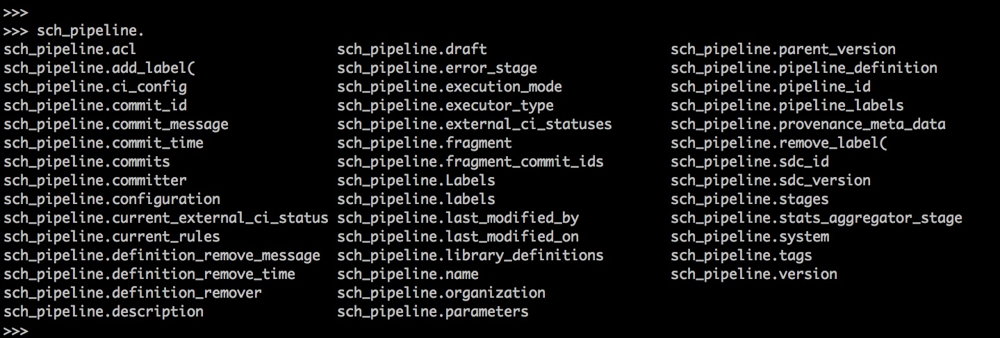

Find SDK methods and fields of an object available   
==================================================

This tutorial covers how to find SDK methods and fields of an object.  
  
Object examples can be instances of a pipeline or SCH job or a stage under the pipeline.

Though this tutorial shows examples with [StreamSets Control Hub pipeline](https://streamsets.com/documentation/controlhub/latest/help/datacollector/UserGuide/Pipeline_Design/What_isa_Pipeline.html) and a stage under it, the process is the same for any other object available via SDK for Python.

SDK documentation has a section with details for this [Configuring stages](https://streamsets.com/documentation/sdk/latest/usage.html#configuring-stages)

### Prerequisites
Make sure to complete [Prerequisites for the SCH pipelines tutorial](../sch/tutorial-pipelines/preparation-for-tutorial/README.md). 

### Tutorial environment details
While creating this tutorial following was used:
* Python 3.6
* StreamSets for SDK 3.8.0
* All StreamSets Data Collector with version 3.17.1

### Outline
In [Prerequisites for the SCH pipelines tutorial](../sch/tutorial-pipelines/preparation-for-tutorial/README.md), one pipeline was created with name 'SCH Hello World pipeline'. 

This tutorial shows: 
1. how to see which methods and fields are available for that SCH pipeline
1. How to see value of a field for that pipeline 
1. how to see which methods and fields are available for a stage of that pipeline 
1. how to see help for a method for that stage

### Workflow
On a terminal, type the following command to open a Python 3 interpreter.

```bash
$ python3
Python 3.6.6 (v3.6.6:4cf1f54eb7, Jun 26 2018, 19:50:54)
[GCC 4.2.1 Compatible Apple LLVM 6.0 (clang-600.0.57)] on darwin
Type "help", "copyright", "credits" or "license" for more information.
>>>
```

### Step 1 &mdash; Connect to StreamSets Control Hub instance

Let’s assume the StreamSets Control Hub is running at http://sch.streamsets.com 
Create an object called control_hub which is connected to the above. 

```python
from streamsets.sdk import ControlHub

# Replace the argument values according to your setup
control_hub = ControlHub(server_url='http://sch.streamsets.com',
                         username='user@organization1',
                         password='password')
```
 
### Step 2 &mdash; Fetch the pipeline created in preparation

```python
sch_pipeline = control_hub.pipelines.get(name='SCH Hello World pipeline')
sch_pipeline
```

This shows us the output like following:
```bash
>>> sch_pipeline
<Pipeline (pipeline_id=388f306c-f8da-4c5f-9387-8fb605306ca0:engproductivity, 
commit_id=da5a5753-cc0b-4eae-977d-7b5f7d74fe6d:engproductivity, 
name=SCH Hello World pipeline, version=3)>
``` 

### Step 3 &mdash; See methods and fields available for the pipeline using dir()
Directly inspect in a Python interpreter using the **dir()** built-in function on the pipeline instance.
```python
# Loop over duplicated pipelines and add label to each
>>> dir(sch_pipeline)
['_Pipeline__pipeline_definition', '__class__', '__delattr__', '__dir__', '__doc__', '__eq__', '__format__', '__ge__', '__getattribute__', 
'__gt__', '__hash__', '__init__', '__init_subclass__', '__le__', '__lt__', '__ne__', '__new__', '__reduce__', '__reduce_ex__', '__repr__', 
'__setattr__', '__sizeof__', '__str__', '__subclasshook__', '_attributes_to_ignore', '_attributes_to_remap', '_builder', '_control_hub', 
'_data', '_parameters', '_repr_metadata', '_rules_definition', 'ci_config', 'commit_id', 'commit_message', 'commit_time', 'committer', 
'current_external_ci_status', 'current_rules', 'definition_remove_message', 'definition_remove_time', 'definition_remover', 'description', 
'draft', 'execution_mode', 'executor_type', 'external_ci_statuses', 'fragment', 'fragment_commit_ids', 'last_modified_by', 'last_modified_on', 
'library_definitions', 'name', 'organization', 'parent_version', 'pipeline_definition', 'pipeline_id', 'pipeline_labels', 'provenance_meta_data', 
'sdc_id', 'sdc_version', 'system', 'version']
```

As convention in Python, any methods or fields starting with '_' (underscore) character are private and let's not use them.

So now, one can see value of a field like:
```python
>>> sch_pipeline.version
'3'
``` 
### Step 4 &mdash; See methods and fields available for the pipeline using help()
This displays the actual help available for the object.

 ```python
help(sch_pipeline)
 ```
The above code produces output like following (cut for brevity):

```bash
Help on Pipeline in module streamsets.sdk.sch_models object:

class Pipeline(BaseModel)
 |  Model for Pipeline.
 |
 |  Args:
 |      pipeline (:obj:`dict`): Pipeline in JSON format.
 |      builder (:py:class:`streamsets.sdk.sch_models.PipelineBuilder`): Pipeline Builder object.
 |      pipeline_definition (:obj:`dict`): Pipeline Definition in JSON format.
 |      rules_definition (:obj:`dict`): Rules Definition in JSON format.
 |      control_hub (:py:class:`streamsets.sdk.sch.ControlHub`): ControlHub object.
 |
 |  Method resolution order:
 |      Pipeline
 |      BaseModel
 |      builtins.objectHelp on Pipeline in module streamsets.sdk.sch_models object:
                       
                       class Pipeline(BaseModel)
                        |  Model for Pipeline.
                        |
                        |  Args:
                        |      pipeline (:obj:`dict`): Pipeline in JSON format.
                        |      builder (:py:class:`streamsets.sdk.sch_models.PipelineBuilder`): Pipeline Builder object.
                        |      pipeline_definition (:obj:`dict`): Pipeline Definition in JSON format.
                        |      rules_definition (:obj:`dict`): Rules Definition in JSON format.
                        |      control_hub (:py:class:`streamsets.sdk.sch.ControlHub`): ControlHub object.
                        |
                        |  Method resolution order:
                        |      Pipeline
                        |      BaseModel
                        |      builtins.object
```

### Step 5 &mdash; See methods and fields available for the pipeline using TAB key
 
Another way is when one types two times TAB key after `sch_pipline.` (Note the '.' in the end)

e.g. here is a sample output with this


### Step 6 &mdash; See help for a pipeline method
Now from above step, it is known that sch_pipeline pipeline object has a method called `add_label`. Reason is above output showed us `(` for add_label.  

Let's see how can we use it. For that we need to see help of that method in the following manner.

```python
help(sch_pipeline.add_label)
```

and it shows output like following:

```python
Help on method add_label in module streamsets.sdk.sch_models:

add_label(*labels) method of streamsets.sdk.sch_models.Pipeline instance
    Add a label

    Args:
        *labels: One or more instances of :obj:`str`
```


### Step 7 &mdash; See methods and fields available for a stage
SDK documentation has a great section with details for this [Configuring stages](https://streamsets.com/documentation/sdk/latest/usage.html#configuring-stages)

Exactly the same ways are available:
1. dir()
1. help()
1. TAB key usage

Here is sample output for a stage of that pipeline by using 2 times TAB key after `dev_data_genertor.` 
```python
>>> dev_data_generator = sch_pipeline.stages[0]
>>>
>>> dev_data_generator.
dev_data_generator.add_output(                dev_data_generator.on_record_error
dev_data_generator.batch_size                 dev_data_generator.output_lanes
dev_data_generator.configuration              dev_data_generator.output_lanes_idx
dev_data_generator.delay_between_batches      dev_data_generator.root_field_type
dev_data_generator.description                dev_data_generator.services
dev_data_generator.event_lanes                dev_data_generator.set_attributes(
dev_data_generator.event_name                 dev_data_generator.stage_name
dev_data_generator.fields_to_generate         dev_data_generator.stage_on_record_error
dev_data_generator.header_attributes          dev_data_generator.stage_record_preconditions
dev_data_generator.instance_name              dev_data_generator.stage_required_fields
dev_data_generator.label                      dev_data_generator.stage_type
dev_data_generator.library                    dev_data_generator.stage_version
dev_data_generator.number_of_threads
```

So now, one can see value of a field like:
```python
>>> dev_data_generator.batch_size
1000
>>> dev_data_generator.label
'Dev Data Generator 1'
``` 

**Note** The dev_data_generator.label here. This is very helpful while creating a pipeline. Reason is, this is what is used for the add_stage call.
Same can be seen in UI too.
e.g. 
```python
# Create a pipeline
builder = control_hub.get_pipeline_builder()
dev_data_generator = builder.add_stage('Dev Data Generator')
```

### Step 8 &mdash; See help for a stage method
Now from above step, it is known that dev_data_generator stage object has a method called `set_attributes`. Reason is above output showed us `(` for set_attributes.  

Let's see how can we use it. For that we need to see help of that method in the following manner.

```python
help(dev_data_generator.set_attributes)
```

and it shows output like following:

```python
Help on method set_attributes in module streamsets.sdk.sdc_models:

set_attributes(**attributes) method of streamsets.sdk.sdc_models.com_streamsets_pipeline_stage_devtest_RandomDataGeneratorSource instance
    Set one or more stage attributes.

    Args:
        **attributes: Attributes to set.

    Returns:
        This stage as an instance of :py:class:`streamsets.sdk.sdc_models.Stage`.
```

### Follow-up
To get to know more details about SDK for Python, check the [SDK documentation](https://streamsets.com/documentation/sdk/latest/index.html).

If you encounter any problems with this tutorial, please [file an issue in the tutorials project](https://github.com/streamsets/tutorials/issues/new).
 
