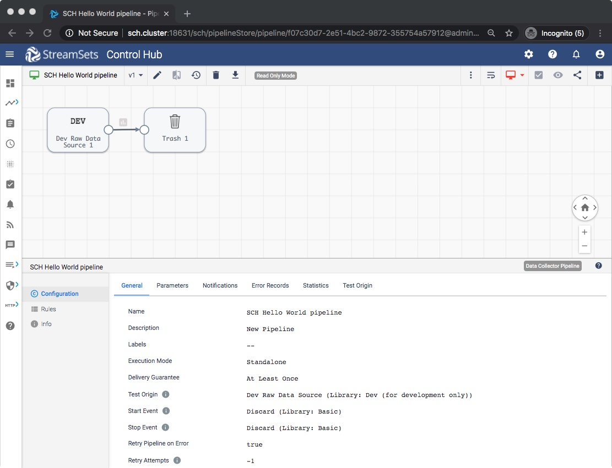
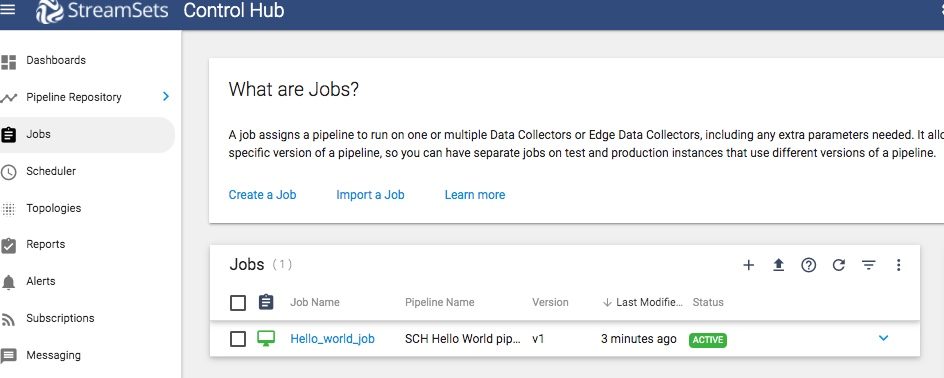
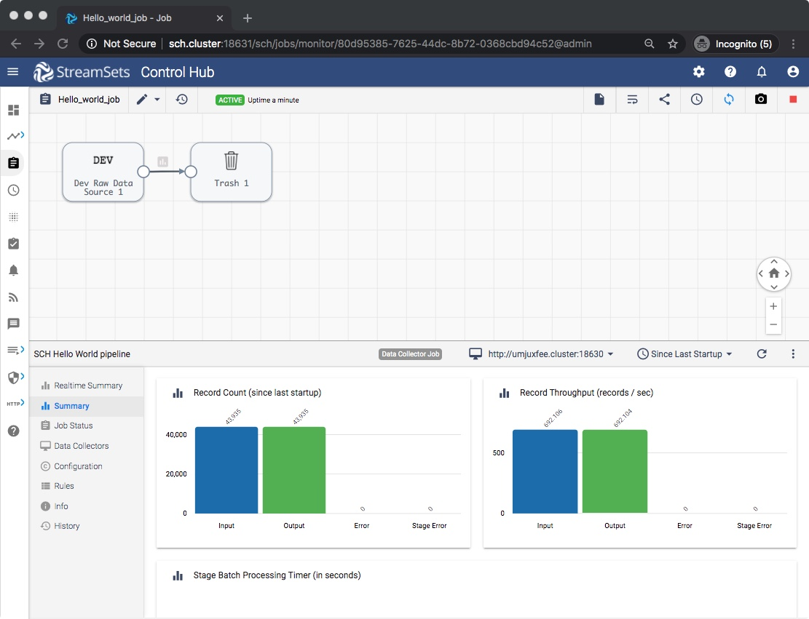

StreamSets Control Hub: Getting Started with SDK for Python
===========================================================

This tutorial covers the most basic yet very powerful workflow for [StreamSets Control Hub](https://streamsets.com/products/dataops-platform/control-hub/). The workflow shows how to design and 
publish a pipeline followed by how to create, start, and stop a job using [SDK for Python](https://streamsets.com/documentation/sdk/latest/index.html). 

### Prerequisites
* [Python 3.4+](https://docs.python.org/3/using/index.html) and pip3 installed
* StreamSets for SDK [Installed and activated](https://streamsets.com/documentation/sdk/latest/installation.html) 
* [Access to StreamSets Control Hub](https://streamsets.com/documentation/controlhub/latest/help/controlhub/UserGuide/OrganizationSecurity/OrgSecurity_Overview.html#concept_q5z_jkl_wy) with an user account in your  organization 
* At least one [StreamSets Data Collector](https://streamsets.com/products/dataops-platform/data-collector/) instance registered with the above StreamSets Control Hub instance
 

**Note**: Make sure that the user account has proper access to do the following tasks this blog post covers. The easiest way for this, is to do those tasks using the Web UI of the StreamSets Control Hub first and fix any access problems before embarking on the path below. 

### Workflow
On a terminal, type the following command to open a Python 3 interpreter.

```bash
$ python3
Python 3.6.6 (v3.6.6:4cf1f54eb7, Jun 26 2018, 19:50:54)
[GCC 4.2.1 Compatible Apple LLVM 6.0 (clang-600.0.57)] on darwin
Type "help", "copyright", "credits" or "license" for more information.
>>>
```

### Step 1 &mdash; Connect to StreamSets Control Hub instance

Let’s assume the StreamSets Control Hub is running at http://sch.streamsets.com 
Create an object called control_hub which is connected to the above. 

```python
from streamsets.sdk import ControlHub

# Replace the argument values according to your setup
control_hub = ControlHub(server_url='http://sch.streamsets.com',
                         username='user@organization1',
                         password='password')
```

To connect to https enabled Control Hub using a cert file, utilize the attribute streamsets.sdk.ControlHub.VERIFY_SSL_CERTIFICATES:

```python
from streamsets.sdk import ControlHub

# Replace the <PATH-TO_CERTFILE> according to your setup
ControlHub.VERIFY_SSL_CERTIFICATES = '<PATH-TO_CERTFILE>' 

# To skip verifying SSL certificate use the following
# ControlHub.VERIFY_SSL_CERTIFICATES = False

# Replace the argument values according to your setup
control_hub = ControlHub(server_url='https://sch.streamsets.com',
                         username='user@organization1',
                         password='password')
```

### Step 2 &mdash; Build and publish a pipeline
A pipeline describes the flow of data from an origin system to destination systems and defines how to transform the data along the way. The following is a very simple pipeline. One can create pretty complex pipelines using the constructs available in SDK for Python.

After building, publish the pipeline to indicate that design is complete and the pipeline is ready to be added to a job and run.

```python
# Create 2 stages and wire them together
dev_raw_data_source = builder.add_stage('Dev Raw Data Source')
trash = builder.add_stage('Trash')
dev_raw_data_source >> trash


# Now build the pipeline with a name and publish it
pipeline = builder.build('SCH Hello World pipeline')
control_hub.publish_pipeline(pipeline, commit_message='First Commit')
```
If all goes well, then StreamSets Control Hub UI on browser shows the following:



### Step 3 &mdash; Create and start a job
When adding a job, specify the published pipeline to run. Also can select Data Collector labels for the job. The labels indicate which group of Data Collectors should run the pipeline. Here we do not specify any label and hence it uses the default label `all`. 

```python
# Create a job
job_builder = control_hub.get_job_builder()
job = job_builder.build('Hello_World_job', pipeline=pipeline)
control_hub.add_job(job)
```


Now let’s start the job.

```python
# Start the job
control_hub.start_job(job)
```

Give it some time. And then StreamSets Control Hub UI on browser shows the following:



Voila! We have successfully created a job and it is running with just a few lines of code. Pretty simple. Right?

### Step 4 &mdash; Monitor the job using UI
Now as the UI shows, one can monitor a job in the UI. 
To achieve the same in SDK, check out [the set of tutorials for the jobs](../tutorial-jobs/readme.md).


### Step 5 &mdash; Stop and delete the job
This is the last step in our workflow.

```python
control_hub.stop_job(job)

control_hub.delete_job(job)
```

### Conclusion
The workflow showed basics about pipeline and job using [StreamSets SDK for Python](https://streamsets.com/documentation/sdk/latest/index.html). 
Now you are ready to start the journey to create more sophisticated workflows.

If you encounter any problems with this tutorial, please [file an issue in the tutorials project](https://github.com/streamsets/tutorials/issues/new).


