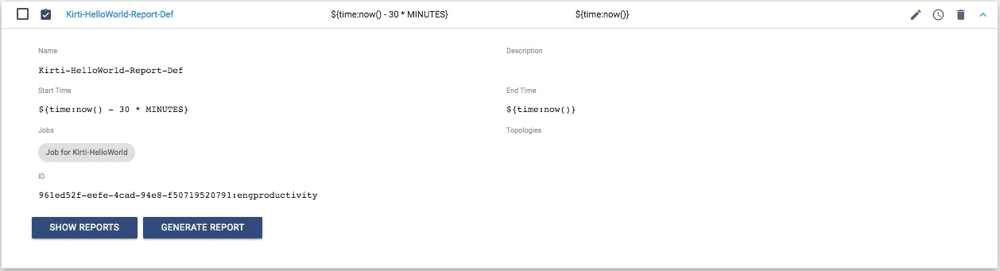
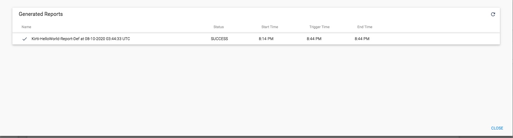

Generate a report
=================

This tutorial covers how to generate a report for a specific job and then; fetch and download it.  

### Prerequisites
Make sure to complete [Prerequisites for the jobs tutorial](preparation-for-tutorial). 

### Tutorial environment details
While creating this tutorial following was used:
* Python 3.6
* StreamSets for SDK 3.8.0
* All StreamSets Data Collector with version 3.17.0

### Outline
In [Prerequisites for the jobs tutorial](preparation-for-tutorial), one job was created with name 'Job for Kirti-HelloWorld'. 
This tutorial shows the following:
1. Create a report definition
1. Generate a report
1. Download that report 

### Workflow
On a terminal, type the following command to open a Python 3 interpreter.

```bash
$ python3
Python 3.6.6 (v3.6.6:4cf1f54eb7, Jun 26 2018, 19:50:54)
[GCC 4.2.1 Compatible Apple LLVM 6.0 (clang-600.0.57)] on darwin
Type "help", "copyright", "credits" or "license" for more information.
>>>
```

### Step 1 &mdash; Connect to StreamSets Control Hub instance

Let’s assume the StreamSets Control Hub is running at http://sch.streamsets.com 
Create an object called control_hub which is connected to the above. 

```python
from streamsets.sdk import ControlHub

# Replace the argument values according to your setup
control_hub = ControlHub(server_url='http://sch.streamsets.com',
                         username='user@organization1',
                         password='password')
```
 
### Step 2 &mdash; Create a report definition

Following code shows how to create a report definition for the job with name 'Job for Kirti-HelloWorld' using [StreamSets SDK for Python](https://streamsets.com/documentation/sdk/latest/index.html).
Optionally you can create the same using UI on the browser.
  
```python
# Get the specific job using job name
job = control_hub.jobs.get(job_name='Job for Kirti-HelloWorld')

# Create Report Definition
report_definition_builder = control_hub.get_report_definition_builder()
report_definition_builder.set_data_retrieval_period(start_time='${time:now() - 30 * MINUTES}',
                                                    end_time='${time:now()}')
# Specify the selected job as the report resource
report_definition_builder.add_report_resource(job)
report_definition = report_definition_builder.build(name='Kirti-HelloWorld-Report')

control_hub.add_report_definition(report_definition)
```
Above code produces report definition like following:



### Step 3 &mdash; Generate a report
```python
report_definition = control_hub.report_definitions.get(name='Kirti-HelloWorld-Report-Def')
# Generate Report
report_command = report_definition.generate_report()
report_id = report_command.response['id']

# Wait for the report to be ready
report = report_definition.reports.get(id=report_id)
while report.report_status == 'REPORT_SUCCESS':
    time.sleep(5)
    report = report_definition.reports.get(id=report_id)

# Fetch the report
report = report_definition.reports.get(id=report_id)
print(f'Fetched report = {report}')
```

Above code generates report like following:



### Step 4 &mdash; Download the report

```python
# Another way to get the report
report = report_definition.reports[0] 
# download report pdf and write it to a file called report.pdf in the current directory
report_content = report.download()
with open('report.pdf', 'wb') as report_file:
    report_file.write(report_content)
```

### Follow-up
To get to know more details about SDK for Python, check the [SDK documentation](https://streamsets.com/documentation/sdk/latest/index.html).

If you encounter any problems with this tutorial, please [file an issue in the tutorials project](https://github.com/streamsets/tutorials/issues/new).
 
