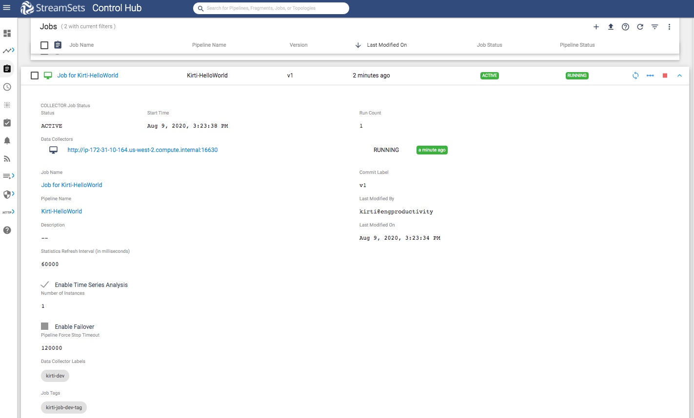

Prerequisites - for SCH Jobs related tutorials
==============================================

This covers the steps needed to complete before starting on any other jobs ralted tutorials in this set.  

### Prerequisites
* [Python 3.4+](https://docs.python.org/3/using/index.html) and pip3 installed
* StreamSets for SDK [Installed and activated](https://streamsets.com/documentation/sdk/latest/installation.html) 
* [Access to StreamSets Control Hub](https://streamsets.com/documentation/controlhub/latest/help/controlhub/UserGuide/OrganizationSecurity/OrgSecurity_Overview.html#concept_q5z_jkl_wy) with an user account in your  organization 
* At least one [StreamSets Data Collector](https://streamsets.com/products/dataops-platform/data-collector/) instance registered with the above StreamSets Control Hub instance
 

**Note**: Make sure that the user account has proper access to do the following tasks this blog post covers. The easiest way for this, is to do those tasks using the Web UI of the StreamSets Control Hub first and fix any access problems before embarking on the path below. 

### Tutorial environment details
While creating this tutorial following was used:
* Python 3.6
* StreamSets for SDK 3.8.0
* All StreamSets Data Collector with version 3.17.0

### Outline
In this preparation, 2 jobs will be created with following names:
1. Job for Kirti-HelloWorld
1. Job for Kirti-DevRawDataSource

This page deatils on how to create them using SDK for Python.
Optionally, you can create them using UI in the browser too. Just follow all the details needed for the jobs.

### Workflow

On a terminal, type the following command to open a Python 3 interpreter.

```bash
$ python3
Python 3.6.6 (v3.6.6:4cf1f54eb7, Jun 26 2018, 19:50:54)
[GCC 4.2.1 Compatible Apple LLVM 6.0 (clang-600.0.57)] on darwin
Type "help", "copyright", "credits" or "license" for more information.
>>>
```

### Step 1 &mdash; Connect to StreamSets Control Hub instance

Let’s assume the StreamSets Control Hub is running at http://sch.streamsets.com 
Create an object called control_hub which is connected to the above. 

```python
from streamsets.sdk import ControlHub

# Replace the argument values according to your setup
control_hub = ControlHub(server_url='http://sch.streamsets.com',
                         username='user@organization1',
                         password='password')
```
 
 ### Step 2 &mdash; Create first job
 Create a job either using UI or using SDK for Python.
 
 Here is a sample job created using SDK for Python. For this tutorial purpose, create the job with 
 
1. tags e.g. tags=['kirti-job-dev-tag'] 
1. datacollector-labels e.g. data_collector_labels = ['kirti-dev']
1. Time series analysis enabled
 
```python
# Create a pipeline
builder = control_hub.get_pipeline_builder()
dev_raw_data_source = builder.add_stage('Dev Data Generator')
trash = builder.add_stage('Trash')
dev_raw_data_source >> trash  # connect the Dev Raw Data Source origin to the Trash destination.
pipeline = builder.build('Kirti-HelloWorld')
control_hub.publish_pipeline(pipeline)

# Create a job for the above
job_builder = control_hub.get_job_builder()
job = job_builder.build('Job for Kirti-HelloWorld', pipeline=pipeline, tags=['kirti-job-dev-tag'])
job.data_collector_labels = ['kirti-dev']
job.enable_time_series_analysis = True
control_hub.add_job(job)
```

After the above code is executed, one can see the job in the UI as following. Note the datacollector-label here. 
 
 
 

### Step 3 &mdash; Create second job  

Create another job either using UI or using SDK for Python.
  
Here is a sample job created using SDK for Python. For this tutorial purpose, create the job with 
  
1. tags e.g. tags=['kirti-job-dev-RawDS-tag'] 
1. datacollector-labels e.g. data_collector_labels = ['kirti-dev']
1. Time series analysis enabled

```python
# Create second pipeline
builder = control_hub.get_pipeline_builder()
dev_raw_data_source = builder.add_stage('Dev Raw Data Source')
trash = builder.add_stage('Trash')
dev_raw_data_source >> trash  # connect the Dev Raw Data Source origin to the Trash destination.
pipeline = builder.build('Kirti-DevRawDataSource')
control_hub.publish_pipeline(pipeline)

# Create a job for the above
job_builder = control_hub.get_job_builder()
job = job_builder.build('Job for Kirti-DevRawDataSource', pipeline=pipeline, tags=['kirti-job-dev-RawDS-tag'])
job.data_collector_labels = ['kirti-dev']
job.enable_time_series_analysis = True
control_hub.add_job(job)
```
 
### Conclusion
Now with this preparation, you are ready to start on other tutorials in this set.
To get to know more details about SDK for Python, check the [SDK documentation](https://streamsets.com/documentation/sdk/latest/index.html).

If you encounter any problems with this tutorial, please [file an issue in the tutorials project](https://github.com/streamsets/tutorials/issues/new).
  