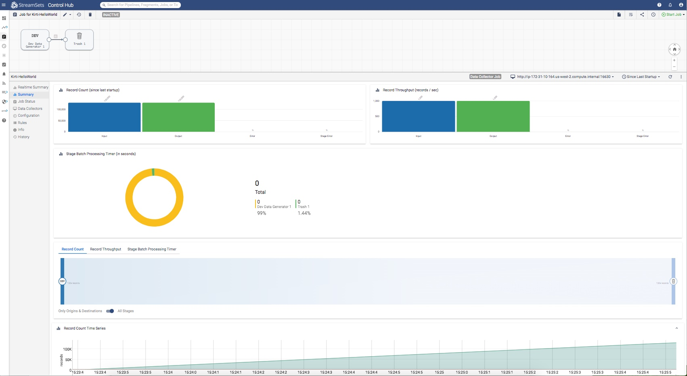

Start and monitor a job
=======================

This tutorial covers how to start a job and monitor that specific job.  

### Prerequisites
Make sure to complete [Prerequisites for the jobs tutorial](preparation-for-tutorial). 

### Tutorial environment details
While creating this tutorial following was used:
* Python 3.6
* StreamSets for SDK 3.8.0
* All StreamSets Data Collector with version 3.17.0

### Outline
In [Prerequisites for the jobs tutorial](preparation-for-tutorial), one job was created with name 'Job for Kirti-HelloWorld'. 
This tutorial shows to start that job and then monitor it using metrics, status and time series metrics for that specific job.
And also how can log for the data_collector where the job was started 

### Workflow
On a terminal, type the following command to open a Python 3 interpreter.

```bash
$ python3
Python 3.6.6 (v3.6.6:4cf1f54eb7, Jun 26 2018, 19:50:54)
[GCC 4.2.1 Compatible Apple LLVM 6.0 (clang-600.0.57)] on darwin
Type "help", "copyright", "credits" or "license" for more information.
>>>
```

### Step 1 &mdash; Connect to StreamSets Control Hub instance

Let’s assume the StreamSets Control Hub is running at http://sch.streamsets.com 
Create an object called control_hub which is connected to the above. 

```python
from streamsets.sdk import ControlHub

# Replace the argument values according to your setup
control_hub = ControlHub(server_url='http://sch.streamsets.com',
                         username='user@organization1',
                         password='password')
```
 
### Step 2 &mdash; Start the job
Now let’s start the job.

 ```python
import time
# Select the job using name
job = control_hub.jobs.get(job_name='Job for Kirti-HelloWorld')
control_hub.start_job(job)
time.sleep(60)  # Let it run for a minute
  ```

### Step 3 &mdash; Monitor started job with Metrics
Let's monitor it using SDK for Python:

**Job Metrics**
```python
# Fetch the job metrics   
job_metrics = job.metrics(metric_type='RECORD_THROUGHPUT', include_error_count=True)
print('Job Metrics = ', job_metrics)
print('Output count = ', job_metrics.output_count)
print('Error count = ', job_metrics.error_count)
```
Above code produces a sample output like following:

```bash
Job Metrics = <JobMetrics 
(output_count={'DevDataGenerator_01:DevDataGenerator_01OutputLane7b50203d_5de5_4ee8_9f9c_d42c2614ba74': 1000.0, 
               'PIPELINE': 1000.0, 
               'DevDataGenerator_01': 1000.0, 
               'Trash_01': 1000.0}, 
error_count={'DevDataGenerator_01:DevDataGenerator_01OutputLane7b50203d_5de5_4ee8_9f9c_d42c2614ba74': 0.0, 
             'PIPELINE': 0.0, 
             'DevDataGenerator_01': 0.0, 
             'Trash_01': 0.0})>
Output count = {'DevDataGenerator_01:DevDataGenerator_01OutputLane7b50203d_5de5_4ee8_9f9c_d42c2614ba74': 1000.0, 
                'PIPELINE': 1000.0, 
                'DevDataGenerator_01': 1000.0, 
                'Trash_01': 1000.0}
Error count = {'DevDataGenerator_01:DevDataGenerator_01OutputLane7b50203d_5de5_4ee8_9f9c_d42c2614ba74': 0.0, 
               'PIPELINE': 0.0, 
               'DevDataGenerator_01': 0.0, 
               'Trash_01': 0.0}
```

### Step 4 &mdash; Monitor started job with Job Status
Let's monitor it with Job status:

```python
job.refresh()  # Make sure to run this so that Job status is updated
job_status = job.status
# The id for the data_collector that was used to execute job
sdc_ids = job_status.sdc_ids
print('sdc_ids = ', sdc_ids)
```
Above code produces a sample output like following:
```bash
<JobStatus (status=ACTIVE, color=GREEN)>
sdc_ids =  ['380e3f59-d74e-11ea-b07f-adf940e256e9']
```

### Step 5 &mdash; Monitor started job with Time Series Metrics
Let's monitor it with Job status:

**Job Time Series Metrics**
Sine while creating the jobs we had enabled the time series metrics, it is available now.
```python
# Fetch the time series metrics
job_time_series_metrics = job.time_series_metrics(metric_type='Record Throughput Time Series')
print('job_time_series_metrics = ', job_time_series_metrics)
```
Above code produced a sample output like following:
```bash
job_time_series_metrics = <JobTimeSeriesMetrics (
input_records=<JobTimeSeriesMetric (name=pipeline_batchInputRecords_meter, 
                                    time_series={'2020-08-09T22:23:38.783Z': 0.0, 
                                                 '2020-08-09T22:23:41.689Z': 0.0, 
                                                 '2020-08-09T22:24:43.675Z': 1000.0, 
                                                 '2020-08-09T22:25:45.675Z': 1000.0, 
                                                 ' 2020-08-09T22:25:52.387Z': 1000.0})>, 
output_records=<JobTimeSeriesMetric (name=pipeline_batchOutputRecords_meter, 
                                    time_series={'2020-08-09T22:23:38.783Z': 0.0, 
                                                 '2020-08-09T22:23:41.689Z': 0.0, 
                                                 '2020-08-09T22:24:43.675Z': 1000.0, 
                                                 '2020-08-09T22:25:45.675Z': 1000.0, 
                                                 '2020-08-09T22:25:52.387Z': 1000.0})>, 
error_records=<JobTimeSeriesMetric (name=pipeline_batchErrorRecords_meter, 
                                    time_series={'2020-08-09T22:23:38.783Z': 0.0, 
                                                 '2020-08-09T22:23:41.689Z': 0.0, 
                                                 '2020-08-09T22:24:43.675Z': 0.0, 
                                                 '2020-08-09T22:25:45.675Z': 0.0, 
                                                 '2020-08-09T22:25:52.387Z': 0.0})>)>
```

One can observe the same using StreamSets Control Hub UI on browser:



### Follow-up
To get to know more details about SDK for Python, check the [SDK documentation](https://streamsets.com/documentation/sdk/latest/index.html).

If you encounter any problems with this tutorial, please [file an issue in the tutorials project](https://github.com/streamsets/tutorials/issues/new).
 
