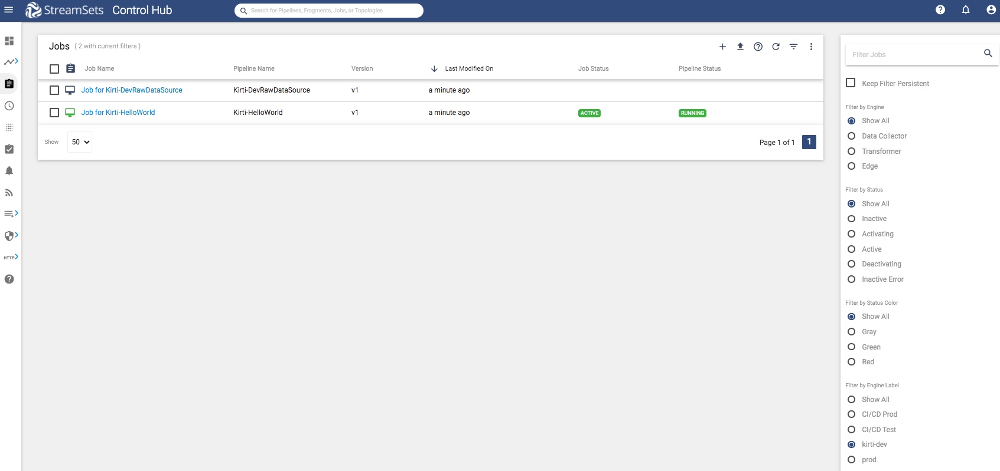
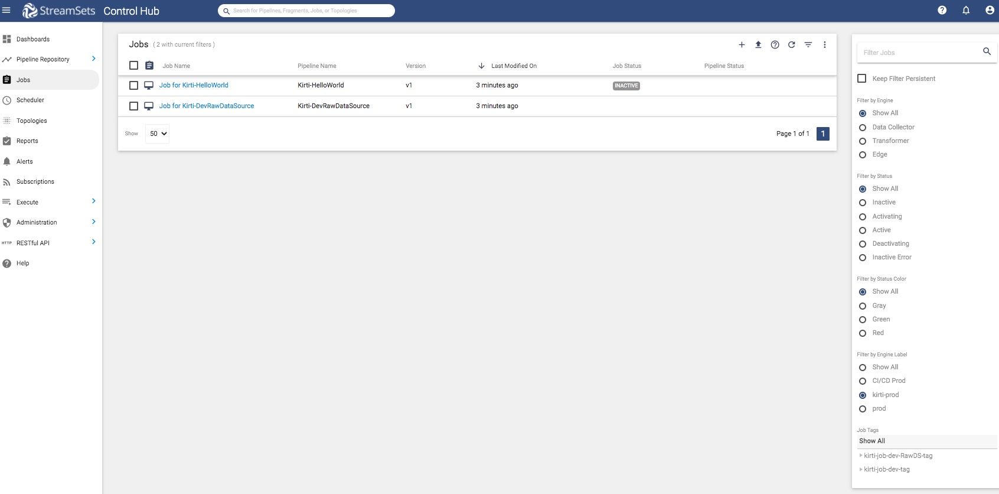

Update data-collector-labels for jobs
=====================================

This tutorial shows how to move jobs from one label to another.

When there are many jobs that need this update, SDK for Python makes it easy to update them with just a few lines of code.

### Prerequisites
Make sure to complete [Prerequisites for the jobs tutorial](../preparation-for-tutorial). 

### Tutorial environment details
While creating this tutorial following was used:
* Python 3.6
* StreamSets for SDK 3.8.0
* All StreamSets Data Collector with version 3.17.0

### Outline
At this point, let's say we are satisfied with both the jobs that we created while preparing for the tutorials.
These jobs have data-collector-label = 'kirti-dev'.
Now let's promote them to production data_collectors, by changing the data_collector_labels for them to 'kirti-prod'. 

### Workflow
On a terminal, type the following command to open a Python 3 interpreter.

```bash
$ python3
Python 3.6.6 (v3.6.6:4cf1f54eb7, Jun 26 2018, 19:50:54)
[GCC 4.2.1 Compatible Apple LLVM 6.0 (clang-600.0.57)] on darwin
Type "help", "copyright", "credits" or "license" for more information.
>>>
```

### Step 1 &mdash; Connect to StreamSets Control Hub instance

Let’s assume the StreamSets Control Hub is running at http://sch.streamsets.com 
Create an object called control_hub which is connected to the above. 

```python
from streamsets.sdk import ControlHub

# Replace the argument values according to your setup
control_hub = ControlHub(server_url='http://sch.streamsets.com',
                         username='user@organization1',
                         password='password')
```
 
 ### Step 2 &mdash; Fetch jobs with dev data_collector_labels 
 
 On browser, one can see jobs with existing data_collector_label = ['kirti-dev'] as following:
 


```python
jobs_with_existing_label = control_hub.jobs.get_all(data_collector_labels=['kirti-dev'])
print(f'jobs_with_existing_label = \n {jobs_with_existing_label}')
```
Above code produces following kind of output:
```bash
jobs_with_existing_label =
 [<Job (job_id=5ec460da-5f1d-44c1-af9d-649cc9a7284f:engproductivity, 
        job_name=Job for Kirti-DevRawDataSource)>, 
  <Job (job_id=fbba2698-c13a-4cd1-95a0-358f9d4d9467:engproductivity, 
        job_name=Job for Kirti-HelloWorld)>]
```

### Step 3 &mdash; Update data_collector_labels

```python
for job in jobs_with_existing_label:
    job.data_collector_labels = ['kirti-prod']
    control_hub.update_job(job)
jobs_with_updated_label = control_hub.jobs.get_all(data_collector_labels=['kirti-prod'])
print(f'jobs_with_updated_label = \n {jobs_with_updated_label}')
jobs_with_old_label = control_hub.jobs.get_all(data_collector_labels=['kirti-dev'])
print(f'jobs_with_old_label = {jobs_with_old_label}')
```
Above code produces following kind of output:
```bash
jobs_with_updated_label =
 [<Job (job_id=5ec460da-5f1d-44c1-af9d-649cc9a7284f:engproductivity, 
        job_name=Job for Kirti-DevRawDataSource)>, 
  <Job (job_id=fbba2698-c13a-4cd1-95a0-358f9d4d9467:engproductivity, 
        job_name=Job for Kirti-HelloWorld)>]
jobs_with_old_label = []
```

At this point, on browser, one can see jobs with updated data_collector_label = ['kirti-prod'] as following:




### Follow-up
To get to know more details about SDK for Python, check the [SDK documentation](https://streamsets.com/documentation/sdk/latest/index.html).

If you encounter any problems with this tutorial, please [file an issue in the tutorials project](https://github.com/streamsets/tutorials/issues/new).
 