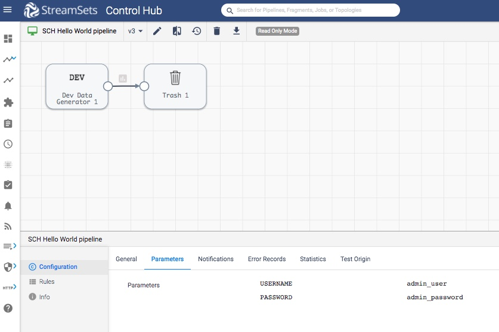
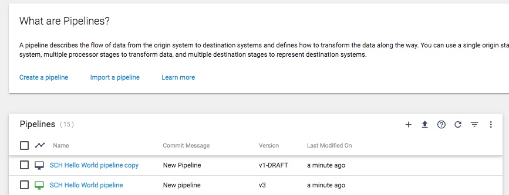
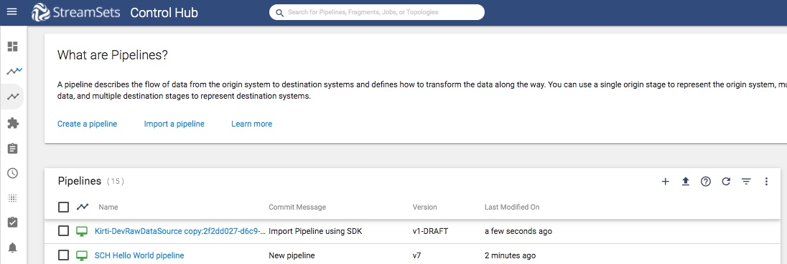

Common operations on SCH pipeline 
=================================

This tutorial covers some common operations for [StreamSets Control Hub pipelines](https://streamsets.com/documentation/controlhub/latest/help/datacollector/UserGuide/Pipeline_Design/What_isa_Pipeline.html)
like update, duplicate , import.  
  
A pipeline describes the flow of data from the origin system to destination systems and defines how to transform the data along the way.

### Prerequisites
Make sure to complete [Prerequisites for the pipelines tutorial](../preparation-for-tutorial). 

### Tutorial environment details
While creating this tutorial following was used:
* Python 3.6
* StreamSets for SDK 3.8.0
* All StreamSets Data Collector with version 3.17.1

### Outline
In [Prerequisites for the pipelines tutorial](../preparation-for-tutorial/README.md), one pipeline was created with name 'SCH Hello World pipeline'. 
On the very pipeline, this tutorial shows some operations like
1. to update the pipeline by adding new pipeline parameters 
1. add a label to it 
1. duplicate the pipeline
1. import and export it 

### Workflow
On a terminal, type the following command to open a Python 3 interpreter.

```bash
$ python3
Python 3.6.6 (v3.6.6:4cf1f54eb7, Jun 26 2018, 19:50:54)
[GCC 4.2.1 Compatible Apple LLVM 6.0 (clang-600.0.57)] on darwin
Type "help", "copyright", "credits" or "license" for more information.
>>>
```

### Step 1 &mdash; Connect to StreamSets Control Hub instance

Let’s assume the StreamSets Control Hub is running at http://sch.streamsets.com 
Create an object called control_hub which is connected to the above. 

```python
from streamsets.sdk import ControlHub

# Replace the argument values according to your setup
control_hub = ControlHub(server_url='http://sch.streamsets.com',
                         username='user@organization1',
                         password='password')
```
 
### Step 2 &mdash; Update pipeline - by adding runtime parameters
Let's update the pipeline by adding new [runtime parameters](https://streamsets.com/documentation/controlhub/latest/help/controlhub/UserGuide/Jobs/RuntimeParameters.html#concept_dwq_33w_vz).

 ```python
pipeline.parameters  = {'USERNAME': 'admin_user', 'PASSWORD': 'admin_password'}
control_hub.publish_pipeline(pipeline)
 ```
At this point, on browser, one can see the pipeline with updated runtime parameters as following:


### Step 3 &mdash; Add a label
[A pipeline label](https://streamsets.com/documentation/controlhub/latest/help/controlhub/UserGuide/Pipelines/PipelineLabels.html?hl=pipeline%2Clabel) 
identifies similar pipelines or pipeline fragments. Use pipeline labels to easily search and filter pipelines and fragments when viewing them in the pipeline repository.

 ```python
pipeline.add_label('updated_label')
control_hub.publish_pipeline(pipeline)
 ```

### Step 4 &mdash; Duplicate the pipeline

 ```python
# Duplicate the pipeline
duplicated_pipeline = control_hub.duplicate_pipeline(pipeline)
 ```

At this point, on browser, one can see the duplicated pipeline with name as 'SCH Hello World pipeline copy':



### Step 5 &mdash; Export and import the pipeline

 ```python
# Export the pipeline
pipeline_zip_data = control_hub.export_pipelines(duplicated_pipeline)

# Write to an archive the exported pipeline
with open('/tmp/sample_imported_pipeline.zip', 'wb') as pipelines_zip_file:
    pipelines_zip_file.write(pipeline_zip_data)

# Import the pipeline from the above archive
with open('/tmp/sample_imported_pipeline.zip', 'rb') as input_file:
    pipelines_imported = control_hub.import_pipelines_from_archive(input_file, 'Import Pipeline using SDK')
 ```

At this point, on browser, one can see the duplicated pipeline with name as 'SCH Hello World pipeline copy':



### Step 6 &mdash; Delete pipelines 
Since now done with the duplicated and imported pipelines, let's delete them.

**Note: Be careful** about delete operation as, this can not be undone.
 ```python
control_hub.delete_pipeline(duplicated_pipeline[0])
control_hub.delete_pipeline(pipelines_imported[0])
```

### Follow-up
To get to know more details about SDK for Python, check the [SDK documentation](https://streamsets.com/documentation/sdk/latest/index.html).

If you encounter any problems with this tutorial, please [file an issue in the tutorials project](https://github.com/streamsets/tutorials/issues/new).
 
