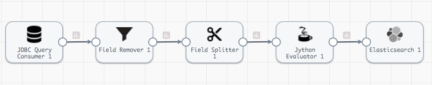
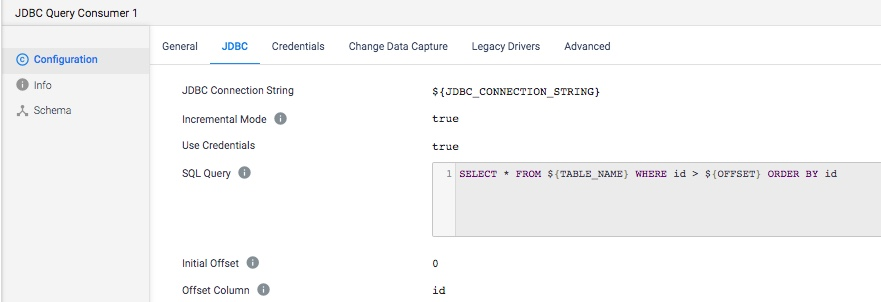
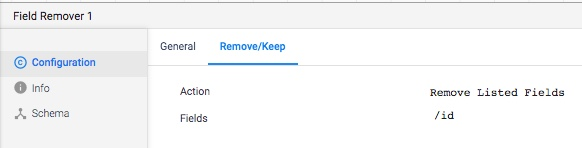
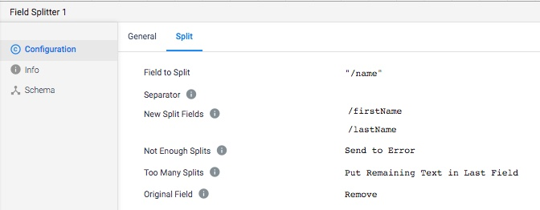
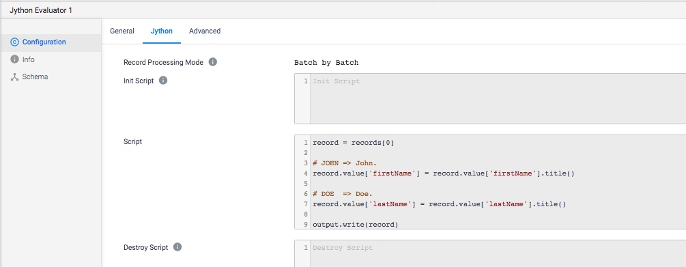
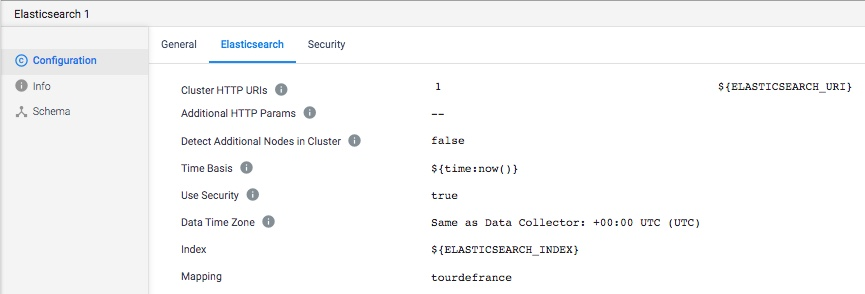
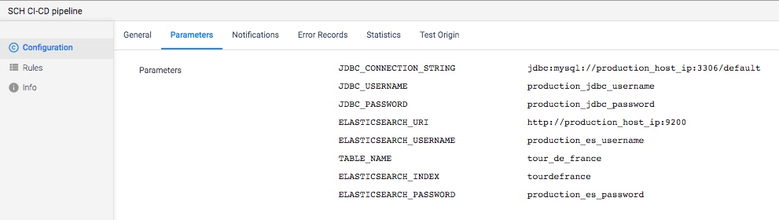
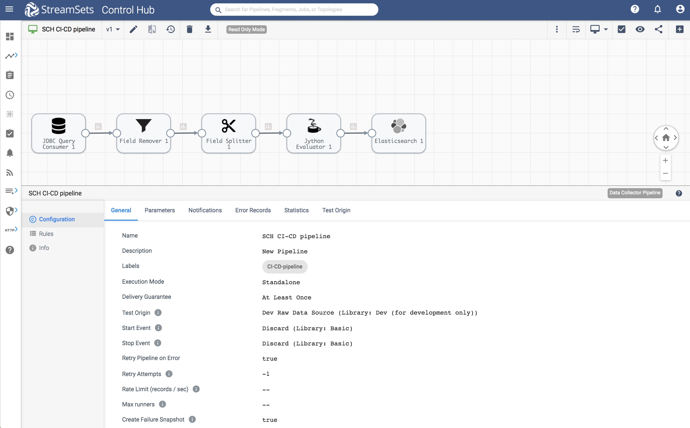
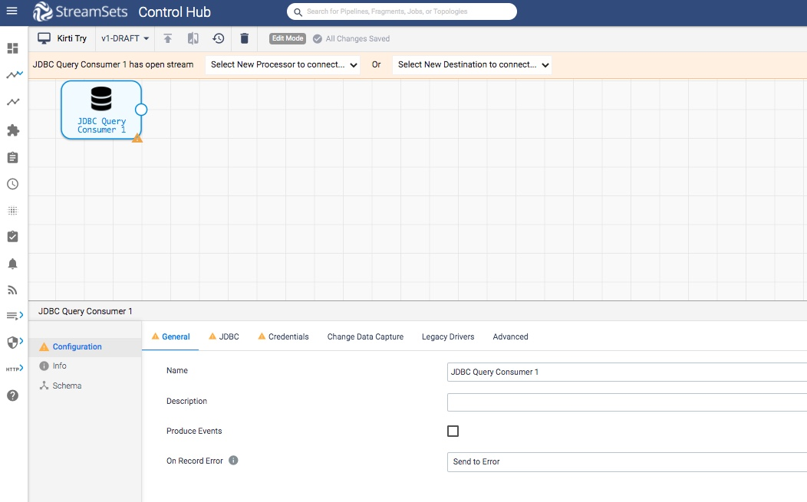

Create CI CD demo Pipeline
==========================

This tutorial covers the steps to create CI CD pipeline as used in the [SCH CI CD demo](https://github.com/dimaspivak/sch_ci_cd_poc). The steps include how to add stages and how to set stage configurations.  Also shows, the use of runtime parameters.

Towards the end, it shows a couple of pointers on
* how to find add_stage parameter for a stage 
* how to find names of stage configurations to use from SDK

### Prerequisites
* [Python 3.4+](https://docs.python.org/3/using/index.html) and pip3 installed
* StreamSets for SDK [Installed and activated](https://streamsets.com/documentation/sdk/latest/installation.html) 
* [Access to StreamSets Control Hub](https://streamsets.com/documentation/controlhub/latest/help/controlhub/UserGuide/OrganizationSecurity/OrgSecurity_Overview.html#concept_q5z_jkl_wy) with an user account in your  organization 
* At least one [StreamSets Data Collector](https://streamsets.com/products/dataops-platform/data-collector/) instance registered with the above StreamSets Control Hub instance
 

**Note**: Make sure that the user account has proper access to do the following tasks this blog post covers. The easiest way for this, is to do those tasks using the Web UI of the StreamSets Control Hub first and fix any access problems before embarking on the path below. 

### Tutorial environment details
While creating this tutorial following was used:
* Python 3.6
* StreamSets for SDK 3.8.0
* All StreamSets Data Collector with version 3.18.1

### Outline
In this tutorial, a pipeline is created with name as `SCH CI CD pipeline`

and with following stages:



This tutorial details on how to create it using SDK for Python.

### Workflow

On a terminal, type the following command to open a Python 3 interpreter.

```bash
$ python3
Python 3.6.6 (v3.6.6:4cf1f54eb7, Jun 26 2018, 19:50:54)
[GCC 4.2.1 Compatible Apple LLVM 6.0 (clang-600.0.57)] on darwin
Type "help", "copyright", "credits" or "license" for more information.
>>>
```

### Step 1 &mdash; Connect to StreamSets Control Hub instance

Let’s assume the StreamSets Control Hub is running at http://sch.streamsets.com 
Create an object called control_hub which is connected to the above. 

```python
from streamsets.sdk import ControlHub

# Replace the argument values according to your setup
control_hub = ControlHub(server_url='http://sch.streamsets.com',
                         username='user@organization1',
                         password='password')
```
 
 ### Step 2 &mdash; Create a pipeline
 
 Here is a sample pipeline created using SDK for Python. For this tutorial purpose, create the pipeline with name as 'SCH CI CD pipeline' and with the following stages: 
 1. Origin Stage = 'JDBC Query Consumer'
 1. First Processor Stage = 'Field Remover'
 1. Second Processor Stage = 'Field Splitter'
 1. Third Processor Stage = 'Jython processor'
 1. Destination Stage = 'Elasticsearch'
 
 Let's get the pipeline builder first.
 
```python
builder = control_hub.get_pipeline_builder()
```

### Step 3 &mdash; Create origin stage
The following code creates the stage 'JDBC Query Consumer' and then sets some of the stage attributes.

Note the use of runtime parameter like ${JDBC_CONNECTION_STRING}. 
These are defined as pipeline parameters later in the tutorial.
```python
jdbc_query_consumer = builder.add_stage('JDBC Query Consumer')
```
Now to find names of stage configurations either of the following works in Python interpreter: For more details refer to the tutorial [Find SDK methods and fields of an object available](../../../find-methods-fields/README.md)
```python
dir(jdbc_query_consumer)
```

```python
help(jdbc_query_consumer)
```
They show the names of stage configurations for the stage. Using them, set some of the configuration values.

```python
jdbc_query_consumer.set_attributes(jdbc_connection_string='${JDBC_CONNECTION_STRING}',
                                   offset_column='id',
                                   password='${JDBC_PASSWORD}',
                                   sql_query='SELECT * FROM ${TABLE_NAME} WHERE id > ${OFFSET} ORDER BY id',
                                   username='${JDBC_USERNAME}')

```
Above is equivalent to the following configurations if one was creating the pipeline from UI. 

Note: The following does not show the `Credentials` tab where username and password are set.
  


### Step 4 &mdash; Create first processor - Field Remover
The following code creates the stage 'Field Remover' and then sets some of the stage attributes.

Note: In this case, there is only one stage configuration to be set. Hence rather than using the method set_attributes, 
one can use the configuration directly as the code below shows.

```python
field_remover = builder.add_stage('Field Remover')

field_remover.fields = ['/id']
```
Above is equivalent to the following configurations if one was creating the pipeline from UI. 
  


### Step 5 &mdash; Create second processor - Field Splitter
The following code creates the stage 'Field Splitter' and then sets some of the stage attributes.

```python
field_splitter = builder.add_stage('Field Splitter')

field_splitter.set_attributes(field_to_split='/name',
                              new_split_fields=["/firstName", "/lastName"])
```
Above is equivalent to the following configurations if one was creating the pipeline from UI. 
  


### Step 6 &mdash; Create third processor - Jython Evaluator
The following code creates the stage 'Jython Evaluator' and then sets some of the stage attributes.

```python
jython_evaluator = builder.add_stage('Jython Evaluator')

jython_evaluator.set_attributes(init_script='',
                                destroy_script='',
                                record_processing_mode='BATCH',
                                script=("record = records[0]\n\n# JOHN => John.\n"
                                        "record.value['firstName'] = record.value['firstName'].title()\n\n"
                                        "# DOE  => Doe.\n"
                                        "record.value['lastName'] = record.value['lastName'].title()\n\n"
                                        "output.write(record)"))
```
Above is equivalent to the following configurations if one was creating the pipeline from UI. 
  


### Step 7 &mdash; Create destination stage - Elasticsearch
The following code creates the stage 'Elasticsearch' and then sets some of the stage attributes.

```python
elastic_search = builder.add_stage('Elasticsearch')

elastic_search.set_attributes(cluster_http_uris=['${ELASTICSEARCH_URI}'],
                              index='${ELASTICSEARCH_INDEX}',
                              mapping='tourdefrance',
                              password='$ELASTICSEARCH_PASSWORD',
                              user_name='$ELASTICSEARCH_USERNAME',
                              use_security=True)
```
Above is equivalent to the following configurations if one was creating the pipeline from UI. 

Note: The following does not show the `Security` tab where user_name and password are set.
  


### Step 8 &mdash; Connect the stages and build the pipeline
```python
# Connect the stages and build the pipeline
jdbc_query_consumer >> field_remover >> field_splitter >> jython_evaluator >> elastic_search

pipeline = builder.build('SCH CI-CD pipeline')
```

### Step 9 &mdash; Add pipeline runtime parameters
The following define [runtime parameters](https://streamsets.com/documentation/controlhub/latest/help/datacollector/UserGuide/Pipeline_Configuration/RuntimeValues.html#concept_rjh_ntz_qr).

Use runtime parameters when you want to define runtime values for a single pipeline.
In the demo case, they help us to use the same runtime_parameters with different values for production vs development.
  
```python
pipeline.parameters  = {'JDBC_CONNECTION_STRING': 'jdbc:mysql://production_host_ip:3306/default',
                        'JDBC_USERNAME': 'production_jdbc_username',
                        'JDBC_PASSWORD': 'production_jdbc_password',
                        'ELASTICSEARCH_URI': 'http://production_host_ip:9200',
                        'ELASTICSEARCH_USERNAME': 'production_es_username',
                        'TABLE_NAME': 'tour_de_france',
                        'ELASTICSEARCH_INDEX': 'tourdefrance',
                        'ELASTICSEARCH_PASSWORD': 'production_es_password',
                        }
```

Above is equivalent to the following configurations if one was creating the pipeline from UI. 



This concludes the actual process of creating the pipeline using SDK for Python.
Following are couple of pointers which are helpful for the process.

### Step 10 &mdash; Add pipeline label and publish the pipeline
Add a [pipeline label](https://streamsets.com/documentation/controlhub/latest/help/controlhub/UserGuide/Pipelines/PipelineLabels.html?hl=pipeline%2Clabel).

A pipeline label identifies similar pipelines or pipeline fragments. Use pipeline labels to easily search and filter pipelines and fragments when viewing them in the pipeline repository.
 
```python
# Add a label
pipeline.add_label('CI-CD-pipeline')
    
control_hub.publish_pipeline(pipeline)
```

After the above code is executed, one can see the pipeline in the UI as following. 
 
 
 
 Now the process of creation of the pipeline is complete. Following are a couple of pointers which help us during the above process.
 * how to find add_stage parameter for a stage
 * how to find names of stage configurations to use from SDK

### How to find out add_stage method parameter
The easiest way to find this out, is using UI.
So create a pipeline in UI with the desired stage and see it's label.

e.g. Let's say we wish to create a pipeline using SDK with JDBC stage.
Now, in a browser, create a pipeline with desired stage and it shows like following:


 
So it shows us Name as `JDBC Query Consumer 1`. 
So now, to achieve the same in SDK, we need to specify `JDBC Query Consumer` (drop the last digit from Name seen in UI)   

```python
# Create a pipeline
builder = control_hub.get_pipeline_builder()
dev_data_generator = builder.add_stage('JDBC Query Consumer')
``` 

### How to find out stage configuration names to use in set_attributes above
Just follow the pointers provided in the tutorial
- [Find SDK methods and fields of an object available](../../../find-methods-fields/README.md) - Object examples can be instances of a pipeline or SCH job or a stage under the pipeline. 

### Follow-up
To get to know more details about SDK for Python, check the [SDK documentation](https://streamsets.com/documentation/sdk/latest/index.html).

If you encounter any problems with this tutorial, please [file an issue in the tutorials project](https://github.com/streamsets/tutorials/issues/new).
  