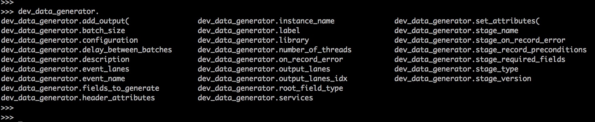
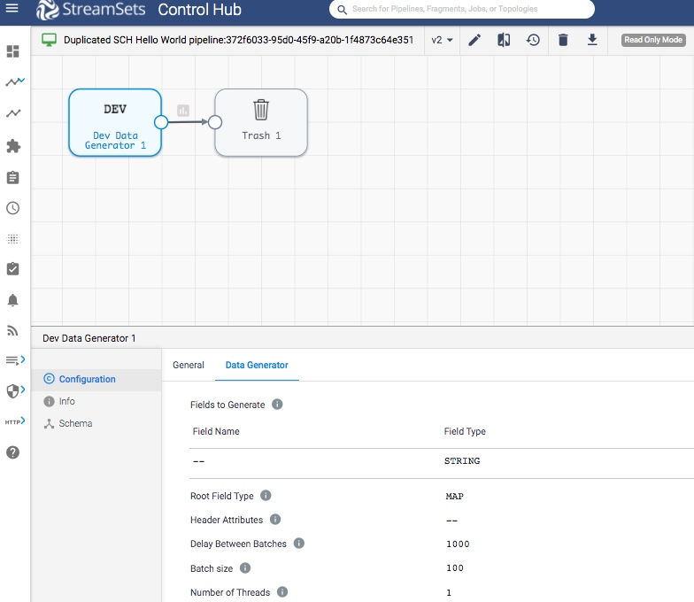

Edit multiple SCH pipelines and their stages   
============================================

This tutorial covers how to edit multiple [StreamSets Control Hub pipelines](https://streamsets.com/documentation/controlhub/latest/help/datacollector/UserGuide/Pipeline_Design/What_isa_Pipeline.html) and the stages under them using [SDK for Python](https://streamsets.com/documentation/sdk/latest/index.html).  
  
A pipeline describes the flow of data from the origin system to destination systems and defines how to transform the data along the way.

When there are many pipelines and stages that need this update, SDK for Python makes it easy to update them **with just a few lines of code**.

### Prerequisites
Make sure to complete [Prerequisites for the pipelines tutorial](../preparation-for-tutorial/README.md). 

### Tutorial environment details
While creating this tutorial following was used:
* Python 3.6
* StreamSets for SDK 3.8.0
* All StreamSets Data Collector with version 3.17.1

### Outline
In [Prerequisites for the pipelines tutorial](../preparation-for-tutorial/README.md), one pipeline was created with name 'SCH Hello World pipeline'. 
This tutorial 
1. duplicates that pipeline to create 3 pipelines 
1. then updates these 3 pipelines by adding a label to each 
1. then for each pipeline updates batch size for appropriate stage
1. shows how to find configurations for a stage 

### Workflow
On a terminal, type the following command to open a Python 3 interpreter.

```bash
$ python3
Python 3.6.6 (v3.6.6:4cf1f54eb7, Jun 26 2018, 19:50:54)
[GCC 4.2.1 Compatible Apple LLVM 6.0 (clang-600.0.57)] on darwin
Type "help", "copyright", "credits" or "license" for more information.
>>>
```

### Step 1 &mdash; Connect to StreamSets Control Hub instance

Let’s assume the StreamSets Control Hub is running at http://sch.streamsets.com 
Create an object called control_hub which is connected to the above. 

```python
from streamsets.sdk import ControlHub

# Replace the argument values according to your setup
control_hub = ControlHub(server_url='http://sch.streamsets.com',
                         username='user@organization1',
                         password='password')
```
 
### Step 2 &mdash; Duplicate the pipeline to create 3 pipelines

```python
sch_pipeline = control_hub.pipelines.get(name='SCH Hello World pipeline')

duplicated_pipelines = control_hub.duplicate_pipeline(sch_pipeline,
                                                      name="Duplicated SCH Hello World pipeline",
                                                      description='Duplication using SDK',
                                                      number_of_copies=3)
```
At this point, on browser, the duplicated pipelines are seen in the following manner:


### Step 3 &mdash; Loop over pipelines to add label to each
[A pipeline label](https://streamsets.com/documentation/controlhub/latest/help/controlhub/UserGuide/Pipelines/PipelineLabels.html?hl=pipeline%2Clabel) 
identifies similar pipelines or pipeline fragments. Use pipeline labels to easily search and filter pipelines and fragments when viewing them in the pipeline repository.

```python
# Loop over duplicated pipelines and add label to each
pipelines = control_hub.pipelines.get_all(filter_text='Duplicated SCH Hello World pipeline')
for pipeline in pipelines:
    pipeline.add_label('From_SDK')
    control_hub.publish_pipeline(pipeline)
```

### Step 4 &mdash; Loop over pipelines and stages under them

Let's explore how can one see the stages under pipelines.

 ```python
for pipeline in pipelines:
    print('pipeline name = ', pipeline.name)
    for stage in pipeline.stages:
        print('stage name = ', stage.stage_name)
    print('-----')
 ```
The above code produces output like following:

```bash
pipeline name =  Duplicated SCH Hello World pipeline1
stage name =  com_streamsets_pipeline_stage_devtest_RandomDataGeneratorSource
stage name =  com_streamsets_pipeline_stage_destination_devnull_NullDTarget
-----
pipeline name =  Duplicated SCH Hello World pipeline2
stage name =  com_streamsets_pipeline_stage_devtest_RandomDataGeneratorSource
stage name =  com_streamsets_pipeline_stage_destination_devnull_NullDTarget
-----
pipeline name =  Duplicated SCH Hello World pipeline3
stage name =  com_streamsets_pipeline_stage_devtest_RandomDataGeneratorSource
stage name =  com_streamsets_pipeline_stage_destination_devnull_NullDTarget
```

### Step 5 &mdash; Find names of stage configurations
SDK documentation has a section with details for this [Configuring stages](https://streamsets.com/documentation/sdk/latest/usage.html#configuring-stages)
 
so e.g.  
```python
sch_pipeline = control_hub.pipelines.get(name='SCH Hello World pipeline')
dev_data_generator = sch_pipeline.stages[0]
```
and then either of the following works in Python interpreter:
```python
dir(dev_data_generator)
``` 

```python
help(dev_data_generator)
``` 

Another way is when one types two times TAB key after `dev_data_generator.`
e.g. here is output with this



### Step 6 &mdash; Loop over stages of pipelines and update some of them

Now we know how to loop over stages from above step. Let's update batch_size for each 'Dev Data Generator' stage which has stage-name='com_streamsets_pipeline_stage_devtest_RandomDataGeneratorSource'. 

```python
# Loop over pipelines and change batch size for each 'Dev Data Generator' stage
pipelines = control_hub.pipelines.get_all(filter_text='Duplicated SCH Hello World pipeline')
for pipeline in pipelines:
    # Update batch size
    for stage in pipeline.stages:
        if stage.stage_name == 'com_streamsets_pipeline_stage_devtest_RandomDataGeneratorSource':
            assert stage.batch_size != 100
            stage.batch_size = 100
            control_hub.publish_pipeline(pipeline)
```

At this point, on browser, one can see the duplicated pipeline with name as 'SCH Hello World pipeline copy':



### Step 7 &mdash; Delete the duplicated pipelines 
Since now done with the duplicated pipelines, let's delete them.

**Note: Be careful** about delete operation as, this can not be undone.
 ```python
# Delete the duplicated pipelines
control_hub.delete_pipelines(duplicated_pipelines)
```

### Follow-up
To get to know more details about SDK for Python, check the [SDK documentation](https://streamsets.com/documentation/sdk/latest/index.html).

If you encounter any problems with this tutorial, please [file an issue in the tutorials project](https://github.com/streamsets/tutorials/issues/new).
 
