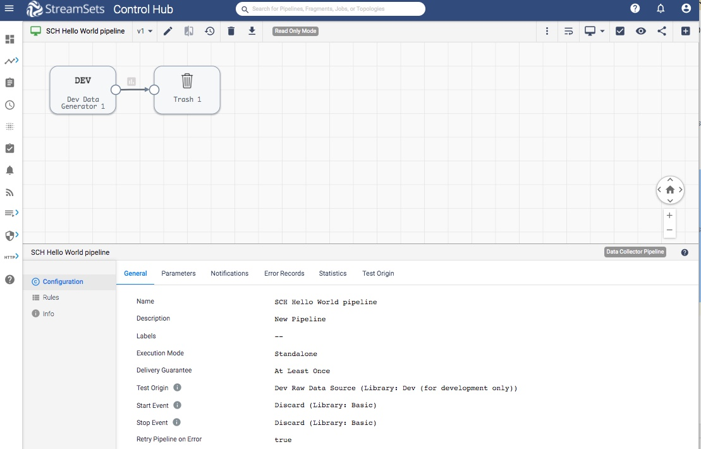

Prerequisites - for SCH Pipelines related tutorials
===================================================

This covers the steps needed to complete before starting on any other [StreamSets Control Hub pipelines](https://streamsets.com/documentation/controlhub/latest/help/datacollector/UserGuide/Pipeline_Design/What_isa_Pipeline.html) related tutorials in this set.  

### Prerequisites
* [Python 3.4+](https://docs.python.org/3/using/index.html) and pip3 installed
* StreamSets for SDK [Installed and activated](https://docs.streamsets.com/sdk/latest/installation.html) 
* [Access to StreamSets Control Hub](https://streamsets.com/documentation/controlhub/latest/help/controlhub/UserGuide/OrganizationSecurity/OrgSecurity_Overview.html#concept_q5z_jkl_wy) with an user account in your  organization 
* At least one [StreamSets Data Collector](https://streamsets.com/products/dataops-platform/data-collector/) instance registered with the above StreamSets Control Hub instance
 

**Note**: Make sure that the user account has proper access to do the following tasks this blog post covers. The easiest way for this, is to do those tasks using the Web UI of the StreamSets Control Hub first and fix any access problems before embarking on the path below. 

### Tutorial environment details
While creating this tutorial following was used:
* Python 3.6
* StreamSets for SDK 3.8.0
* All StreamSets Data Collector with version 3.17.1

### Outline
In this preparation, a pipeline is created with the name as `SCH Hello World pipeline`.

This page details on how to create it using SDK for Python.
Optionally, you can create it using UI in the browser too. Just follow all the details needed for the pipeline.

### Workflow

On a terminal, type the following command to open a Python 3 interpreter.

```bash
$ python3
Python 3.6.6 (v3.6.6:4cf1f54eb7, Jun 26 2018, 19:50:54)
[GCC 4.2.1 Compatible Apple LLVM 6.0 (clang-600.0.57)] on darwin
Type "help", "copyright", "credits" or "license" for more information.
>>>
```

### Step 1 &mdash; Connect to StreamSets Control Hub instance

Let’s assume the StreamSets Control Hub is running at http://sch.streamsets.com 
Create an object called control_hub which is connected to the above. 

```python
from streamsets.sdk import ControlHub

# Replace the argument values according to your setup
control_hub = ControlHub(server_url='http://sch.streamsets.com',
                         username='user@organization1',
                         password='password')
```
 
 ### Step 2 &mdash; Create a pipeline
 Create a pipeline either using UI or using SDK for Python.
 
 Here is a sample pipeline created using SDK for Python. For this tutorial purpose, create the pipeline with 
 1. name as 'SCH Hello World pipeline'
 1. Origin Stage = 'Dev Data Generator'
 1. Destination Stage = 'Trash'
 
```python
# Create a pipeline
builder = control_hub.get_pipeline_builder()
dev_data_generator = builder.add_stage('Dev Data Generator')
trash = builder.add_stage('Trash')

dev_data_generator >> trash  # connect the Dev Data Generator origin to the Trash destination.

pipeline = builder.build('SCH Hello World pipeline')

# Add the pipeline to Control Hub
control_hub.publish_pipeline(pipeline)
```

After the above code is executed, one can see the pipeline in the UI as following. 
 
 
 
 ### How to find out add_stage method parameter
The easiest way to find this out, is using UI.
So create a pipeline in UI with the desired stage and see it's label.

e.g. Let's say we wish to create a pipeline using SDK with JDBC stage.
Now, in a browser, create a pipeline with desired stage and it shows like following:


 
So it shows us Name as `JDBC Query Consumer 1`. 
So now, to achieve the same in SDK, we need to specify `JDBC Query Consumer` (drop the last digit from Name seen in UI)   

```python
# Create a pipeline
builder = control_hub.get_pipeline_builder()
dev_data_generator = builder.add_stage('JDBC Query Consumer')
``` 

### Conclusion
Now with this preparation, you are ready to start on other tutorials in this set.
To get to know more details about SDK for Python, check the [SDK documentation](https://docs.streamsets.com/sdk/latest/index.html).

If you encounter any problems with this tutorial, please [file an issue in the tutorials project](https://github.com/streamsets/tutorials/issues/new).
  