## Part 1 - Basic Log preparation

### Creating a Pipeline
* Open the Data Collector and create a new pipeline.

 #### Defining the source

 * Drag the 'Directory' origin stage into your canvas.

 * Go to the Configuration Settings below and Select the *Files* tab

   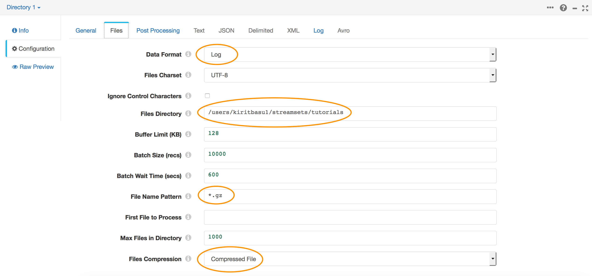

 * Enter the following settings :

   * **Files Directory** - the absolute file path to the directory containing the sample .log.gz files
   * **File Name Pattern** - `*.gz`
   *this will pick up all .gz files in this folder, you can use any wildcard to narrow down your selection*

 * In the *Post Processing* tab make sure **File Post Processing** is set to None.

    *Note: This dropdown also lets you delete source files after they have been processed. You may want to use this in your production systems once you have verified your pipelines are configured correctly.*

    

  * In the **Data Format** Tab, configure the following settings :

    * **Data Format** - Log
    * **Compression Format** - Compressed File
    * **Log Format** - Combined Log Format.

    *Note:The Data Collector already knows the format of the Combined Log Format and a few other log types, and has built in RegEx patterns to decode them. If you are working with custom log formats choose either Regular Expression or Grok Pattern from the dropdown and define your own format.*

    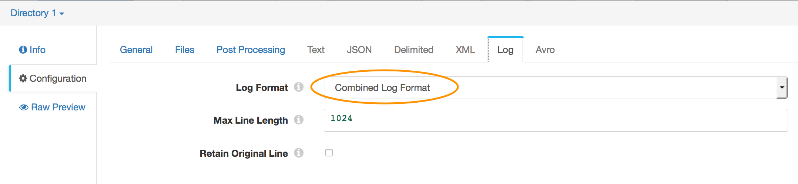

 #### Defining the 'geo' field
 * Drag and drop an 'Expression Evaluator' processor into the canvas.

 * In its Configuration, select the *Expressions* Tab

 * Under Field Expressions add an output field called **/geo** and set the field expression to `${emptyMap()}`.
   *This creates a Map data structure to hold the value of the geo object that we will populate later*

   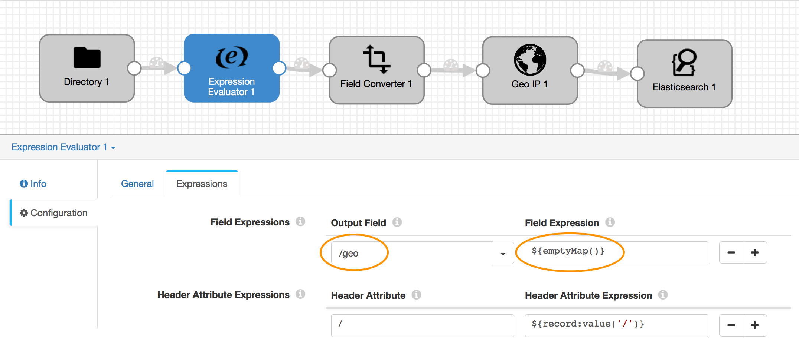

 #### Converting Fields
 By default the Data Collector will read the fields in the log file as string values, this works for most fields however we know that Web Server logs contain numeric values for Response Code, Bytes Transferred and a Date Time stamp. Let's convert these fields into the right data types.

 * Drag and drop a 'Field Type Converter' stage into the pipeline.

 * Go to its Configuration and select the 'Conversions' tab.

   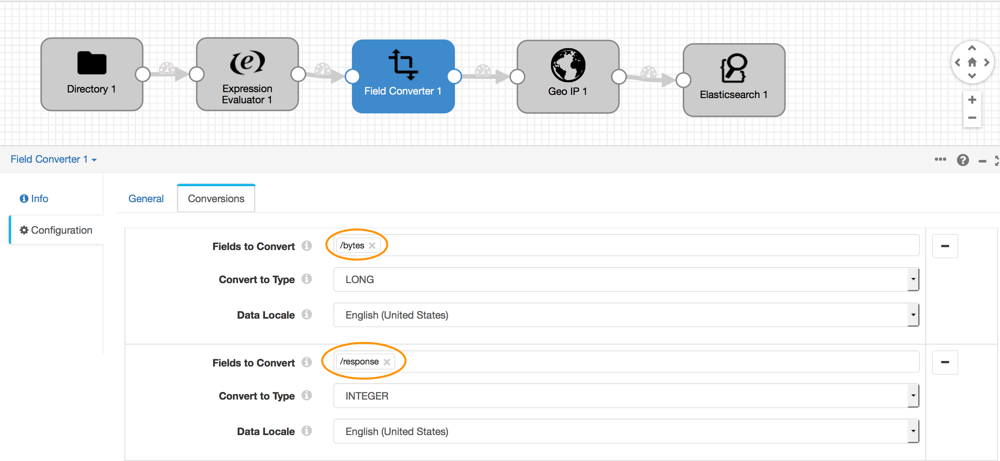

 * In the **Fields to Convert** textbox type `/bytes` and set **Convert to Type** as LONG.

 * Click the `+` button to add another conversion.

 * In the new row, set **Fields to Convert** to `/response` and set **Convert to Type** as INTEGER.

 * Click the `+` button to add another conversion.

 * In the new row, set **Fields to Convert** to `/timestamp` and set **Convert to Type** as DATETIME. Set **Date Format** to Other and in the **Other Date Format** textbox type `dd/MMM/y:H:m:s Z`
 *You can use [Java DateTime format specifiers](https://docs.oracle.com/javase/7/docs/api/java/text/SimpleDateFormat.html) to change the format to suit your needs*

 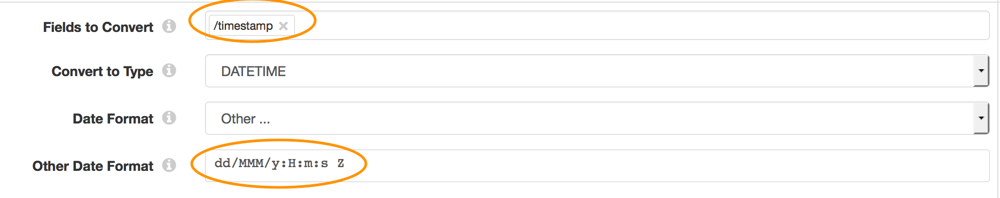

 #### Performing a GeoIP Lookup
 * Download a copy of the MaxMind free [GeoIP2 Lite City Database](http://geolite.maxmind.com/download/geoip/database/GeoLite2-City.mmdb.gz). Move the downloaded file to the StreamSets Resources Folder and unzip it there.

 * Back in the Data Collector, drag and drop the 'GeoIP' Stage into the Canvas

 * Go to its Configuration and select the *Geolocations* tab.

 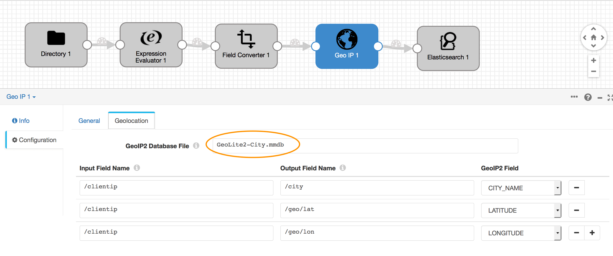

 * In the 'GeoIP2 Database File' textbox type `GeoLite2-City.mmdb`

 * Set 'GeoIP2 Database Type' to 'CITY'

 * Under 'Input Field Name' type `/clientip` and set its corresponding 'Output Field Name' to `/city` and select `CITY_NAME` under 'GeoIP2 Field'.

 * Hit `+` to add another field, set 'Input Field Name' to `/clientip` and set 'Output Field Name' to `/geo/lat` and 'GeoIP2 Field' to `LATITUDE`

 * Hit `+` again to add the last field, set 'Input Field Name' to `/clientip` and set 'Output Field Name' to `/geo/lon` and 'GeoIP2 Field' to `LONGITUDE`

 #### Setting up ElasticSearch

 * Finally let's specify a destination, and drag and drop an 'ElasticSearch' stage to the Canvas.

 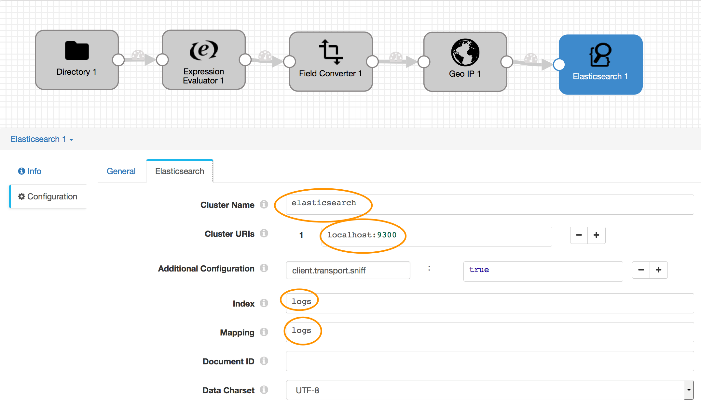

 * Go to the 'ElasticSearch' Tab and in the 'Cluster HTTP URIs' field specify the host:port where your ElasticSearch RESTful API is running.

 * In 'Index' and 'Mapping' textboxes write `logs`. This is the index and mapping we setup earlier in this tutorial.

 * Finally before we do anything with the Pipeline click on any blank spot on the canvas, go to Configuration and the 'Error Records' tab. And under 'Error Records' select 'Discard(Library:Basic)'. This effectively tells the system to discard any erroneous data. In a real production system you can choose to send error records to a number of different systems.

 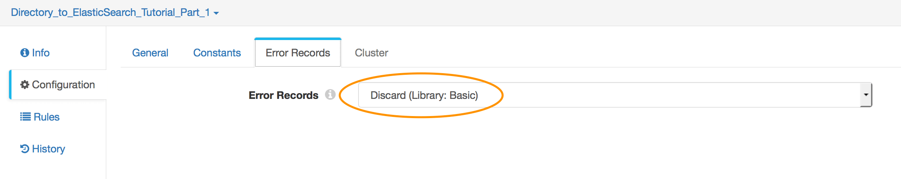

### Preview the pipeline

After you setup the pipeline you can hit the Preview button to examine the flow of a small subset of the data.

The preview mode lets you interactively debug your stage configurations.

#### Lets ship some logs

* Once the pipeline has been setup Hit the 'Start' button to execute the pipeline.

* At this point the system should start reading off the origin directory and sending data into ElasticSearch.

 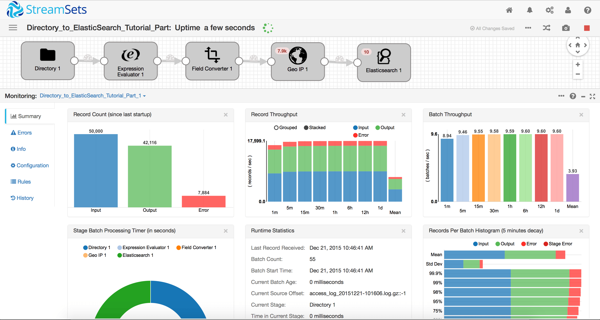

 *Note - the sample access logs contain 'dummy' data with random IP addresses. You will see some errors logged in your pipeline for IP addresses that are not matched in the GeoIP2 database. StreamSets correctly detects and flags these errors for analysis. You can click on the GeoIP processor, drill down into the errors and see exactly what the problem is:*

 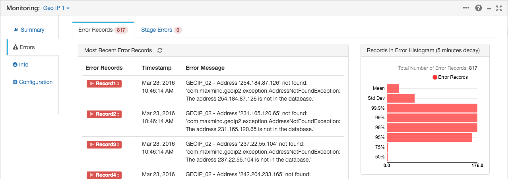

* You can fireup a [Kibana Dashboard](kibana/ApacheWebLog.json) to view the results of the import into ElasticSearch. Note - when you create the Index Pattern in Kibana, do NOT select `timestamp` as the time filter field; you must select 'I don't want to use the Time Filter' for Kibana to correctly visualize the data.

 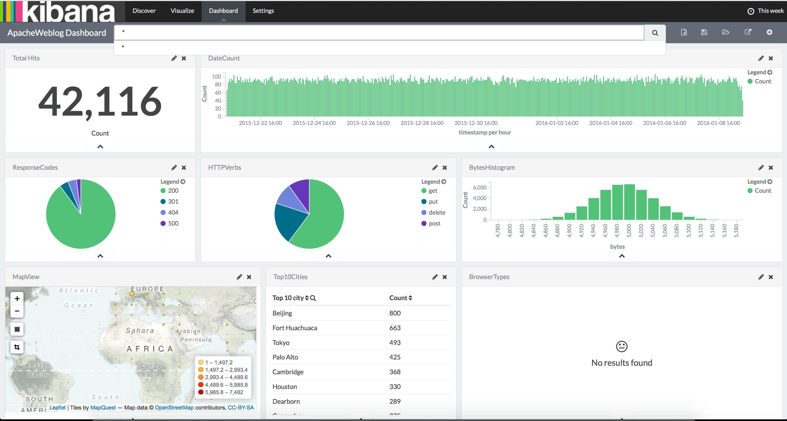

  *Notice that the Browser Type graph doesn't show up in Kibana, we'll take care of that next in Part 2*

  *If you don't see any data in Kibana, check that you created the mappings as mentioned in the [introduction](readme.md)*

## Where to go from here

* In [Part 2](log_shipping_to_elasticsearch_part2.md) of this tutorial we will see how to write custom Python code to enhance our log data. We will also setup Metric Alerts as we prepare the pipeline for production use.
