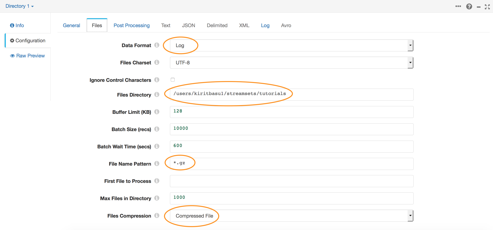
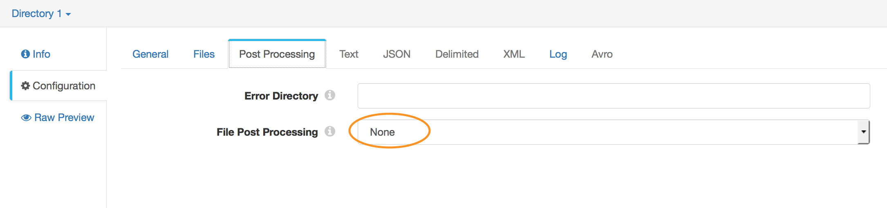
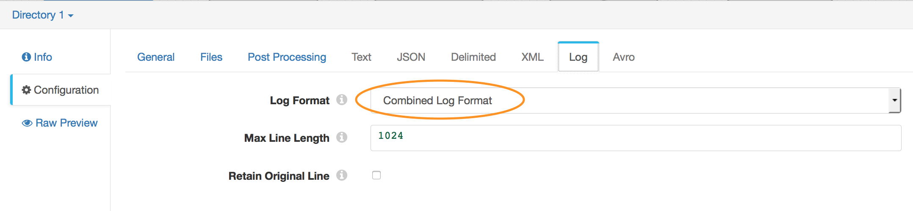
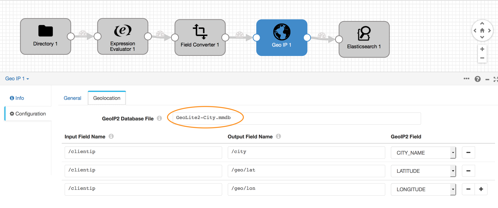

## Part 1 - Basic Log preparation

### Creating a Pipeline
* Open the DataCollector and create a new pipeline.

 #### Defining the source
* Drag the 'Directory' origin stage into your canvas.

* Go to the Configuration Settings below and Select the *Files* tab

* Enter the following settings :

  * **Data Format** - Log
  * **Files Directory** - the absolute file path to the directory containing the sample .log.gz files
  * **File Name Pattern** - `*.gz`
  *this will pick up all .gz files in this folder, you can use any wildcard to narrow down your selection*
  * **Files Compression** - Compressed File

* In the *Post Processing* tab make sure **File Post Processing** is set to None. *This dropdown also lets you delete source files after they have been processed. You may want to use this in your production systems once you have verified your pipelines are configured correctly.*

* In the **Log** Tab set the **Log Format** option to Combined Log Format.

   #### Defining the 'geo' field
* Drag and drop an 'Expression Evaluator' processor into the canvas.

* In its Configuration, select *Expressions*

* Under Field Expressions add an output field called **/geo** and set the field expression to `${emptyMap()}`
*This is basically creating a Map data structure to hold the value of the *geo* object we will populate later*

    #### Converting Fields
 By default the Data Collector will read the fields in the log file as string values, this works for most fields however we know that Web Server logs contain numeric Response codes, Bytes transferred and a Date Time stamp. We will now convert these into data types that we can later use in ElasticSearch.

 * Drag and drop a 'Field Converter' stage into the pipeline.

 * Go to its Configuration and select the 'Conversions' tab.

 * In the **Fields to Convert** textbox type `/bytes` and set **Convert to Type** as LONG.

 * Click the `+` button to add another conversion.

 * In the new row, set **Fields to Convert** to `/response` and set **Convert to Type** as INTEGER.

 * Click the `+` button to add another conversion.

 * In the new row, set **Fields to Convert** to `/timestamp` and set **Convert to Type** as DATETIME. Set **Date Format** to Other and in the **Other Date Format** textbox type `dd/MMM/y:H:m:s Z`
 *You can use [Java DateTime format specifiers](https://docs.oracle.com/javase/7/docs/api/java/text/SimpleDateFormat.html) to change the format to suit your needs*

  #### Performing a GeoIP Lookup
  * Download a copy of the MaxMind free [GeoIP2 Lite City Database](http://geolite.maxmind.com/download/geoip/database/GeoLite2-City.mmdb.gz). Move the downloaded file to the StreamSets Resources Folder and unzip it there.

  * Back in the Data Collector, drag and drop the 'GeoIP' Stage into the Canvas

  * Go to its Configuration and select the *Geolocations* tab.

  * In the 'GeoIP2 Database File' textbox type 'GeoLite2-City.mmdb'

  * Under 'Input Field Name' type `/clientip` and set its corresponding 'Output Field Name' to `/city` and select `CITY_NAME` under 'GeoIP2 Field'.

  * Hit `+` to add another field, set 'Input Field Name' to `/clientip` and set 'Output Field Name' to `/lat` and 'GeoIP2 Field' to `LATITUDE`

  * Hit `+` again to add the last field, set 'Input Field Name' to `/clientip` and set 'Output Field Name' to `/lon` and 'GeoIP2 Field' to `LONGITUDE`

  #### Setting up ElasticSearch

  * Finally lets specify a destination, drag and Drop a 'ElasticSearch' stage to the Canvas.

  * Go to its Configuration and select the 'General' Tab. In the drop down for 'Stage Library' select `ElasticSearch 1.7.1`

  * Go to the 'ElasticSearch' Tab and in the 'Cluster Name' textbox enter the name of your cluster as specified in elasticsearch.yml

  * In the 'Cluster URI' field specify the host:port where your ElasticSearch service is running

  * In 'Index' and 'Mapping' textboxes write `logs`. This is the index and mapping we setup earlier in this tutorial.

* Finally before we do anything with the Pipeline click on any blank spot on the canvas, go to Configuration and the 'Error Records' tab. And under 'Error Records' select 'Discard(Library:Basic)'. This effectively tells the system to discard any erroneous data.
In a real production system you can choose to send error records to a number of different systems.

    #### Lets ship some logs
  * Once the pipeline has been setup Hit the 'Start' button to execute the pipeline.

  * At this point the system should start reading off the origin directory and sending data into ElasticSearch.
  

## Where to go from here
* In [Part 2](log_shipping_to_elastic_part2.md) of this tutorial we will see how to write custom Python code to enhance our log data.
* In [Part 3](log_shipping_to_elastic_part3.md) we will setup Metric Alerts and Data Rules as we prepare the pipeline for production use.
