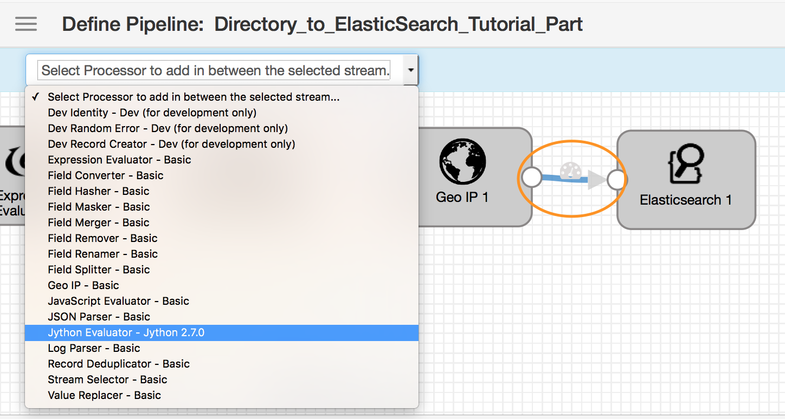
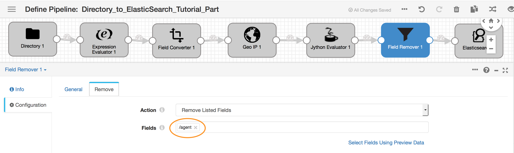
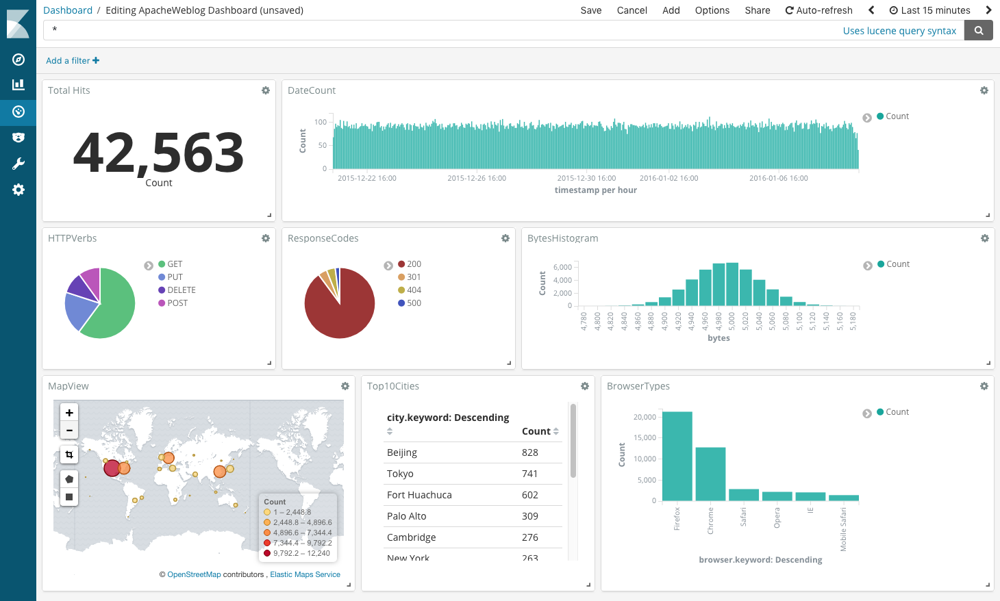
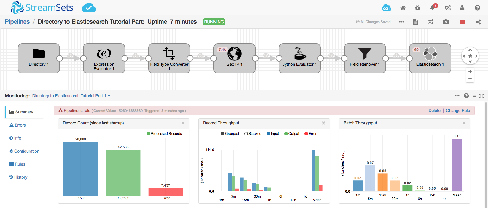

## Part 2 - Enhancing Log Data

Now that we've examined the basics of how use Data Collector, let's see how to clean up and/or decorate the log data before posting it into Elasticsearch. We'll also look at some nifty features (metric alerts and data rules) within Data Collector that set up alerts for when the pipeline needs attention.

### Before We Begin
* Clean up Elasticsearch - *delete any previous test data by running the following command.*

```bash
$ curl -XDELETE 'http://localhost:9200/logs'
```

* Recreate the Elasticsearch index:

```bash
$ curl -X PUT -H "Content-Type: application/json" 'http://localhost:9200/logs' -d '{
  "mappings": {
    "logs" : {
      "properties" : {
        "timestamp": {
          "type": "date"
        },
        "geo": {
          "type": "geo_point"
        }
      }
    }
  }
}'
```

### Add a Jython Evaluator
The log files contain a User Agent string that contains a lot of information about the browser. For the sake of this exercise we want to parse the UA string and only extract the name of the browser. Let's use the Python [user-agents](https://pypi.python.org/pypi/user-agents/0.2.0) package for this.
* Install user-agents to your computer.
```python
pip install pyyaml ua-parser user-agents
```

* In your existing pipeline, click the connector between the GeoIP and Elasticsearch processors and select Jython Evaluator from the Add Processor list.
  * If the help bar doesn't display, you can turn it on: Click the Help icon in the upper right corner > Settings, clear the Hide Pipeline Creation Help Bar option.
  * If the Jython Evaluator does not appear in the list, then you will need to [install it](https://streamsets.com/documentation/datacollector/latest/help/index.html#datacollector/UserGuide/Installation/AddtionalStageLibs.html#concept_fb2_qmn_bz).


* Replace the existing code in the Jython Evaluator's **Script** box with the following code snippet :

```python

import sys
sys.path.append('/Library/Python/2.7/site-packages')
from user_agents import parse

for record in records:
  try:
    user_agent = parse(record.value['agent'])
    record.value['browser'] = user_agent.browser.family
    # Write record to processor output
    output.write(record)

  except Exception as e:
    # Send record to error
    error.write(record, str(e))
```

This piece of Python code parses the User Agent field denoted by ```record.value['agent']``` and uses the user_agent parser to figure out the browser family.

*Note: The location of your pip packages may differ from this example, use*

```python
>>> import site; site.getsitepackages()
```

*to find the location on your computer.*

### Removing fields with the Field Remover
Now that we've identified the browser, we don't have any use for the user-agent string in our dataset. Let's remove that field and save space on our Elasticsearch index.

* Add a Field Remover processor to the pipeline.

* In its configuration properties, click the *Remove* tab.



* In the Fields property, select the `/agent` field, and set Action to "Remove Listed Fields". You can add additional fields to remove fields you don't need.

### Setting up for production
At this point, you can hit Start and get data flowing into Elasticsearch. However for long running pipelines, you may want to configure a few alerts to let you know when the status of the pipeline changes.

#### Setting up metric alerts
  Metric alerts are a powerful mechanism for notifying users when the pipeline needs attention. To configure these alerts, click on a blank spot on the canvas and go to the *Rules* tab.
  

  For this exercise let's pick from a preconfigured alert.
  Let's say we know that we are expecting a steady flow of data from our web server logs, and if we go two minutes without receiving any data, something might be wrong upstream and an operator will need to look into it.

  * Click Edit for the Pipeline is Idle alert and set the value to

  ```${time:now() - value() > 120000}```

  where 120000 is the number of milliseconds.

  * Enable the **Active** checkbox for the Pipeline is Idle alert.

  * Data Collector triggers alerts on the Data Collector console, and if you select the Send Email option, sends an alert email to addresses specified in the Email IDs tab.

#### Reprocess the Data

* You can hit Preview to see and debug a subset of the data flowing through the pipeline. Or reset the origin, then hit Run to start the pipeline and get data flowing into Elasticsearch.

* Refresh the Dashboard in Kibana and you will see the Browser Type graph correctly rendered:

  

* Leave the pipeline for a couple of minutes, and, since there is no new data being processed, you will see the Pipeline is Idle alert:

  

## Where to go from here

* [Explore the full set of StreamSets tutorials](https://streamsets.com/tutorials/).