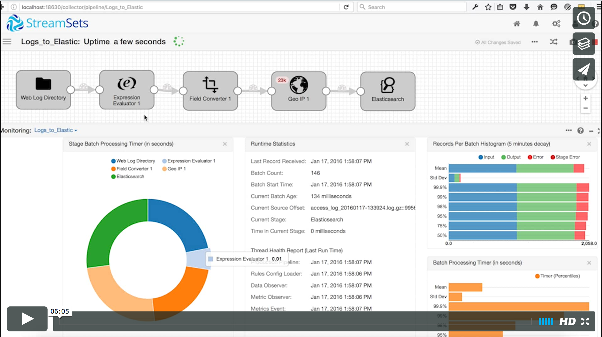

# Log Shipping into Elasticsearch

In this two part tutorial, we will learn how to read Apache web server logs and send them to Elasticsearch. Along the way we will transform the data and set up alerts and data rules to let us know if any bad data is encountered. And finally, we'll learn how to adapt the pipeline when data suddenly changes.

Data Collector can read from and write to a large number of origins and destinations, but for this tutorial we will limit our scope to a Directory origin and Elasticsearch destination.

[](https://vimeo.com/152097120 "Log shipping into Elasticsearch")

## Goals
The goal of this tutorial is to gather Apache log files and send them to Elasticsearch.

## Pre-requisites
* A working instance of StreamSets Data Collector.
* Access to Elasticsearch and Kibana.
* A copy of this tutorials directory containing the [sample data](../sample_data) and [pipeline](pipelines/Directory_to_Elasticsearch_Tutorial_Part_1.json).
* A copy of the MaxMind GeoLite2 free IP geolocation database. *Either get and unzip the binary file or use the csv file* [GeoLite2 City](https://dev.maxmind.com/geoip/geoip2/geolite2/).

## Our Setup
The tutorial's [sample data directory](../sample_data) contains a set of Apache web server log files. Data Collector can read many file formats, but for this example we will use compressed logs (.log.gz) that simulate a system that generates log rotated files.

The log files contain standard Apache Combined Log Format Data.

` host rfc931 username date:time request statuscode bytes referrer user_agent `

*If you'd like to generate a larger volume of log files, you can use the [Fake Apache Log Generator](http://github.com/kiritbasu/Fake-Apache-Log-Generator) script*.

### Setting up an index on Elasticsearch
We will need to setup an index with the right mapping before we can use [Elasticsearch](https://www.elastic.co/guide/en/elasticsearch/reference/current/setup.html), here's how:

```bash
$ curl -X PUT -H "Content-Type: application/json" 'http://localhost:9200/logs' -d '{
  "mappings": {
    "logs" : {
      "properties" : {
        "timestamp": {
          "type": "date"
        },
        "geo": {
          "type": "geo_point"
        }
      }
    }
  }
}'
```
This piece of code creates an index called "logs" and defines a few field types:

* `timestamp` - this is a date field
* `geo` - this is a geo_point field that has lat/lon attributes

*You can use the [Kibana Dev Tools Console](https://www.elastic.co/guide/en/kibana/current/console-kibana.html) or the [Postman API Tool](http://www.getpostman.com/) to interact with Elasticsearch via API*.

### Installing StreamSets
* Download and install the latest [StreamSets Data Collector](https://streamsets.com/opensource) binaries.

## Let's Get Started
* [Part 1 - Basic Log Preparation](log_shipping_to_elasticsearch_part1.md)
* [Part 2 - Enhancing Log Data & Preparing for Production](log_shipping_to_elasticsearch_part2.md)
