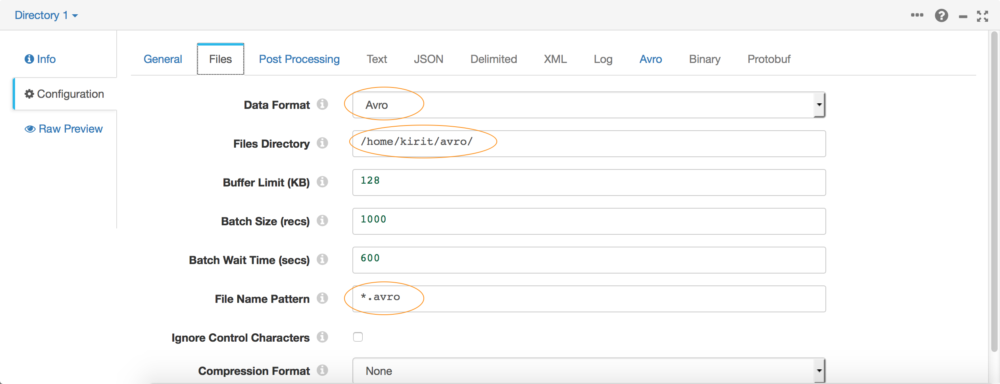
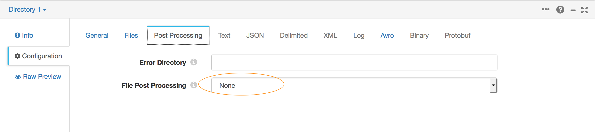
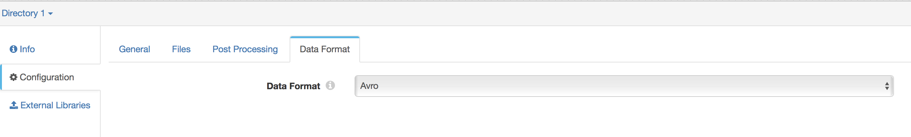
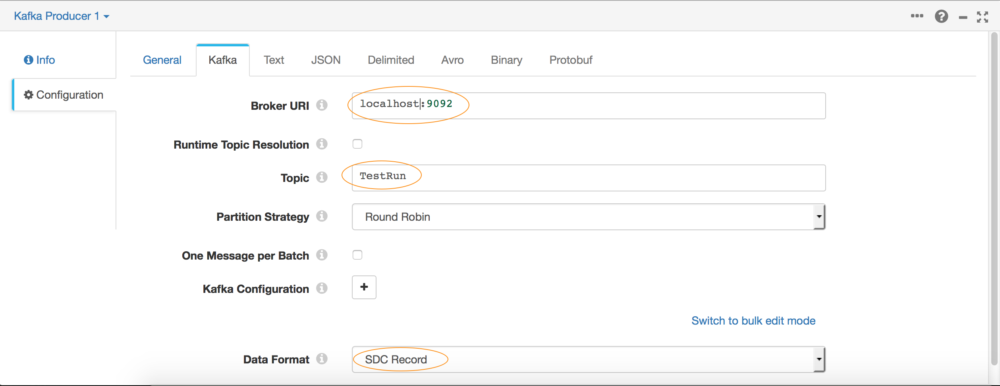
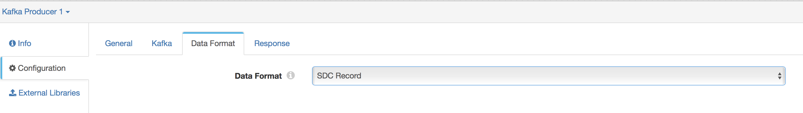

## Part 1 - Publishing to a Kafka Producer

### Creating a Pipeline
* Launch the Data Collector console and create a new pipeline.

#### Defining the Source
* Drag the Directory origin stage into your canvas.

* In the Configuration settings below, select the *Files* tab.

* Enter the following settings:

 * **Files Directory** - The absolute file path to the directory containing the sample .avro files.
 * **File Name Pattern** - `cc*` - 
 *The ccdata file in the samples directory is a bzip2 compressed Avro file. Data Collector will automatically detect and decrypt it on the fly.*

* In the *Post Processing* tab make sure **File Post Processing** is set to None.

*Note: This property also lets you delete source files after they have been processed. You may want to use this in your production systems once you have verified your pipelines are configured correctly.*

* In the *Data Format* select **Avro**.

#### Defining the Kafka Producer
* Drag a Kafka Producer destination to the canvas.

* In the Configuration settings, click the General tab. For Stage Library, select the version of Kafka that matches your environment.

* Go to the Kafka tab and set the Broker URI property to point to your Kafka broker e.g.`<hostname/ip>:<port>`. Set Topic to the name of your Kafka topic.

You can use the Kafka Configuration section of this tab to enter any specific Kafka settings you want to use. In a future tutorial we'll see how to configure TLS, SASL or Kerberos with Kafka.

* On Data Format tab select SDC Record

*SDC Record is the internal data format that is highly optimized for use within StreamSets Data Collector (SDC). Since we are going to be using another Data Collector pipeline to read from this Kafka topic we can use SDC Record to optimize performance. If you have a custom Kafka Consumer on the other side you may want to use one of the other data formats and decode it accordingly.*

You may choose to transform data using any of the Data Collector processor stages before you write it to Kafka, however for this tutorial we will do the transformations on the other end.

That's it! Your pipeline is now ready to feed messages into Kafka.

#### Preview the Data
* Feel free to hit the Preview icon to examine the data before executing the pipeline.

#### Execute the Pipeline
* Hit the Start icon. If your Kafka server is up and running, the pipeline should start sending data to Kafka.

#### What's Next?
* Part 2 - [Reading with a Kafka Consumer](kafkaconsumer_to_multipledestinations.md)
