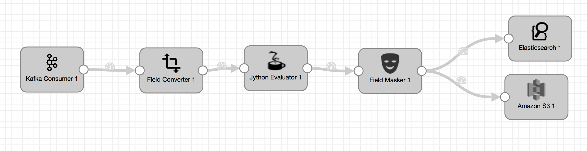
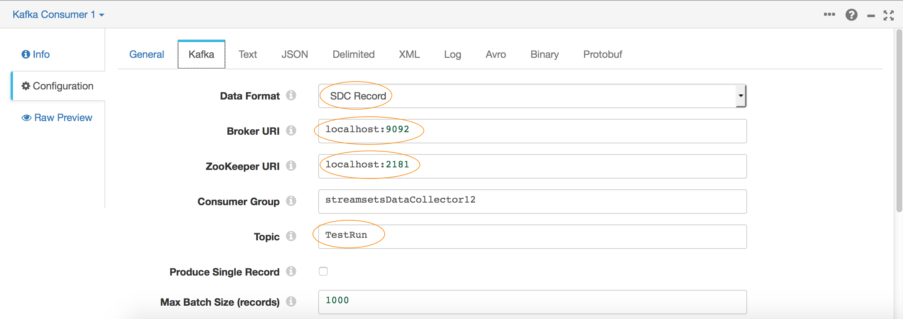
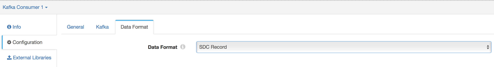
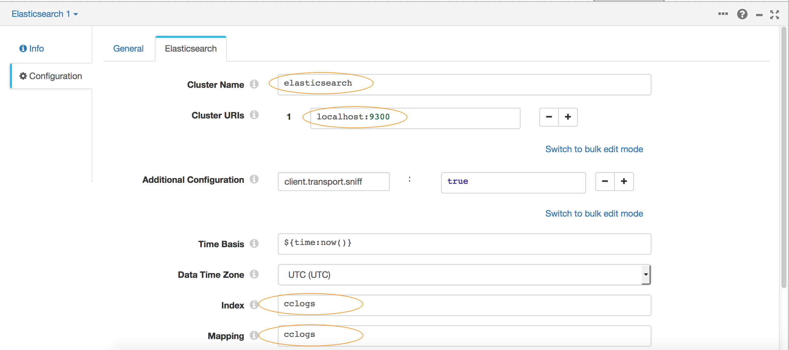
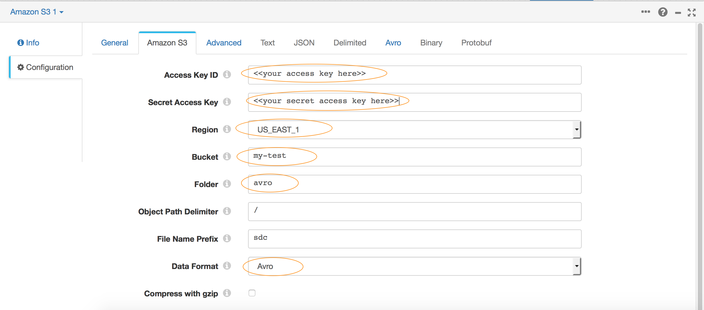
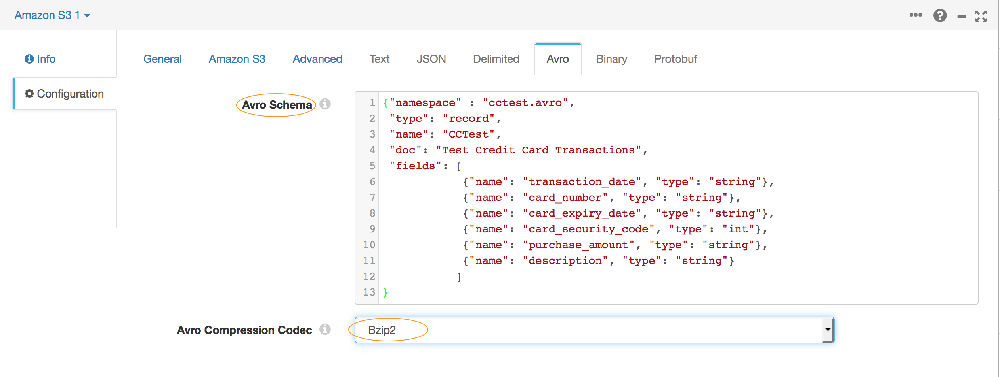

## Part 2 - Reading from a Kafka Consumer

In this part of the tutorial we will setup a pipeline that drains data from a Kafka Consumer, makes a couple of transformations and writes to multiple destinations.



You may remember the data we are reading simulates credit card information and contains the card number :
```json
{
  "transaction_date":"dd/mm/YYYY",
  "card_number":"0000-0000-0000-0000",
  "card_expiry_date":"mm/YYYY",
  "card_security_code":"0000",
  "purchase_amount":"$00.00",
  "description":"transaction description of the purchase"
}
```
We don't want to store credit card information in any of our data stores so this is a perfect opportunity to sanitize the data before it gets there. We'll use a few built in transformation stages to mask the card numbers so what makes it through are just the last 4 digits.

#### Defining the source
* Drag the 'Kafka Consumer' origin stage into your canvas.

* Go to the 'General' Tab in its configuration and select the version of Kafka that matches your environment in the 'Stage Library' dropdown.

* On 'Kafka' tab set the Broker URI, Zookeeper URI and topic name to match the settings in your environment.



* On 'Data Format' tab select SDC Record. (You may remember from Part 1 of this tutorial we sent data through Kafka in this format, so we want to make sure we decode the incoming data appropriately.)


#### Field Converter
* It so happens that the card number field is defined as an integer in Avro. We will want to convert this to a string value. So type '/card_number' in the 'Fields to Convert' text box and set it to type String in 'Convert to Type'. Leave the rest to default values.


#### Jython Evaluator
* In this stage we'll use a small piece of python code to look at the first few digits of the card number and figure out what type of card it is. We'll add that card type to a new field called 'credit_card_type'.

Go to the 'Jython' tab of the Jython Evaluator and enter the following piece of code.

```python

for record in records:
  try:
    cc = record.value['card_number']
    if cc == '':
      error.write(record, "Credit Card Number was null")
      continue

    cc_type = ''
    if cc.startswith('4'):
      cc_type = 'Visa'
    elif cc.startswith(('51','52','53','54','55')):
      cc_type = 'MasterCard'
    elif cc.startswith(('34','37')):
      cc_type = 'AMEX'
    elif cc.startswith(('300','301','302','303','304','305','36','38')):
      cc_type = 'Diners Club'
    elif cc.startswith(('6011','65')):
      cc_type = 'Discover'
    elif cc.startswith(('2131','1800','35')):
      cc_type = 'JCB'
    else:
      cc_type = 'Other'

    record.value['credit_card_type'] = cc_type
    output.write(record)

  except Exception as e:
    # Send record to error
    error.write(record, str(e))

```

#### Field Masker
* The last step of the process is to mask the card number so that the last 4 digits of the card is all that makes it to the data stores.


* In the 'Field Masker' stage configuration type '/card_number', set the mask type to custom. In this mode you can use '#' to show characters and any other character to use as a mask. e.g. a mask to show the last 4 digits of a credit card number :

 '0123 4567 8911 0123' would be

 '---- ---- ---- ####' will change the value to

 '---- ---- ---- 0123'

#### Destinations
In this particular example we will write the results to 2 destinations: Elasticsearch and an Amazon S3 bucket.

##### Setting up ElasticSearch

* Drag and Drop a 'ElasticSearch' stage to the Canvas.

* Go to its Configuration and select the 'General' Tab. In the drop down for 'Stage Library' select the version of ElasticSearch you are running.

* Go to the 'ElasticSearch' Tab and in the 'Cluster URI' field specify the host:port where your ElasticSearch service is running

* In 'Index' and 'Mapping' textboxes specify the name of your index and mapping.



##### Writing to an Amazon S3 bucket
A common usecase is to backup data to S3, in this example we'll convert the data back to Avro format and store it there.

* Drag and drop the 'Amazon S3' stage to the canvas.

* In its configuration enter in your 'Access Key ID' and 'Secret Access Key', select the 'Region' and enter the 'Bucket' name you want to store the files in.



* On 'Data Format' select 'Avro' and 'In Pipeline Configuration' for Avro Schema Location. Then specify the following schema for Avro Schema:

```json
{"namespace" : "cctest.avro",
 "type": "record",
 "name": "CCTest",
 "doc": "Test Credit Card Transactions",
 "fields": [
            {"name": "transaction_date", "type": "string"},
            {"name": "card_number", "type": "string"},
            {"name": "card_expiry_date", "type": "string"},
            {"name": "card_security_code", "type": "string"},
            {"name": "purchase_amount", "type": "string"},
            {"name": "description", "type": "string"}
           ]
}
```

* To save space on the S3 bucket lets compress the data as its written. Select BZip2 as the Avro Compression Codec.



#### Execute the Pipeline
* Hit Run and the pipeline should start draining Kafka messages and writing them to Elastic and Amazon S3.
