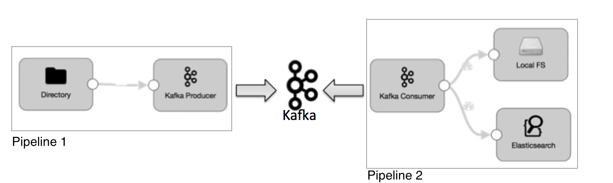
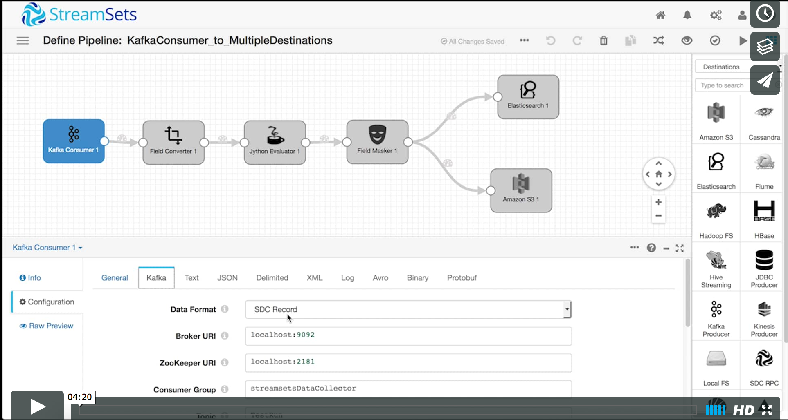
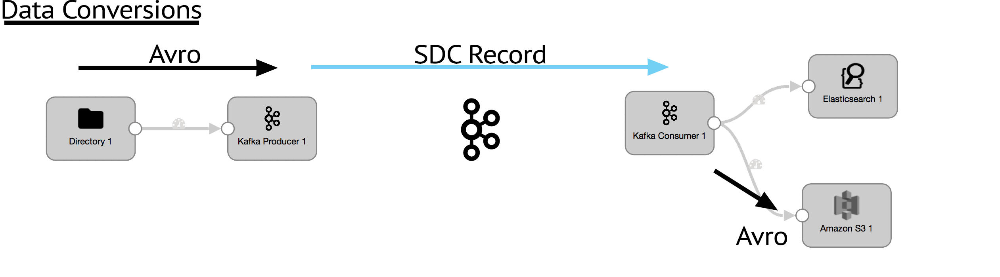

# Simple Kafka Enablement using StreamSets Data Collector

Creating custom Kafka producers and consumers is often a tedious process that requires manual coding. In this tutorial, we'll see how to use StreamSets Data Collector to create data ingest pipelines to write to Kafka using a Kafka Producer, and read from Kafka with a Kafka Consumer with no handwritten code.



[](https://vimeo.com/153061876 "Simple Kafka Enablement")

## Goals
The goal of this tutorial is read Avro files from a file system directory and write them to a Kafka topic using the StreamSets Kafka Producer. We'll then use a second pipeline configured with a Kafka Consumer to drain that topic, perform a set of transformations and send the data to two different destinations.

## Prerequisites
* A working instance of StreamSets Data Collector
* A working Kafka instance (see the [Quickstart](http://kafka.apache.org/quickstart) for easy local setup. Last tested on version 1.1.0 but older and newer versions should work too.)
* A copy of this tutorials directory containing the [sample data](../sample_data)

## Our Setup
The tutorial [sample data directory](../sample_data) contains a set of compressed Avro files that contain simulated credit card transactions in the following JSON format:

```json
{
  "transaction_date":"dd/mm/YYYY",
  "card_number":"0000-0000-0000-0000",
  "card_expiry_date":"mm/YYYY",
  "card_security_code":"0000",
  "purchase_amount":"$00.00",
  "description":"transaction description of the purchase"
}
```
## Data Conversions
We will read Avro files from our source directory and write to Kafka using the Data Collector SDC Record data format. Then use another pipeline to read the SDC Record data from Kafka and write it to Elasticsearch and convert data to Avro for S3.




## Let's Get Started
* Part 1 - [Publishing to a Kafka Producer](directory_to_kafkaproducer.md)
* Part 2 - [Reading from a Kafka Consumer](kafkaconsumer_to_multipledestinations.md)
