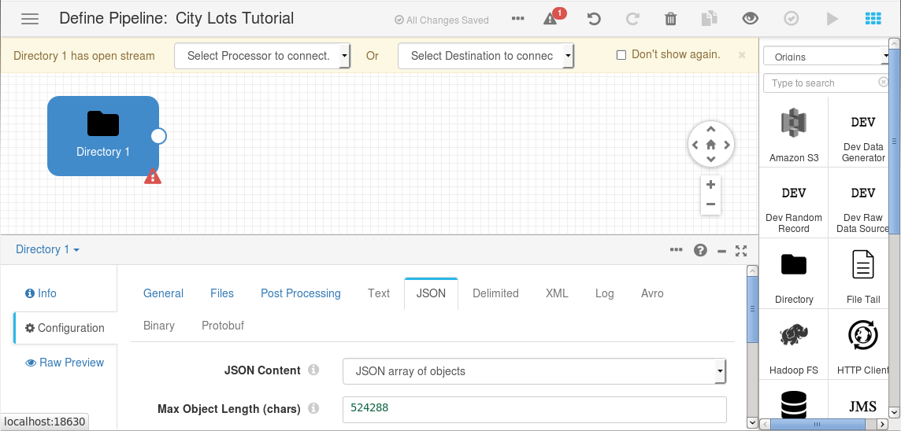
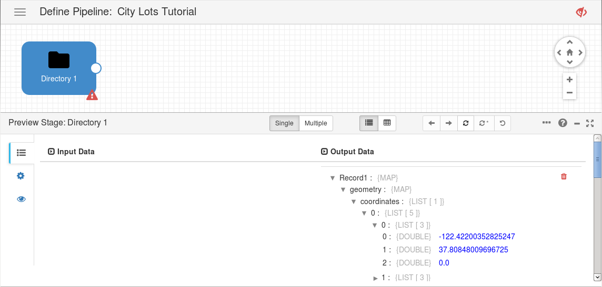
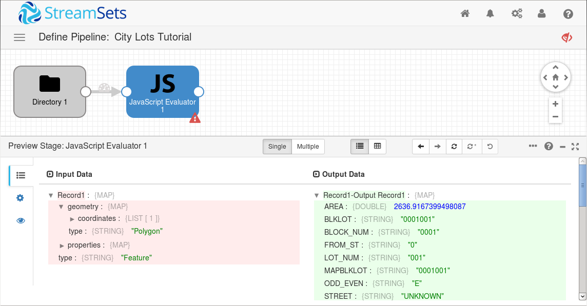
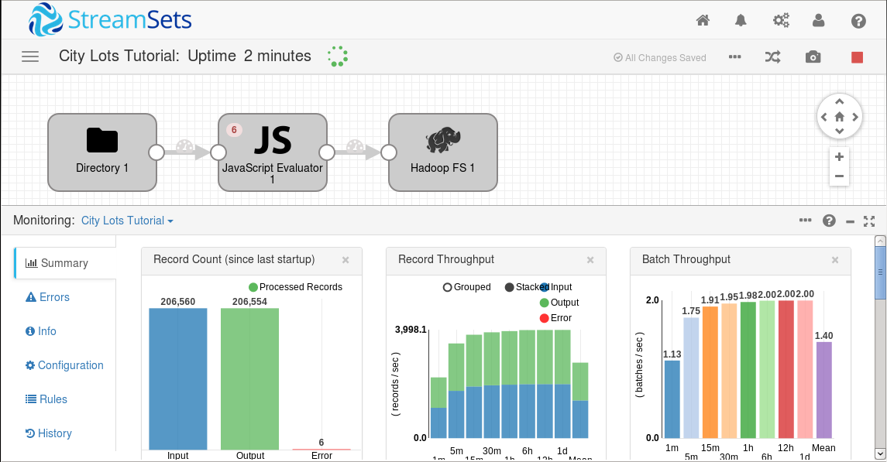
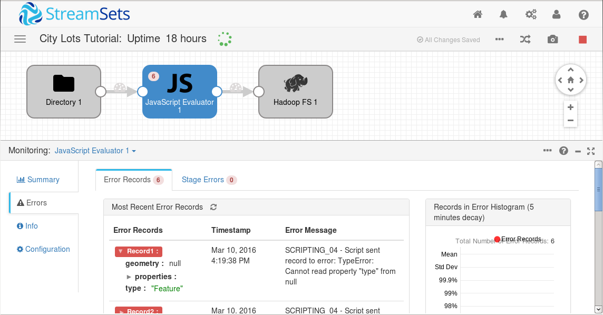
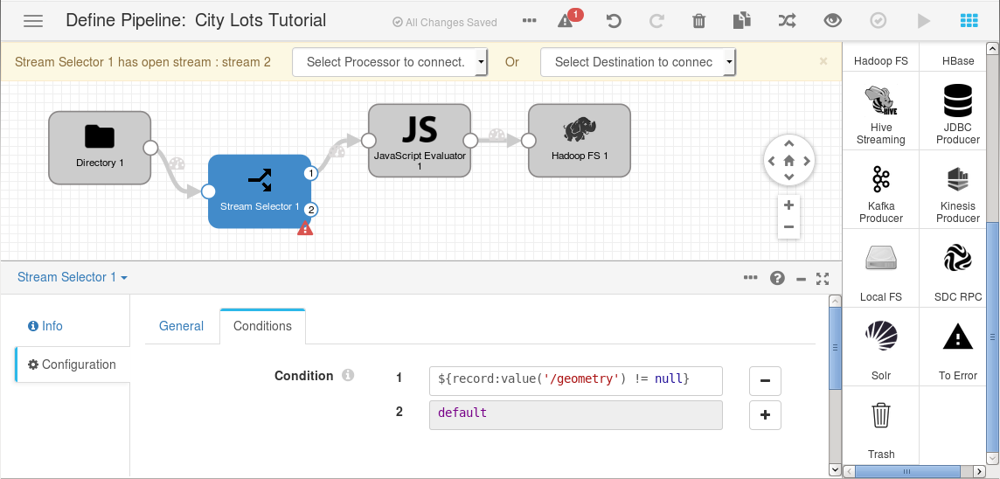
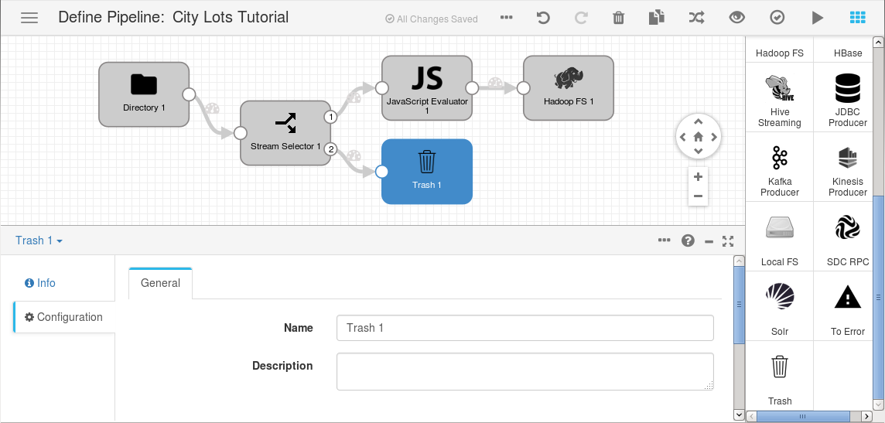
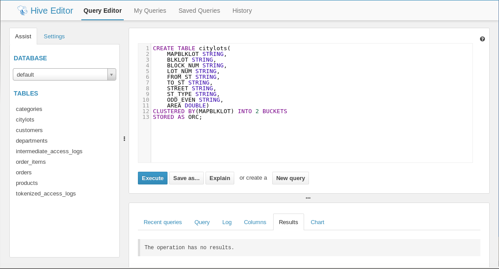
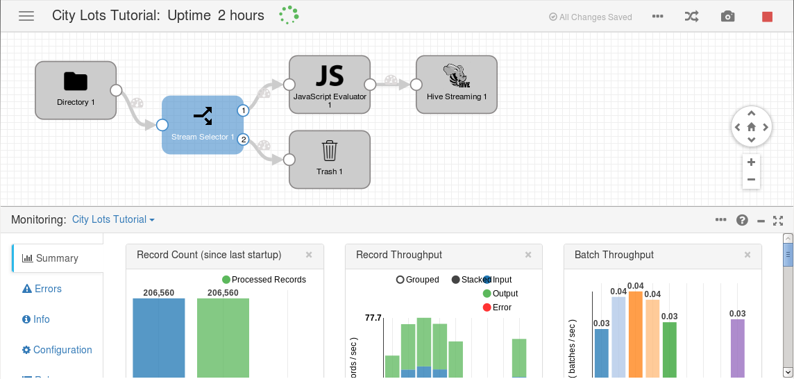
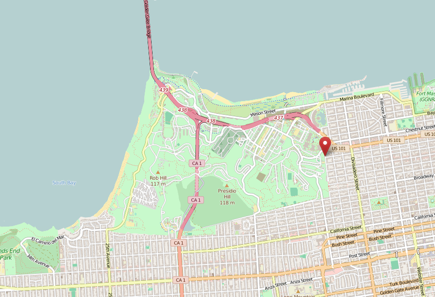

What’s the Biggest Lot in the City of San Francisco?
====================================================

Ingesting and Processing JSON Data at Scale
-------------------------------------------

In this tutorial you’ll learn how to create a [StreamSets Data Collector](https://streamsets.com/product/) (SDC) pipeline to ingest hundreds of thousands of JSON objects, processing each one via JavaScript code and writing the results to [Apache Hive](https://hive.apache.org/).

### Introduction

[SF OpenData](https://data.sfgov.org/), the City and County of San Francisco’s official open data portal, makes hundreds of city datasets available for use by developers, analysts, residents, and more. [One of those datasets](https://data.sfgov.org/Geographic-Locations-and-Boundaries/City-Lots-Zipped-Shapefile-Format-/3vyz-qy9p) contains the polygon coordinates for every single lot in the city - a total of 206560 records, in [shapefile format](https://en.wikipedia.org/wiki/Shapefile).

Happily, [Mirco Zeiss](https://twitter.com/zemirco), a consultant at [CGI](http://www.cgi.com/en) in Germany, converted the shapefile data to JSON and [pushed it to a GitHub project](https://github.com/zemirco/sf-city-lots-json), since he ‘needed a really big .json file for testing various code’. We can use SDC to read the JSON data, calculate the area of each lot in a JavaScript evaluator, and write the resulting records to Hive for analysis. Specifically, we are looking to answer the question, "What’s the Biggest Lot in the City of San Francisco?"

### Prerequisites

You will need the following:

* Hadoop - I used the QuickStart VM for [Cloudera Distribution Hadoop (CDH) 5.5](http://www.cloudera.com/downloads/quickstart_vms/5-5.html), but other versions and distributions will likely work just as well. I highly recommend working through the CDH Quickstart Tutorial if you no prior experience with Hadoop.

* [StreamSets Data Collector](https://streamsets.com/product/) - this tutorial assumes you have installed StreamSets into the Cloudera QuickStart VM, alongside CDH. See [this blog entry](https://streamsets.com/blog/getting-started-streamsets-data-collector/) for a handy guide to getting started. Again, I **highly recommend** working through [the tutorial](https://streamsets.com/documentation/datacollector/latest/help/#Tutorial/Tutorial-title.html) to get a feel for SDC.

* Common development tools such as git

### Download the Source JSON Data

The first step is to download the source JSON data from GitHub. Simply clone the project:

    git clone https://github.com/zemirco/sf-city-lots-json.git

The citylots.json file is big - 181MB - containing over 200,000 JSON objects, each representing a single city lot. Here are the first few lines of the file, formatted for readability:

    {
      "type": "FeatureCollection",
      "features": [
        {
          "type": "Feature",
          "properties": {
            "BLKLOT": "0001001",
            "BLOCK_NUM": "0001",
            "FROM_ST": "0",
            "LOT_NUM": "001",
            "MAPBLKLOT": "0001001",
            "ODD_EVEN": "E",
            "STREET": "UNKNOWN",
            "ST_TYPE": null,
            "TO_ST": "0"
          },
          "geometry": {
            "type": "Polygon",
            "coordinates": [
              [
                [-122.42200352825247, 37.80848009696725, 0.0],
                [-122.42207601332528, 37.808835019815085, 0.0],
                [-122.42110217434863, 37.808803534992904, 0.0],
                [-122.42106256906727, 37.80860105681815, 0.0],
                [-122.42200352825247, 37.80848009696725, 0.0]
              ]
            ]
          }
        },
        {
          "type": "Feature",
          "properties": {
            "BLKLOT": "0002001",
            "BLOCK_NUM": "0002",
            "FROM_ST": "0",
            "LOT_NUM": "001",
            "MAPBLKLOT": "0002001",
            "ODD_EVEN": "E",
            "STREET": "UNKNOWN",
            "ST_TYPE": null,
            "TO_ST": "0"
          },
          "geometry": {
            "type": "Polygon",
            "coordinates": [
              [
                [-122.42082593937107, 37.80863147414603, 0.0],
                [-122.4208580496797, 37.80879564136959, 0.0],
                [-122.4198119587043, 37.80876180971401, 0.0],
                [-122.42082593937107, 37.80863147414603, 0.0]
              ]
            ]
          }
        },
        ...

The entire file is a single JSON object, which contains an array of lot objects in its features property.

We’ll use the SDC Directory Origin to read in the JSON data. Since the Directory Origin can accept either a series of JSON objects, or a JSON array of objects, we’ll need to pre-process the data a little. Fortunately, this is a simple matter of deleting everything before the first opening square bracket ‘[‘ at the top of the file, and everything after the last closing square bracket ‘]’ at the end of the file. You will need to use an editor capable of handling very large files. I used vim. Save the file as `citylots-array.json`.

### Create a Pipeline

Now the source data is in the correct format, you can get to work with SDC.

1. If you haven’t run through the [StreamSets tutorial](https://streamsets.com/documentation/datacollector/latest/help/#Tutorial/Tutorial-title.html), you will need to create directories to hold origin, destination, and error files, under the StreamSets base directory:

  * `/<base directory>/tutorial/origin`
  * `/<base directory>/tutorial/destination`
  * `/<base directory>/tutorial/error`

2. Move the `citylots-array.json` file to `/<base directory>/tutorial/origin`

3. If you aren't already logged in, log in to SDC.

4. From the **Home** page or **Getting Started** page, click **Create New Pipeline**.

5. In the **New Pipeline** window, enter a pipeline name and optional description, and click **Save**.

6. In the Properties panel, click the **Error Records** tab; for the **Error Records** property, select **Write to File**.
This writes error records to a file so you can deal with error records without having to stop the pipeline.

7. Click the **Error Records - Write to File** tab and set **Directory** to `/<base directory>/tutorial/error`

### Configure the Origin

We’ll use the Directory origin to process the JSON city lot data.

1. To add the stage to the canvas, from the Pipeline Creation Help Bar, click **Select Origin > Directory**. Or, in the stage library, click the **Directory** origin.
The origin displays in the canvas and the Properties panel displays the properties for the stage.

2. In the Properties panel, click the **Files** tab and configure the following properties.
Use the defaults for properties that aren't listed:

  | Directory Property | Value |
  | --- | --- |
  | Data Format | **JSON**  |
  | Files Directory | `/<base directory>/tutorial/origin` |
  | Buffer Limit (KB) | The individual JSON objects can contain many coordinates, so you will need to set the buffer limit to `512`. |
  | File Name Pattern | `citylots-array.json` |

3. Click the **JSON** tab and configure the following properties.
Use the defaults for properties that aren't listed:

  | JSON Property | Value |
  | --- | --- |
  | JSON Content  | **JSON array of objects** |
  | Max Object Length (chars) | `524288` (this is 512KB, the same as the buffer limit) |

Your pipeline should look like this:

### Preview Data

It’s a good idea to preview the data to verify that you have configured the Directory Origin correctly. Above the pipeline canvas, click the **Preview** icon, and accept the default properties. You should be able to drill down into the first few records of **Output Data** below the pipeline canvas and see the coordinates of the city lot’s polygon:

If you encounter any errors, check the properties for the pipeline and origin.

Now that we have verified that the Directory Origin is reading JSON data correctly, click the **Close Preview** icon.

### Configure a JavaScript Evaluator

Now that our pipeline is successfully reading in JSON data, we need to calculate the area of each city lot. I used a version of the algorithm for calculating the area of a polygon on the surface of the earth provided in [an answer on the Geographic Information Systems StackExchange](http://gis.stackexchange.com/a/816) by [Tim Schaub](https://twitter.com/tschaub).

1. Add a **JavaScript Evaluator** processor to the canvas and connect the first output location of the Directory Origin to it.

2. With the JavaScript Evaluator selected, in the Properties panel, click the **JavaScript** tab.

3. Delete the existing contents of the **Script** text box and paste in the following script:

        function degreesToRadians(input) {
          return input * Math.PI / 180;
        }

        for(var i = 0; i < records.length; i++) {
          try {
            // Normalize the input data so that polygons look like multipolygons
            var polygons = (records[i].value.geometry.type === 'Polygon')
                ? [records[i].value.geometry.coordinates]
                : records[i].value.geometry.coordinates;

            // Area calculation code based on Tim Schaub's answer at 
            // http://gis.stackexchange.com/a/816
            var area = 0.0;

            for (var j=0; j < polygons.length; j++) {
                var coordinates = polygons[j][0];
                if (coordinates.length > 2) {
                    var p1, p2;
                    for (var k = 0; k < coordinates.length - 1; k++) {
                        p1 = coordinates[k];
                        p2 = coordinates[k+1];
                        area += degreesToRadians(p2[0] - p1[0]) *
                            (2 + Math.sin(degreesToRadians(p1[1])) +
                            Math.sin(degreesToRadians(p2[1])));
                    }
                }

            }

            // Use the flat properties - lose the coordinates etc
            records[i].value = records[i].value.properties;
            records[i].value.AREA = area * 6378137.0 * 6378137.0 / 2.0;

            // Write record to processor output
            output.write(records[i]);
          } catch (e) {
            // Send record to error
            error.write(records[i], e);
          }
        }

Preview the pipeline again, click the JavaScript Evaluator, and you should see that output records now have an AREA field:

Notice that the script only copies the properties field from the input to output record and sets area. This ‘flattens’ the record and makes it easy to write to an Apache Hive table.

Click the **Close Preview** icon, and we’ll add a destination for our processed records.

### Configure a Hadoop FS Destination

We could go right ahead and configure a Hive Streaming destination, but writing to Hive is much, much slower than simply appending data to a file on disk, so we’ll test the pipeline on the entire dataset by simply writing it to a JSON file. This will give us some confidence that the pipeline is correct before we invest time in running it against Hive.

1. Add a **Hadoop FS** destination to the canvas and connect the JavaScript Evaluator to it.

2. In the Properties panel, click the **Hadoop FS** tab. To use Hadoop FS to write to a local file system, configure the following properties.
Use the defaults for properties that aren't listed:

  | Hadoop FS Property | Value |
  | --- | --- |
  | Hadoop FS URI | `file:///` |

3. Click the **Output Files** tab and configure the following properties.
Use the defaults for properties that aren't listed:

  | Hadoop FS Property | Value |
  | --- | --- |
  | Data Format | **JSON** |
  | Directory Template | `/<base directory>/tutorial/destination` |

### Run the Pipeline

Now that the basic pipeline is complete, you can start it by clicking the **Start** icon.

The console enters Monitor mode and shows summary statistics in the Monitor panel. It will take a couple of minutes for SDC to work through the records.

When all 206,560 records have been ingested, notice that the JavaScript Evaluator has detected 6 errors:

Click on the **JavaScript Evaluator** in the pipeline canvas and then the **Errors** tab on the left. You’ll see that the six errors are all *SCRIPTING_04 - Script sent record to error: TypeError: Cannot read property "type" from null*. Drill into the first error and you’ll see why - the geometry field for this record is null.

If you work through the other five listed records, you’ll see that they all have null geometry. It turns out that a handful of plots have no recorded coordinates. Let’s filter them out so that the JavaScript Evaluator can operate successfully on its input.

### Route Data with the Stream Selector

We’ll configure a Stream Selector to route only those records with a non-null geometry field to the JavaScript Evaluator.

1. From the Pipeline Creation Help Bar, click **Select Processor to Connect > Stream Selector**. Or, in the stage library, select the **Stream Selector** processor and connect the Directory origin to it.

2. Click the **Conditions** tab.
A condition for the default stream displays. The default stream represents any records not captured by other conditions.

3. Click the **Add** icon.
A condition text box displays in the Property panel, and the corresponding output location appears on the stage in the canvas.

4. The following condition captures records where the geometry field is non-null. You can copy and paste the expression, but try typing it in to see how the expression completion feature helps you select the function and ensure valid syntax.

        ${record:value('/geometry') != null}

All records that match this condition pass to the first output stream. All other records are captured by the default condition and passed through the second output stream.

The Stream Selector should look like this:

### Discard Unwanted Records

In our scenario, we have no use for records with no associated geometry, so we’ll just discard them. SDC includes a Trash destination that meets our needs perfectly. Simply add a **Trash** destination to the canvas and connect the Stream Selector’s default output (marked ‘2’) to it.

### Rerun the Pipeline

If you try running the pipeline now, you’ll notice that it doesn’t actually process any records. Why is this? Well, the pipeline has already processed all the files in its input directory, so it’s waiting for new input. Since we’re still developing our pipeline, we need to be able to reset its state so it can process the same input data again.

Stop the pipeline if it is running, click the **More** icon above the pipeline canvas, then click **Reset Origin**. You will be prompted to confirm that you really do want to reset the origin, so click **OK**.

Now click the **Run** icon. The pipeline will reprocess the origin data and, after a couple of minutes you should see that all 206,560 records have been successfully processed, with no errors:

Click the **Stop** icon to stop the pipeline.

### Create a Hive Table

Now that we have seen that our pipeline is functioning correctly, we need to switch the Hadoop FS destination out for a destination that will allow queries. We’ll create a new table in Hive to receive our output records. The SDC Hive Streaming destination supports the [ORC](https://orc.apache.org/) (Optimized Row Columnar) file format, so we’ll need to specify that in our data definition language (DDL) code.

Assuming you are using Cloudera Distribution Hadoop (CDH) QuickStart VM:

1. Open a new browser tab, and go to `http://quickstart.cloudera:8888/beeswax/`

2. Paste the following DDL code into the query area:

        CREATE TABLE citylots(
          MAPBLKLOT STRING,
          BLKLOT STRING,
          BLOCK_NUM STRING,
          LOT_NUM STRING,
          FROM_ST STRING,
          TO_ST STRING,
          STREET STRING,
          ST_TYPE STRING,
          ODD_EVEN STRING,
          AREA DOUBLE)
        CLUSTERED BY(MAPBLKLOT) INTO 256 BUCKETS
        STORED AS ORC;

3. Click **Execute**.

Hive should create the table in just a few seconds, and the screen will look like this:

### Configure a Hive Streaming Destination

Hive is ready for our output records; let’s configure the Hive Streaming destination:

1. On the pipeline canvas, click the **Hadoop FS** destination and then click the **Delete** icon.

2. Add a **Hive Streaming** destination to the canvas and connect the JavaScript Evaluator to it.

3. In the Properties panel, click the **General** tab. Configure the following properties.
Use the defaults for properties that aren't listed:

  | Hive Streaming Property | Value |
  | --- | --- |
  | Stage Library | Set according to the version of Hive that you are using; for example, **CDH 5.5** |

4. Click the **Hive** tab. Configure the following properties.
Use the defaults for properties that aren't listed:

  | Hive Property | Value |
  | --- | --- |
  | Hive Metastore Thrift URL | If you installed StreamSets alongside the CDH VM, this will be `thrift://localhost:9083` |
  | Table | `citylots` |
  | Hive Configuration Directory | If you installed StreamSets alongside the CDH VM, this will be `/etc/impala/conf` |

### Run the Pipeline, Sending Records to Hive

Stop the pipeline if it is running, click the **More** icon above the pipeline canvas, then click **Reset Origin**. You will be prompted to confirm that you really do want to reset the origin, so click **OK**.

Now click the **Run** icon. Again, the pipeline will reprocess the origin data and, after about a couple of hours you should see that all 206,560 records have been successfully processed, with no errors:

### So, What *Is* The Biggest Lot in the City of San Francisco?

Now we can run a query in Hive! Let’s get the ten biggest lots. Paste the following query into the Hive query area and click **Execute**:

    SELECT * FROM citylots ORDER BY AREA DESC LIMIT 10;

After a couple of minutes, you should see this result:

Here are the results in a more readable form:

| mapblklot | blklot | block_num | lot_num | from_st | to_st | street | st_type | odd_even | area |
| --- | --- | --- | --- | --- | --- | --- | --- | --- | --- |
| 1300001 | 1300001 | 1300 | 1 | 2901 | 2901 | LYON | ST | O | 6104089 |
| 1700001 | 1700001 | 1700 | 1 | 1101 | 1199 | 09TH | AVE | O | 4149480 |
| 4591A079 | 4591A079 | 4591A | 79 | 520 | 520 | SPEAR | AVE | E | 2893706 |
| 7283004 | 7283004 | 7283 | 4 | 991 | 991 | LAKE MERCED | BLVD | O | 2480004 |
| 1939001 | 1939001 | 1939 | 1 | 300 | 600 | CALIFORNIA | AVE | E | 1684637 |
| 6220002 | 6220002 | 6220 | 2 | 61 | 61 | JOHN F SHELLEY | DR | O | 1351541 |
| 4502A002 | 4502A002 | 4502A | 2 | 3305 | 3305 | 03RD | ST | O | 696521 |
| 900003 | 900003 | 900 | 3 | 3751 | 3751 | LAGUNA | ST | O | 657407 |
| 1939002 | 1939002 | 1939 | 2 | 0 | 0 | UNKNOWN | NULL | E | 620400 |
| 7284001 | 7284001 | 7284 | 1 | 599 | 599 | SKYLINE | BLVD | O | 462228 |

So, at 6,104,089 m2, or 2.36 square miles, **2901 Lyon St** is the biggest lot in San Francisco. What could be at that address? Let’s take a look:

[Map data © OpenStreetMap contributors](https://www.openstreetmap.org/copyright)

It’s the [Presidio](https://en.wikipedia.org/wiki/Presidio_of_San_Francisco)! For the purposes of the City of San Francisco, the Presidio is one giant lot.

### Conclusion

In this tutorial you’ve learned:

* How to ingest JSON data via the Directory origin

* How to implement a non-trivial calculation in a JavaScript evaluator

* How to use the Hadoop FS destination for rapid development of your pipeline

* How to discard records that do not meet desired criteria

* How to write records to Apache Hive

And, finally, you’ve learned that the Presidio is the biggest city lot in San Francisco!

