# Creating a CRUD Microservice Pipeline

StreamSets Data Collector version 3.4.0 introduced microservice pipelines - a new type of dataflow pipeline for implementing RESTful web services natively in Data Collector. Microservice pipelines use a REST Service origin, similar to the HTTP Server origin, to listen for JSON-formatted requests. Where the HTTP Server origin was limited in the response it could return to the HTTP client, the REST Service origin works with the new Send Response to Origin destination to allow you to control the HTTP response code and payload.

This tutorial explains how to create a simple microservice pipeline, implementing create, read, update and delete (CRUD) operations against a MySQL database. Some pre-existing knowledge of Data Collector, MySQL, and RESTful web services is assumed. You should complete the [basic Data Collector tutorial](https://streamsets.com/documentation/datacollector/latest/help/#Tutorial/Overview.html) if you have not already done so.

## Prerequisites

* [StreamSets Data Collector 3.4.0 or higher](https://streamsets.com/opensource/)
* A relational database. This tutorial uses [MySQL](https://www.mysql.com/) as the source database. You should be able to use any database accessible via a JDBC driver, though you may need to tweak the SQL statements used to create a table and insert data.

You must configure SDC to use your database's JDBC driver. See the [documentation on installing external libraries](https://streamsets.com/documentation/datacollector/latest/help/index.html#datacollector/UserGuide/Configuration/ExternalLibs.html#concept_pdv_qlw_ft). Note in particular for MySQL that you must use the version of the JDBC driver corresponding to your MySQL server. We have seen problems using a version 8 driver with the version 5.x database.

## Creating a Microservice Pipeline

From the Data Collector home page, click the 'Create New Pipeline' button. Enter a pipeline name and ensure that 'Microservice Pipeline' is selected:

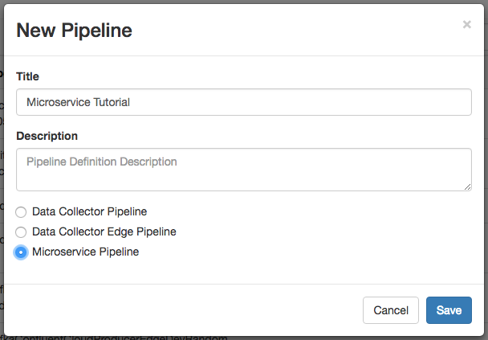

If you do not see the 'Microservice Pipeline' option, check your Data Collector version - you need version 3.4.0 or higher.

The pipeline is initialized with a template containing the REST Service origin, a Stream Selector, some Expression Evaluators and some Send Response to Origin destinations:

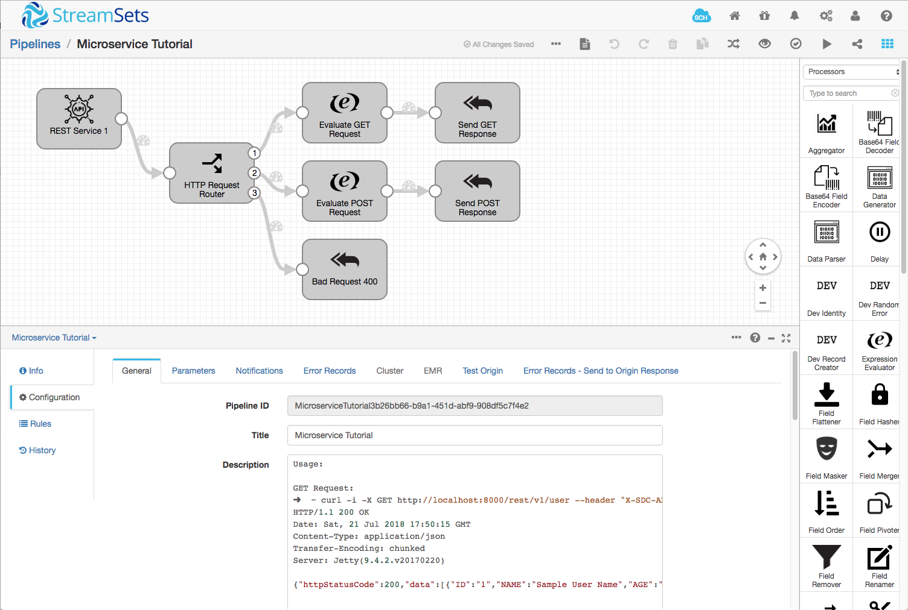

The template pipeline is ready-to-run, and the pipeline description contains full instructions on interacting with it using the [curl](https://curl.haxx.se/) command line HTTP client.

Run the pipeline, and then use curl to send an HTTP GET request:

    $ curl -i -X GET http://localhost:8000/rest/v1/user --header "X-SDC-APPLICATION-ID:microservice"

You should get a response similar to:

    HTTP/1.1 200 OK
    Date: Wed, 25 Jul 2018 00:51:31 GMT
    Content-Type: application/json
    Transfer-Encoding: chunked
    Server: Jetty(9.4.2.v20170220)

    {"httpStatusCode":200,"data":[{"ID":"1","NAME":"Sample User Name","AGE":"37","ADDRESS":"1234 San Francisco"}],"error":[],"errorMessage":null}

Note that curl's `-i` option includes the HTTP header in the output, showing us the HTTP response code, `200`, indicating success.

> If you receive a 'failed to connect' error, check that the pipeline is running, and that you are running curl on the same machine as Data Collector. If you are running Data Collector in a container, you will need to use the hostname of that container instead of `localhost`.

Click on the Stream Selector named 'HTTP Request Router' in the pipeline, then click *Configuration*, then *Conditions* in the lower pane:

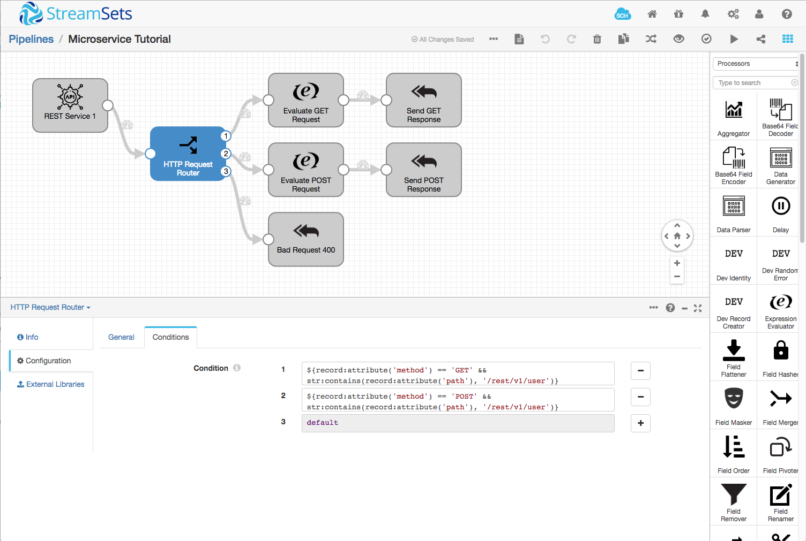

The first condition is:

    ${record:attribute('method') == 'GET' && str:contains(record:attribute('path'), '/rest/v1/user')}

The HTTP request that curl just sent matched this condition - the method was `GET` and the path did indeed contain `/rest/v1/user` - so it was routed to the uppermost Expression Evaluator, captioned 'Evaluate GET Request'. Click this Expression Evaluator, then click *Configuration*, then *Expressions* in the lower pane:

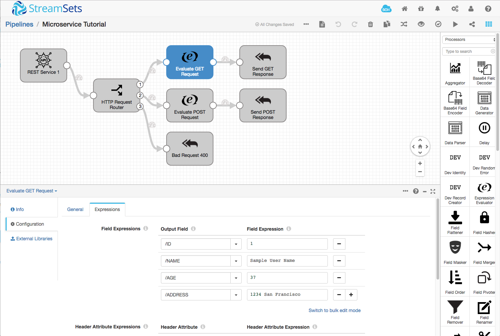

You will see that the evaluator sets several fields in the record. The record then passes to the 'Send GET Response' destination. This destination inserts the incoming record into a REST response, which is returned to curl and displayed in your terminal.

Now use curl to send a different request:

    curl -i -X POST http://localhost:8000/rest/v1/user \
    --header "X-SDC-APPLICATION-ID:microservice" \
    -d '{"ID":1, "NAME": "Sample Name", "AGE":34, "ADDRESS": "2333 San Francisco"}'

You should see output similar to:

    HTTP/1.1 200 OK
    Date: Wed, 25 Jul 2018 01:05:29 GMT
    Content-Type: application/json
    Transfer-Encoding: chunked
    Server: Jetty(9.4.2.v20170220)

    {"httpStatusCode":200,"data":[{"ID":1,"NAME":"Sample Name","AGE":34,"ADDRESS":"2333 San Francisco","sampleData":"POST Request Processed"}],"error":[],"errorMessage":null

Again, click around the pipeline and you should see how the incoming record is routed and modified before being sent back in the HTTP response.

Finally, use curl again to send a request with an invalid URL:

    curl -i -X GET http://localhost:8000/invalidPath --header "X-SDC-APPLICATION-ID:microservice"

This time, we see that the response indicates a client error - HTTP response code 400:

    HTTP/1.1 400 Bad Request
    Date: Wed, 25 Jul 2018 01:07:50 GMT
    Content-Type: application/json
    Transfer-Encoding: chunked
    Server: Jetty(9.4.2.v20170220)

    {"httpStatusCode":400,"data":[{}],"error":[],"errorMessage":null}

You can use Data Collector's [Snapshot](https://streamsets.com/documentation/datacollector/latest/help/index.html#datacollector/UserGuide/Pipeline_Monitoring/PipelineMonitoring_title.html#concept_tyr_2zx_rr) feature to examine record processing in detail. While the pipeline is running, click the Snapshot icon, then click 'Capture Snapshot'. The pipeline will wait for the next batch of data to arrive. Run one of the curl commands, and then click 'View'. You will be able to click around the pipeline and see how the record is routed and modified before being returned in the HTTP response.

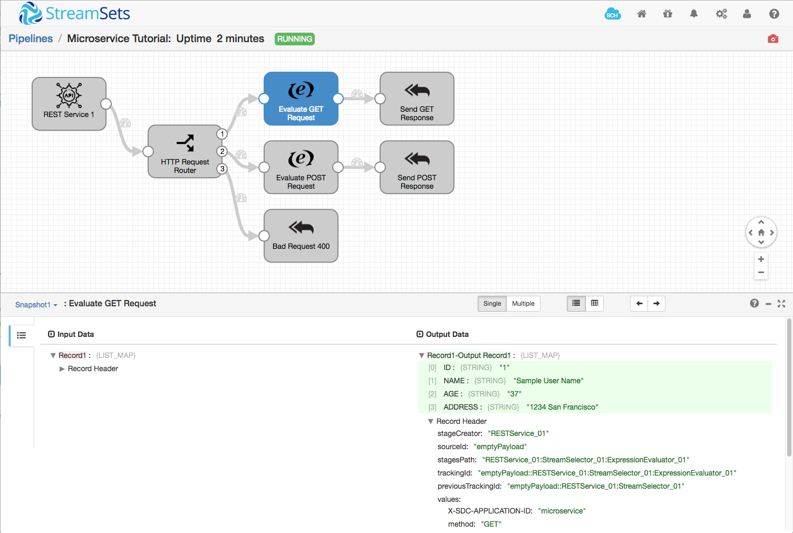

Feel free to use this technique at any point in the tutorial to gain a deeper view into the pipeline's function.

Close the snapshot, if it is still open, and stop the pipeline if it is still running.

## Creating a Database Table

Let's create a table in MySQL. Open a terminal and run the MySQL shell, logging in to your database. Paste the following table definition and insert statement into the MySQL shell to create the `restuser` table and a few records:

    CREATE TABLE restuser (
        id INT NOT NULL AUTO_INCREMENT,
        name VARCHAR(32) NOT NULL,
        PRIMARY KEY (id)
    );

    INSERT INTO restuser (name) VALUES ('Jim');
    INSERT INTO restuser (name) VALUES ('Chuck');
    INSERT INTO restuser (name) VALUES ('Babs');

Note that the `id` primary key column is `AUTO_INCREMENT` - the value is automatically generated by the database to ensure that each row has a unique ID.

> Why not call the table `user`, rather than `restuser`? While creating this tutorial we encountered an issue with the `getPrimaryKeys` call in the MySQL JDBC driver, where the driver would return primary keys for the `mysql.user` table as well as the table in our separate database.

## Reading Data from the Database

Our requirement here is for an HTTP client to be able to retrieve a record by specifying its ID in the URL path: `/rest/v1/user/1`. We'll need to parse the ID value out of the URL, and retrieve the relevant row from the database.

Click the link between the REST Service origin and the 'HTTP Request Router' Stream Selector, then select an Expression Evaluator from the processor dropdown menu. If you have disabled the Pipeline Creation Help Bar, you can either manually insert the Expression Evaluator, or re-enable the help bar from Help / Settings. Click the auto-arrange button to tidy things up:

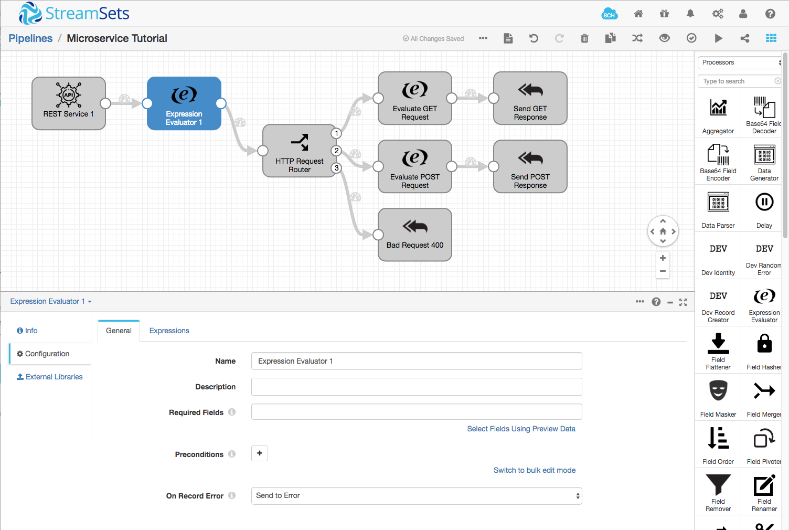

In the **General** tab, set the evaluator's name to `Parse id from URL`, and in the **Expressions** tab, set the field expression to:

* **Output Field**: `/id`
* **Field Expression**: `${str:regExCapture(record:attribute('path'), '^/rest/v1/user/(.*)', 1)}`

This expression will match the regular expression against the incoming URL path, and 'capture' everything after the initial `/rest/v1/user/` into the `/id` field. You can test this straight away by running the pipeline, capturing a snapshot and running this curl command - note the record ID number in the URL:

    $ curl -i -X GET http://localhost:8000/rest/v1/user/1 --header "X-SDC-APPLICATION-ID:microservice"

In the snapshot, click the 'Parse id from URL' Expression Evaluator, and you should see that the `/id` field is indeed set to `1`. Exit the snapshot and stop the pipeline.

> If you encounter the error `HTTP_SERVER_ORIG_01 - Port not available: java.net.BindException: Address already in use (Bind failed) : HTTP Listening Port` when running the pipeline, stop the pipeline and try to run it again a couple of times. [We are investigating this issue](https://issues.streamsets.com/browse/SDC-9611) and it should be resolved in a future release.

Now that we have extracted a record ID from the incoming URL, we can add a JDBC Lookup processor to retrieve the corresponding data from the database. Click the link between the new Expression Evaluator (labeled 'Parse id from URL') and the 'HTTP Request Router'. Insert a JDBC Lookup processor, and click the auto-arrange icon to tidy up the pipeline:

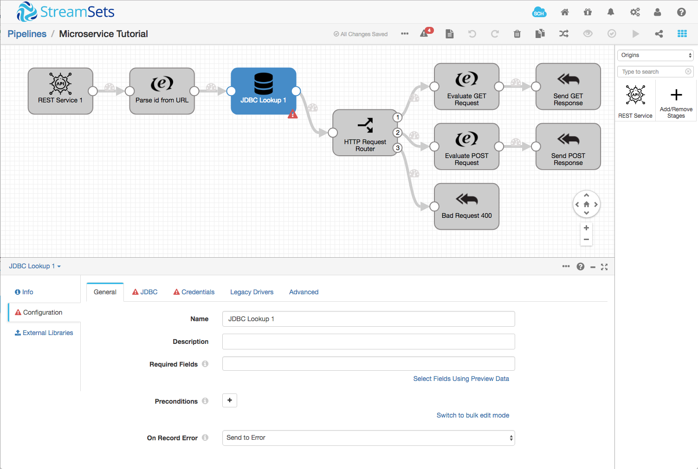

Since we'll be adding several JDBC stages, we'll use runtime parameters to avoid having to copy and paste the same settings multiple times. Click the background of the pipeline canvas, away from the pipeline stages, then click the *Parameters* tab in the lower pane. Add new parameters:

* `JDBC_URI`: this has the form `jdbc:mysql://localhost:3306/databasename` but might vary depending on your environment.
* `JDBC_USERNAME`: your MySQL user, for example `root`
* `JDBC_PASSWORD`: your MySQL password

Now click on the new JDBC Lookup processor, and configure it thus:

**General tab**

* **Name**: `READ record`

**JDBC tab**

* **JDBC Connection String**: `${JDBC_URI}`

* **SQL Query**: `SELECT name FROM restuser WHERE id = ${record:value('/id')}`

Note - in this, and all other tabs, leave unlisted properties with their default configuration. In particular, we do not need to set any field-to-column mappings, since the column names in the database correspond to the field names we want.

**Credentials tab**

* **Username**: `${JDBC_USERNAME}`

* **Password**: `${JDBC_PASSWORD}`

Finally, delete the 'Evaluate GET Request' Expression Evaluator and connect the HTTP Request Router's #1 stream directly to the 'Send GET Response' destination:

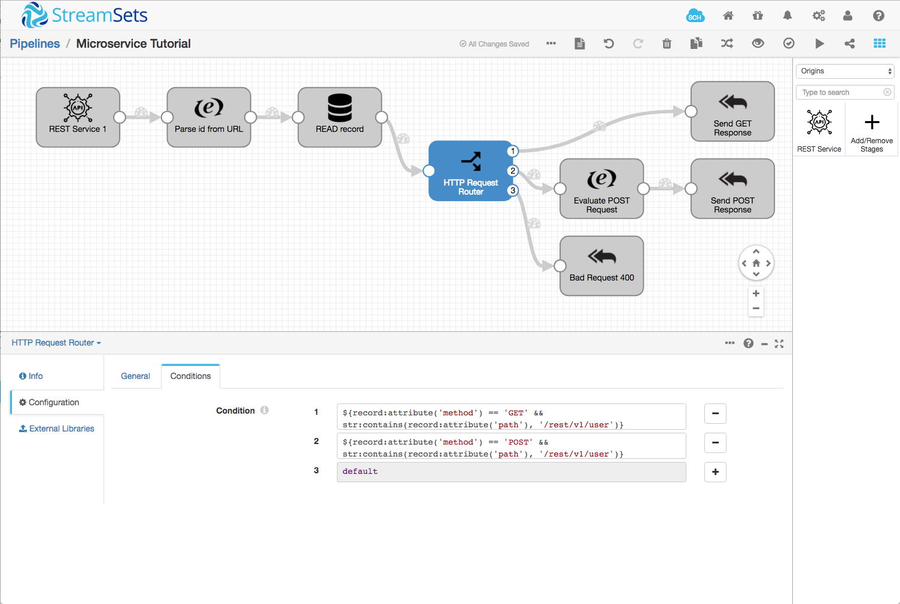

Run the pipeline, then run the following `curl` command:

    $ curl -i -X GET http://localhost:8000/rest/v1/user/1 --header "X-SDC-APPLICATION-ID:microservice"

You should see output similar to the following:

    HTTP/1.1 200 OK
    Date: Wed, 25 Jul 2018 14:25:22 GMT
    Content-Type: application/json
    Transfer-Encoding: chunked
    Server: Jetty(9.4.2.v20170220)

    {"httpStatusCode":200,"data":[{"id":"1","name":"Jim"}],"error":[],"errorMessage":null}

As you can see, the record corresponding to the ID in the request was retrieved and returned in the HTTP response.

What happens when we request a non-existent record? Try the following `curl` command:

    $ curl -i -X GET http://localhost:8000/rest/v1/user/99 --header "X-SDC-APPLICATION-ID:microservice"

The output should be like this:

    HTTP/1.1 200 OK
    Date: Wed, 25 Jul 2018 14:27:38 GMT
    Content-Type: application/json
    Transfer-Encoding: chunked
    Server: Jetty(9.4.2.v20170220)

    {"httpStatusCode":200,"data":[{"id":"99"}],"error":[],"errorMessage":null}

The result is as we might expect: success, but no data; but a RESTful web service should return a 404 response to a request for non-existent data. Let's fix this. Stop the pipeline and insert a new Stream Selector between the JDBC Lookup and the existing Stream Selector. Configure it like this:

**General tab** 

* **Name**: `Record found?` 

**Conditions tab**

* Add a new condition and set it to:

      ${record:exists('/name')}

Remove the existing output link from the new Stream Selector, if there is one, and connect stream #1 to the 'HTTP Request Router'. Add a new Send Response to Origin destination, name it `Not Found 404` and set its **Status Code** to `404`. The pipeline should now look like this:

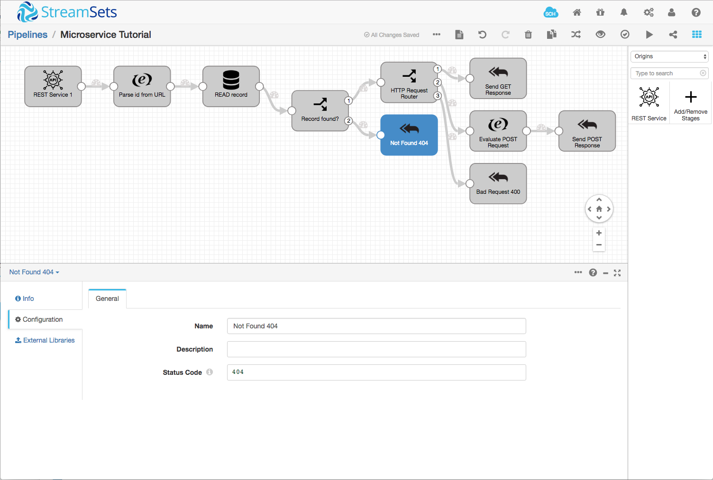

Run the pipeline and test it by resending the erroneous request from curl:

    $ curl -i -X GET http://localhost:8000/rest/v1/user/99 --header "X-SDC-APPLICATION-ID:microservice"

The output should now indicate that the a record with ID `99` was not found:

    HTTP/1.1 404 Not Found
    Date: Wed, 25 Jul 2018 14:41:23 GMT
    Content-Type: application/json
    Transfer-Encoding: chunked
    Server: Jetty(9.4.2.v20170220)

    {"httpStatusCode":404,"data":[{"id":"99"}],"error":[],"errorMessage":null}

You might be wondering why we added the ID lookup at the beginning of the pipeline, before we test the HTTP method. It turns out that we will need to check for the existence of a matching record when we come to update or delete records, so it's better to do it once at the beginning of the pipeline, before the record is routed based on the HTTP method.

We now have a functional microservice, but we can extend it to do more. Let's create a row in the database.

## Creating Data in the Database

Now we want to allow an HTTP client to supply a new user to be added to the database. In our simple example, the HTTP client will send an HTTP POST request to the URL path `/rest/v1/user` with a JSON payload containing the user name:

    { "name" : "Bob" }

The microservice's response will include the new record's ID, so that the client can reference it later.

Right now, our pipeline parses an ID out of the URL path, and uses it to retrieve an existing record. As it stands, if we send a request without an ID, we will get an error. Try the following curl request:

    $ curl -i -X POST http://localhost:8000/rest/v1/user \
        --header "X-SDC-APPLICATION-ID:microservice" \
        -d '{"name" : "Bob"}'

You'll see output similar to:

    HTTP/1.1 500 Server Error
    Date: Thu, 26 Jul 2018 19:31:14 GMT
    Content-Type: application/json
    Transfer-Encoding: chunked
    Server: Jetty(9.4.2.v20170220)

    {"httpStatusCode":500,"data":[],"error":[{"name":"Bob"}],"errorMessage":"JDBC_02 - Exception executing query: 'SELECT name FROM user WHERE id = ' - 'You have an error in your SQL syntax; check the manual that corresponds to your MySQL server version for the right syntax to use near '' at line 1'"}

This is because, with no value in the `/id` field, the JDBC Lookup processor is constructing an invalid query: `SELECT name FROM user WHERE id = `. Let's update the pipeline to handle a URL path without an ID, then we can add the logic to add the new data to the database.

Add a new Stream Selector between 'Parse id from URL' and 'READ record', name it `Request has id?` and add a condition:

    ${record:exists('/id') && (str:length(record:value('/id')) > 0)}

Note that the 'Parse id from URL' Expression Evaluator will create an empty `/id` field if there is no ID in the URL path. We take that into account in the condition we just added by checking the '/id' field's length as well as its existence.

Connect the Stream Selector's #1 stream to 'READ Record', connect the #2 stream to 'HTTP Request Router'. After an auto-arrange, your pipeline should look like this:

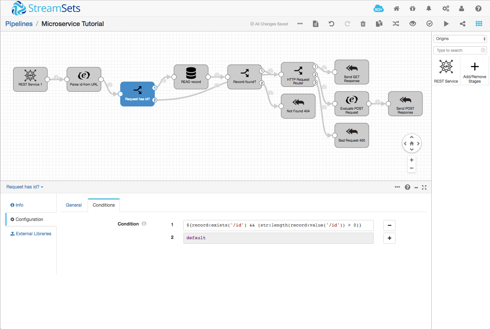

Run the pipeline and try the POST from curl again - you should see that the record is now returned with dummy data:

    $ curl -i -X POST http://localhost:8000/rest/v1/user \
        --header "X-SDC-APPLICATION-ID:microservice" \
        -d '{"name" : "Bob"}'

    HTTP/1.1 200 OK
    Date: Thu, 26 Jul 2018 19:38:59 GMT
    Content-Type: application/json
    Transfer-Encoding: chunked
    Server: Jetty(9.4.2.v20170220)

    {"httpStatusCode":200,"data":[{"name":"Bob","id":null,"sampleData":"POST Request Processed"}],"error":[],"errorMessage":null}

Now we can implement the database insert and replace that dummy data with a real record ID. Delete the 'Evaluate POST Request' Expression Evaluator and add a new JDBC Tee processor in its place. The JDBC Tee processor is very like a JDBC Producer destination: it writes data to the database, but it also retrieves the values of 'generated fields' such as our record ID.

Configure the JDBC Tee processor:

**General tab**

* **Name**: `CREATE record`

**JDBC tab**

* **JDBC Connection String**: `${JDBC_URI}`

* **Table Name**: `restuser`

* **Generated Column Mappings**:
    * **Column Name**: `id`
    * **SDC Field**: `/id`

* **Default Operation**: INSERT

**Credentials tab**

* **Username**: `${JDBC_USERNAME}`

* **Password**: `${JDBC_PASSWORD}`

The pipeline should look like this - you might need to hit auto-arrange, and the 'home' button in the bottom right corner of the canvas, to fit the pipeline to the canvas:

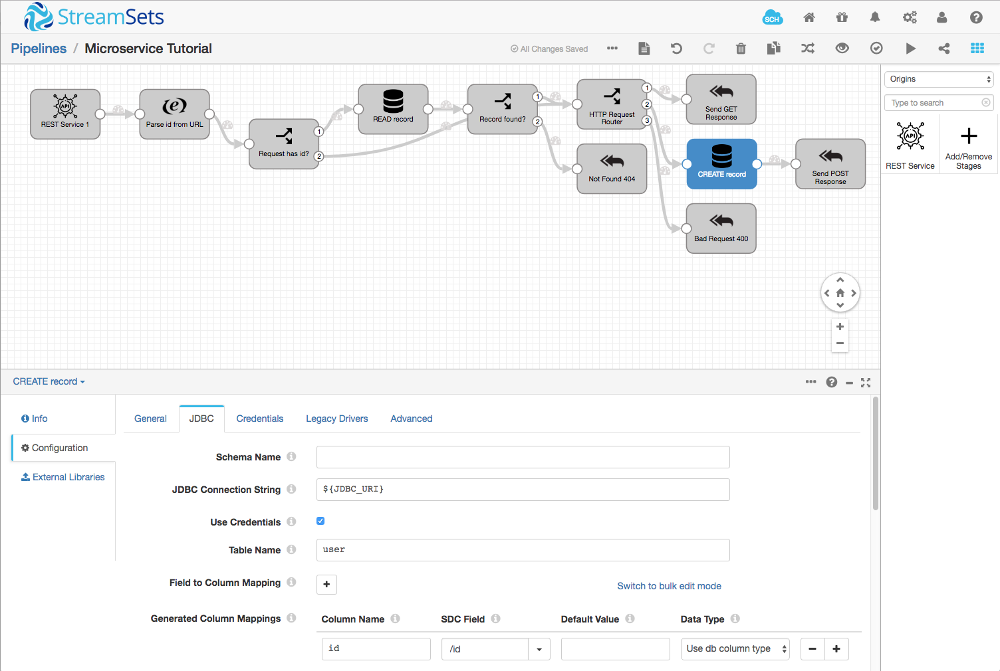

Run the pipeline, and resubmit the POST request from curl:

    $ curl -i -X POST http://localhost:8000/rest/v1/user         --header "X-SDC-APPLICATION-ID:microservice"         -d '{"name" : "Bob"}'

You should see a response including a new record ID:

    HTTP/1.1 200 OK
    Date: Thu, 26 Jul 2018 19:41:58 GMT
    Content-Type: application/json
    Transfer-Encoding: chunked
    Server: Jetty(9.4.2.v20170220)

    {"httpStatusCode":200,"data":[{"name":"Bob","id":4}],"error":[],"errorMessage":null}

Run a select in MySQL, and you should see the new row there:

    mysql> SELECT * from restuser;
    +----+-------+
    | id | name  |
    +----+-------+
    |  1 | Jim   |
    |  2 | Chuck |
    |  3 | Babs  |
    |  4 | Bob   |
    +----+-------+
    4 rows in set (0.04 sec)

Of course, we can retrieve the new record using the ID that we got in the response:

    $ curl -i -X GET http://localhost:8000/rest/v1/user/4 --header "X-SDC-APPLICATION-ID:microservice"
    HTTP/1.1 200 OK
    Date: Thu, 26 Jul 2018 19:46:13 GMT
    Content-Type: application/json
    Transfer-Encoding: chunked
    Server: Jetty(9.4.2.v20170220)

    {"httpStatusCode":200,"data":[{"id":"4","name":"Bob"}],"error":[],"errorMessage":null}

Success! We can read and create data in our microservice. Now let's close the loop by adding update and delete.

## Updating Data in the Database

To update a row in the database, the client will specify the ID on the URL path, exactly as for a read, but supply new data in the HTTP payload, just like a create. Typically, clients use the PATCH HTTP method to indicate an update.

The first step is to add a condition to the REST Request Router to handle the PATCH request. Select the 'REST Request Router' Stream Selector, click its **Conditions** tab, and add a new condition:

    ${record:attribute('method') == 'PATCH' && str:contains(record:attribute('path'), '/rest/v1/user')}

Since the update operation is very similar to the create, we can copy and paste the existing JDBC Tee processor. Click on the 'CREATE record' JDBC Tee processor, then type ctrl-C (cmd-C on a Mac) to copy it. Click the canvas background to deselect the processor, then type ctrl-V (cmd-V on a Mac) to paste it. Connect the REST Request Router's #1 stream to the new processor's input. After an auto-arrange, your pipeline will look like this:

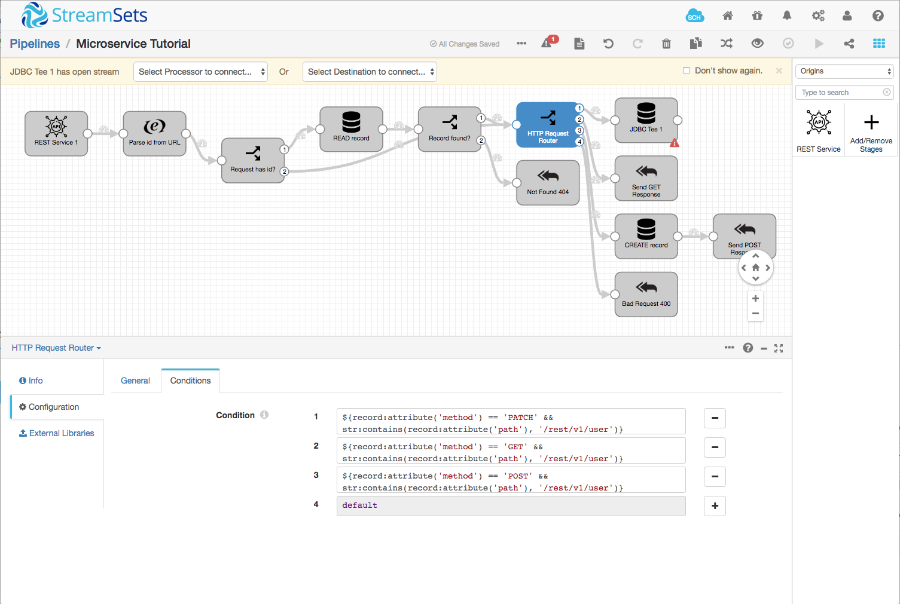

Now edit the new JDBC Tee processor's configuration as follows:

**General tab**

* **Name**: `UPDATE record`

**JDBC tab**

* **Default Operation**: UPDATE

Finally, connect a new Send Response to Origin destination to the 'UPDATE record' processor's output. Your pipeline should look like this:

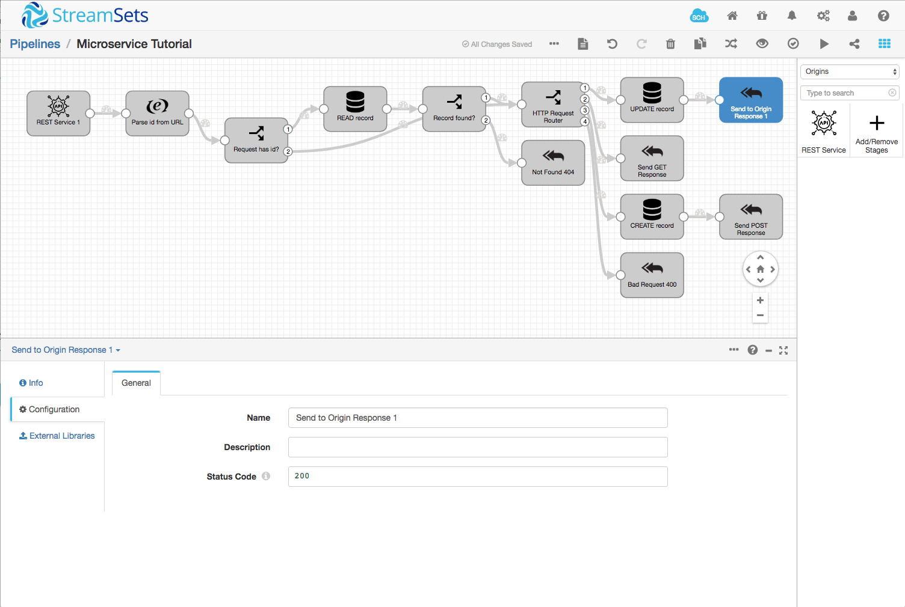

Run the pipeline, and send a PATCH request with record ID 4 and a new name:

    $ curl -i 'http://localhost:8000/rest/v1/user/4' --header "X-SDC-APPLICATION-ID:microservice" -d '{"name":"Robert"}' -X PATCH
    HTTP/1.1 200 OK
    Date: Thu, 26 Jul 2018 21:33:14 GMT
    Content-Type: application/json
    Transfer-Encoding: chunked
    Server: Jetty(9.4.2.v20170220)

    {"httpStatusCode":200,"data":[{"name":"Bob","id":"4"}],"error":[],"errorMessage":null}

That's not what we expected! Checking the database shows that the row was not updated:

    mysql> SELECT * from restuser;
    +----+-------+
    | id | name  |
    +----+-------+
    |  1 | Jim   |
    |  2 | Chuck |
    |  3 | Babs  |
    |  4 | Bob   |
    +----+-------+
    4 rows in set (0.00 sec)

What's going on? Remember that we are retrieving the current record in the 'READ record' JDBC Lookup processor? The `user` value from that query is overwriting the one that the client is sending. We can resolve this by rewriting the SQL query. Select the 'READ record' processor, click its **JDBC** tab, and change the query to:

    SELECT 1 AS found ${record:attribute('method') == 'PATCH' ? '' : ', name'} FROM restuser WHERE id = ${record:value('/id')}

We're using an expression with the conditional operator `?:` to send a different SQL query depending on the HTTP method. If the HTTP method is PATCH, then the query will evaluate to:

    SELECT 1 AS found FROM restuser WHERE id = ...

For any other HTTP method, it will evaluate to:

    SELECT 1 AS found, name FROM restuser WHERE id = ...

Now, the query will return a column named `found` with value `1` if there is a match on the ID, and will return the `name` value only for GET requests (recall that POST requests should not contain an ID). A little creativity with our SQL query has saved us from having to add more complexity to the pipeline in the form of additional processors!

Now all that remains is to change the condition in the 'Record found?' Expression Evaluator to reference `found` rather than `name`. Select the 'Record found?' Expression Evaluator, click its **Conditions** tab and change the condition to:

    ${record:exists('/found')}

Run the pipeline, and resend the PATCH request from curl:

    $ curl -i 'http://localhost:8000/rest/v1/user/4' --header "X-SDC-APPLICATION-ID:microservice" -d '{"name":"Robert"}' -X PATCH

You should see the expected output this time:

    HTTP/1.1 200 OK
    Date: Thu, 26 Jul 2018 21:48:53 GMT
    Content-Type: application/json
    Transfer-Encoding: chunked
    Server: Jetty(9.4.2.v20170220)

    {"httpStatusCode":200,"data":[{"name":"Robert","id":"4","found":1}],"error":[],"errorMessage":null}

Querying MySQL shows that the row was indeed updated:

    mysql> SELECT * from restuser;
    +----+--------+
    | id | name   |
    +----+--------+
    |  1 | Jim    |
    |  2 | Chuck  |
    |  3 | Babs   |
    |  4 | Robert |
    +----+--------+
    4 rows in set (0.01 sec)

## Deleting Data in the Database

As you might expect, we can repeat the above process to implement the delete operation. Clients will invoke the DELETE HTTP method with a URL path including the ID of the record to be deleted.

Add another new condition to the REST Request Router to handle the DELETE request:

    ${record:attribute('method') == 'DELETE' && str:contains(record:attribute('path'), '/rest/v1/user')}

Copy the 'CREATE record' JDBC Tee processor and paste a new copy. Connect the REST Request Router's #1 stream to the new processor's input, and edit the new JDBC Tee processor's configuration as follows:

**General tab**

* **Name**: `DELETE record`

**JDBC tab**

* **Default Operation**: DELETE

Finally, connect a new Send Response to Origin destination to the 'UPDATE record' processor's output. Your pipeline should look like this:

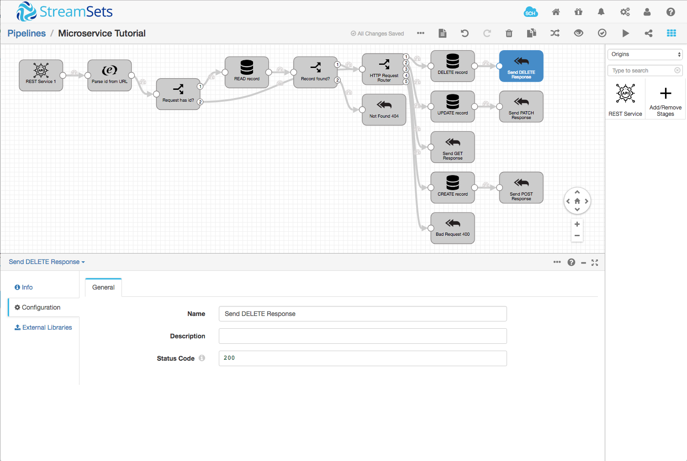

Run the pipeline, and test the delete operation from curl:

    $ curl -i 'http://localhost:8000/rest/v1/user/4' --header "X-SDC-APPLICATION-ID:microservice" -X DELETE

    HTTP/1.1 200 OK
    Date: Thu, 26 Jul 2018 22:02:27 GMT
    Content-Type: application/json
    Transfer-Encoding: chunked
    Server: Jetty(9.4.2.v20170220)

    {"httpStatusCode":200,"data":[{"id":"4","found":1,"name":"Robert"}],"error":[],"errorMessage":null}

Let's see if it's gone from the database:

    mysql> SELECT * from restuser;
    +----+-------+
    | id | name  |
    +----+-------+
    |  1 | Jim   |
    |  2 | Chuck |
    |  3 | Babs  |
    +----+-------+
    3 rows in set (0.00 sec)

Success - we now have a microservice that implements all four CRUD operations!

## Going Further

### Error Handling

If you experiment with the microservice pipeline, you will discover that it does not always respond appropriately to erroneous input. For example, if we try to create a record without a name:

    $ curl -i 'http://localhost:8000/rest/v1/user' --header "X-SDC-APPLICATION-ID:microservice" -d '{}' -X POST

You will likely see that the pipeline stops with an error. It is straightforward, if a little tedious, to add a Stream Selector before each of the JDBC Tee processors to check that the record has `/id` and/or `/name` fields as appropriate, returning a `400` client error for missing data.

### Additional Operations

We've implemented the basic four CRUD operations here, but it is possible to go much further. You could try adding an operation to search for a record by name, or list all the records in the database.

## Conclusion

This tutorial showed how to create a simple microservice using [StreamSets Data Collector](https://streamsets.com/products/sdc) and its new Microservice Pipeline feature. You learned how to use the REST Service origin and Send Response to Origin destination to implement different operations, returning data or error code as appropriate.

If you want to ask questions about any aspect of Data Collector, or you want to share an interesting microservice pipeline that you have written, feel free to get in touch via our [user community](https://streamsets.com/community/).