Creating Custom Data Protector Procedure
==========================================

[StreamSets Data Protector](https://streamsets.com/products/data-protector) provides a policy driven governance framework for the in-stream detection and protection of sensitive data. Out of the box it can detect over 150+ [PII data elements](https://streamsets.com/documentation/controlhub/latest/help/controlhub/UserGuide/ClassificationRules/StreamSetsClassifications.html#concept_qps_3yv_zdb), and protect them with a number of [protection algorithms](https://streamsets.com/documentation/controlhub/latest/help/controlhub/UserGuide/ProtectionPolicies/Procedures-ProtectionMethods.html#concept_hss_mgj_x2b).

This tutorial walks you through adding your own custom data protection algorithm which you can use as protection method to apply to record fields.

### Prerequisites

* Instance of [StreamSets Data Collector (SDC) version 3.5.2 or greater](https://streamsets.com/documentation/datacollector/latest/help/datacollector/UserGuide/Getting_Started/GettingStarted_Title.html#concept_htw_ghg_jq)
* Instance of [StreamSets Control Hub (SCH) version 3.6.0 or greater](https://streamsets.com/documentation/controlhub/latest/help/controlhub/UserGuide/GettingStarted/GettingStarted_title.html)
* [Data Protector enabled in SCH](https://streamsets.com/documentation/controlhub/latest/help/controlhub/UserGuide/DataProtector/DataProtector-Enabling.html#concept_bj1_bsb_v2b)

**NOTE**: It is assumed that you have SCH and an authoring SDC up and running. If you don't have access to SCH, sign up for 30-day free trial by visiting https://streamsets.com/products/sch/control-hub-trial.

### Step 1 &mdash; Generate Custom Field Processor Project

In a terminal window, run the following Maven archetype:

* For *groupId*, enter ***com.streamsets***
* For *artifactId*, enter ***custom-datacollector-field-processor***
* Leave *version* and *package* blank for default values

```sh 
mvn archetype:generate -DarchetypeGroupId=com.streamsets -DarchetypeArtifactId=streamsets-datacollector-stage-lib-tutorial -DarchetypeVersion=3.5.2 -DinteractiveMode=true
```

You should see the following output:

```sh
[INFO] Scanning for projects...
[INFO]
[INFO] ------------------< org.apache.maven:standalone-pom >-------------------
[INFO] Building Maven Stub Project (No POM) 1
[INFO] --------------------------------[ pom ]---------------------------------
[INFO]
[INFO] >>> maven-archetype-plugin:3.0.1:generate (default-cli) > generate-sources @ standalone-pom >>>
[INFO]
[INFO] <<< maven-archetype-plugin:3.0.1:generate (default-cli) < generate-sources @ standalone-pom <<<
[INFO]
[INFO]
[INFO] --- maven-archetype-plugin:3.0.1:generate (default-cli) @ standalone-pom ---
[INFO] Generating project in Interactive mode
[INFO] Archetype repository not defined. Using the one from [com.streamsets:streamsets-datacollector-stage-lib-tutorial:3.5.2] found in catalog remote
Define value for property 'groupId': com.streamsets
Define value for property 'artifactId': custom-datacollector-field-processor
Define value for property 'version' 1.0-SNAPSHOT: :
Define value for property 'package' com.streamsets: :
Confirm properties configuration:
groupId: com.streamsets
artifactId: custom-datacollector-field-processor
version: 1.0-SNAPSHOT
package: com.streamsets
 Y: : y
[INFO] ----------------------------------------------------------------------------
[INFO] Using following parameters for creating project from Archetype: streamsets-datacollector-stage-lib-tutorial:3.5.2
[INFO] ----------------------------------------------------------------------------
[INFO] Parameter: groupId, Value: com.streamsets
[INFO] Parameter: artifactId, Value: custom-datacollector-field-processor
[INFO] Parameter: version, Value: 1.0-SNAPSHOT
[INFO] Parameter: package, Value: com.streamsets
[INFO] Parameter: packageInPathFormat, Value: com/streamsets
[INFO] Parameter: package, Value: com.streamsets
[INFO] Parameter: version, Value: 1.0-SNAPSHOT
[INFO] Parameter: groupId, Value: com.streamsets
[INFO] Parameter: artifactId, Value: custom-datacollector-field-processor
[INFO] Project created from Archetype in dir: /Users/dash/temp/custom-datacollector-field-processor
[INFO] ------------------------------------------------------------------------
[INFO] BUILD SUCCESS
[INFO] ------------------------------------------------------------------------
[INFO] Total time: 01:13 min
[INFO] Finished at: 2018-11-14T21:15:09-08:00
[INFO] ------------------------------------------------------------------------
```

Maven will generate a template project from archetype with *artifactId* ***custom-datacollector-field-processor*** as its name.

This is what the folder structure should look like:

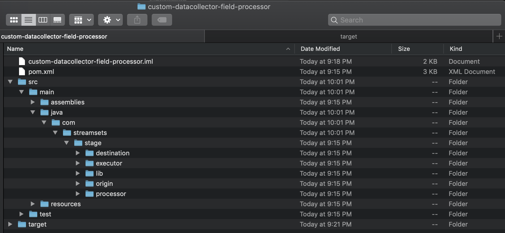

### Step 2 &mdash; Open Custom Field Processor Project

Using an IDE such as IntelliJ, open ***custom-datacollector-field-processor*** project (created in step 1) and expand source as shown below:

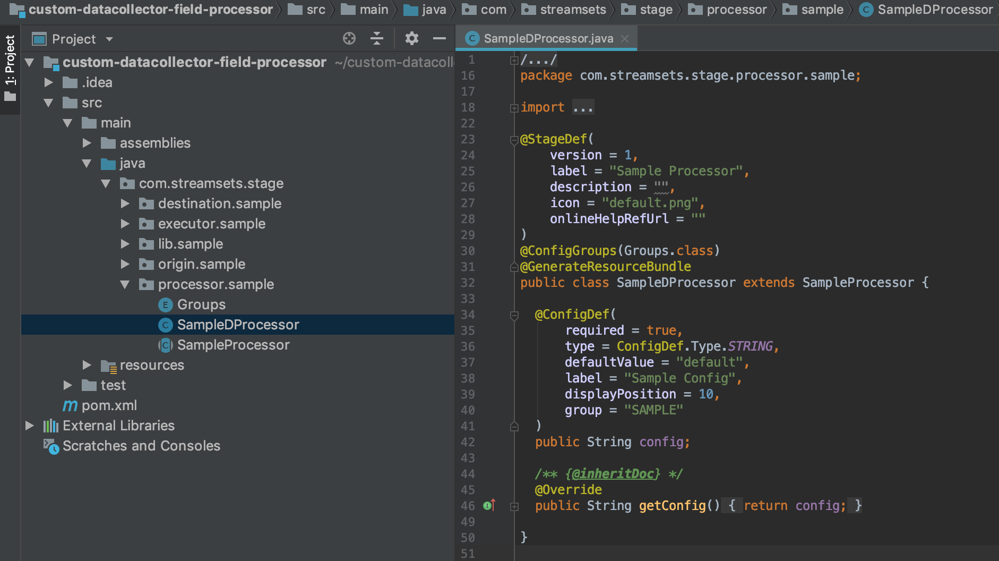

* Replace *entire code snippet* in class **SampleDProcessor.java** with the following code:

```java
package com.streamsets.stage.processor.sample;

import com.streamsets.pipeline.api.*;
import com.streamsets.pipeline.api.base.BaseFieldProcessor;

@StageDef(
    version = 1,
    label = "My Custom Field Processor",
    description = "",
    icon = "default.png",
    onlineHelpRefUrl = ""
)

@HideStage(HideStage.Type.FIELD_PROCESSOR)
public class SampleDProcessor extends BaseFieldProcessor {

  @Override
  public void process(FieldBatch fieldBatch) throws StageException {
    while(fieldBatch.next()) {
      fieldBatch.replace(Field.create("PROTECTED using My Custom Field Processor."));
    }
  }
}

```

**NOTE**: In production environment, it is recommended that you set ***label*** to a unique and easily identifiable value instead of something generic ("My Custom Field Processor" as illustrated in this example) and one that differs from [built-in protection methods](https://streamsets.com/documentation/controlhub/latest/help/controlhub/UserGuide/ProtectionPolicies/Procedures-ProtectionMethods.html#concept_hss_mgj_x2b).

This is what the updated **SampleDProcessor.java** should look like:

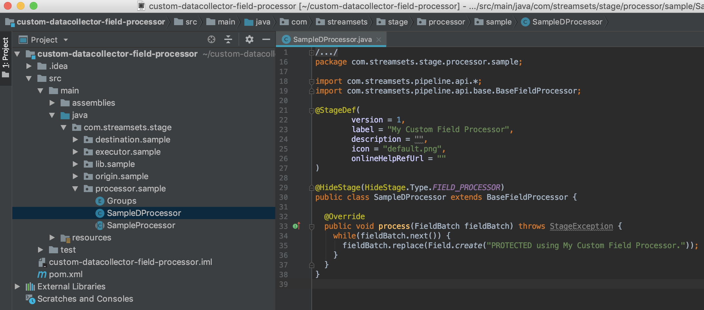

* Delete *SampleProcessor.java* and *Groups.java* &mdash; these classes are not needed for creating custom field processor.

This is what the final project should look like:

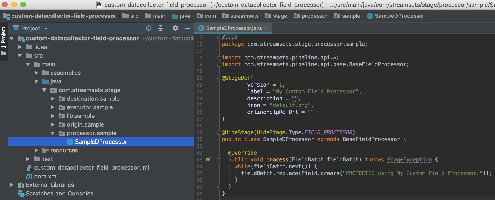

### Step 3 &mdash; Build Custom Field Processor Project

Build project by executing the following command from the project root folder:

```sh
 mvn clean package -Pui,dist -DskipTests

```

If all goes well, **custom-datacollector-field-processor-1.0-SNAPSHOT.tar.gz** will be created as shown below:

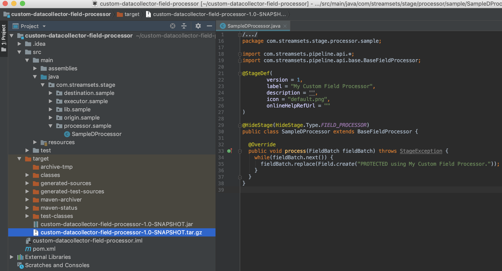

### Step 4 &mdash; Install Custom Field Processor in StreamSets Data Collector

* Extract **custom-datacollector-field-processor-1.0-SNAPSHOT.tar.gz** (created in step 3) in **$SDC_HOME/user-libs** folder of the authoring SDC as shown below:

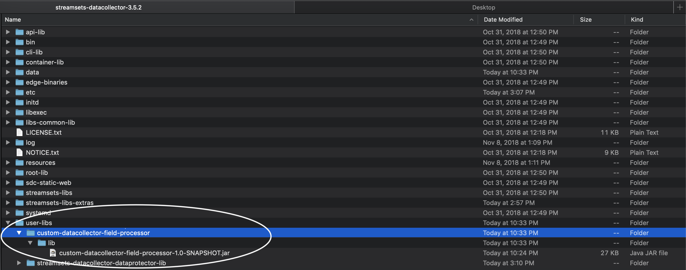

* Restart authoring SDC
* Browse to **Package Manager** and click on **All Stage Libraries** on the left menu
* Type 'Sample' in the search box

You should see *custom-datacollector-field-processor* listed as shown below:

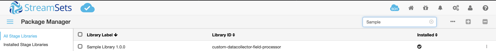

### Step 5 &mdash; Provision Custom Field Processor in StreamSets Control Hub

* Click on **Protection Policies** menu on the left to create a new policy as shown below:
* For *Name*, enter "Custom Policy"
* For *Enactment*, select "Read"
* For *Sampling*, select "All records"

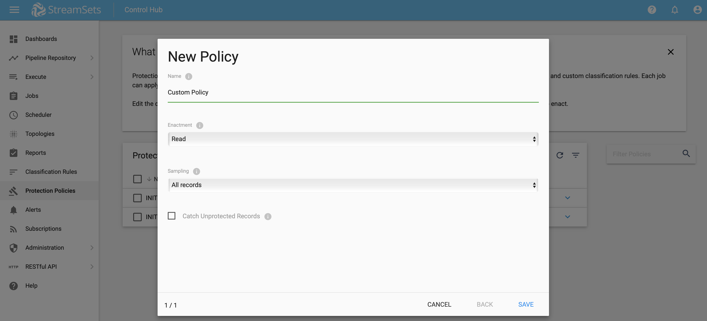

* Select the newly created policy and click on **VIEW PROCEDURES** to create a new procedure as shown below:

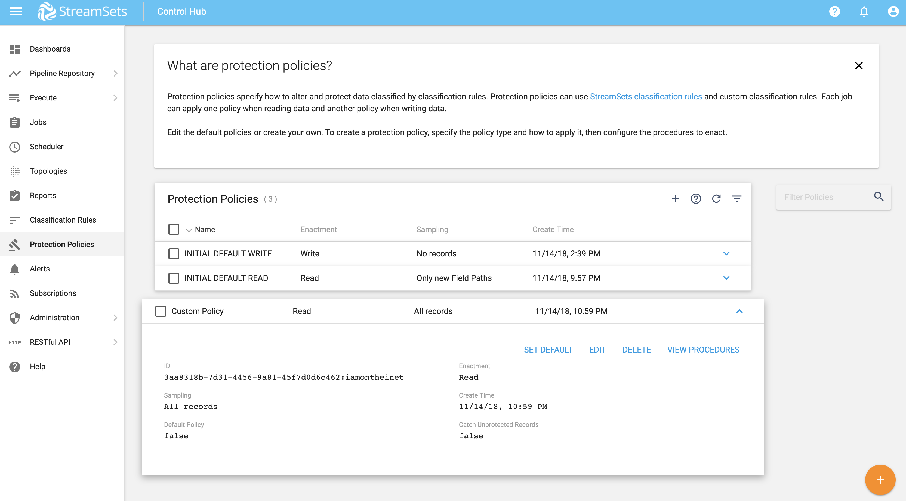

* For *Procedure Basis*, select "Category Pattern"
* For *Classification Category Pattern*, enter "US_SSN"
* For *Authoring SDC*, select SDC where custom field processor was installed in step 4


* For *Protection Method*, select "My Custom Field Processor (Library: Sample Library 1.0.0)" that was installed in step 4

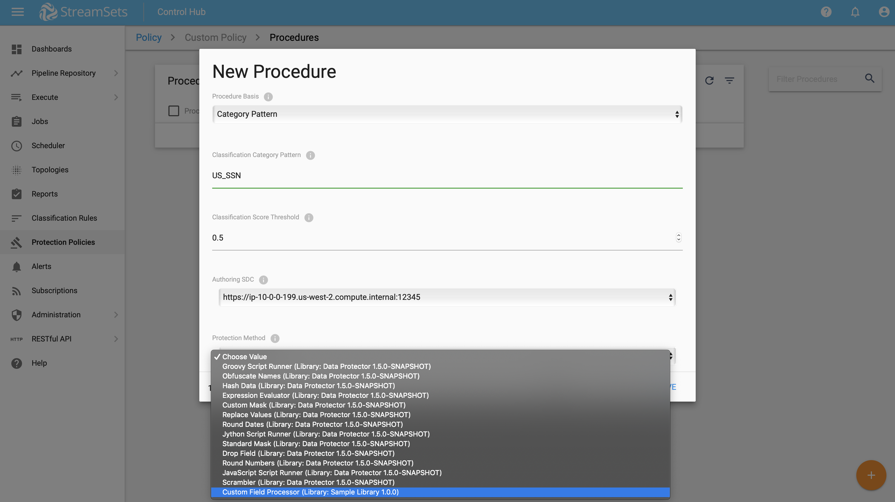


### Step 6 &mdash; Test Custom Field Processor in StreamSets Control Hub

Let's create a simple pipeline to test our custom field processor.

* Click on **Pipeline Repositories** >> **Pipelines** menu on the left and create a new pipeline as shown below:

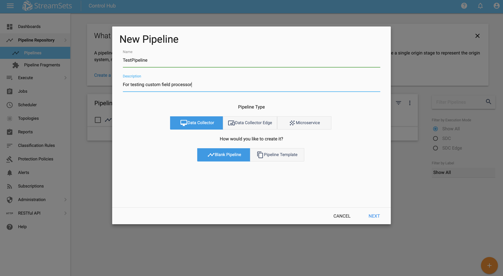

* For *Authoring Data Collector* select SDC where custom field processor was installed in step 4

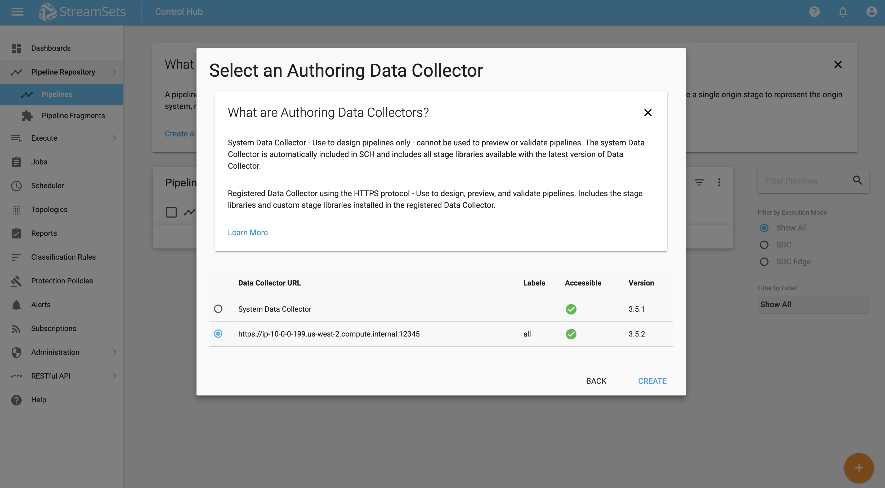

* Add **Dev Raw Data Source** origin
* Add **Trash** destination
* Under **Dev Raw Data Source** origin >> **Raw Data** add new field *"SSN"* with its value set to *"123-45-6789"*

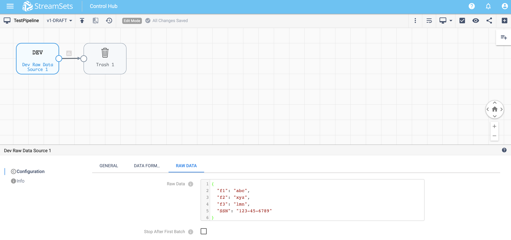

* Click on **Preview**.

You should see the *SSN* field value "protected" as per our custom field processor which replaces field values based on classification category pattern "US_SSN" (configured in step 5) with **"PROTECTED using My Custom Field Processor."** (See line 35 in **SampleDProcessor.java**)

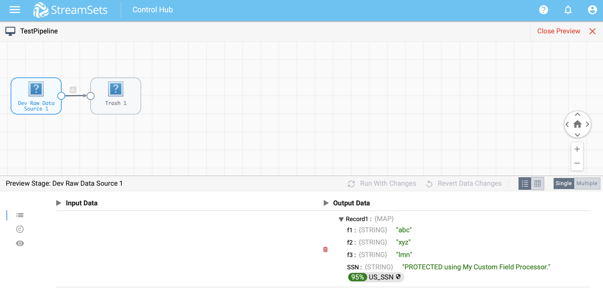

### Success!

You should be able to apply what you’ve learned and create more sophisticated custom data protection algorithms now. If you don't have access to SCH, sign up for 30-day free trial by visiting https://streamsets.com/products/sch/control-hub-trial.

If you encounter any problems with this tutorial, please [file an issue in the tutorials project](https://github.com/streamsets/tutorials/issues/new).
