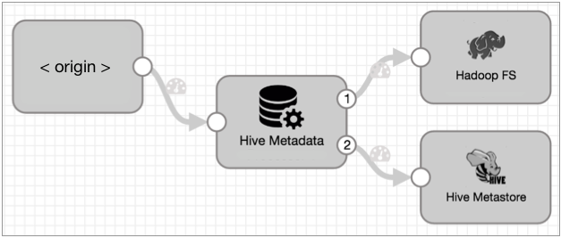
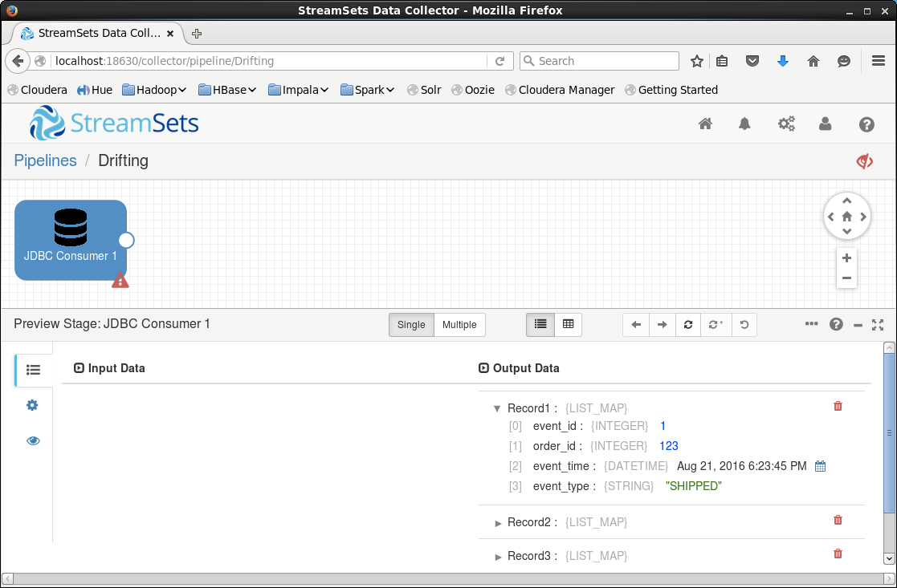
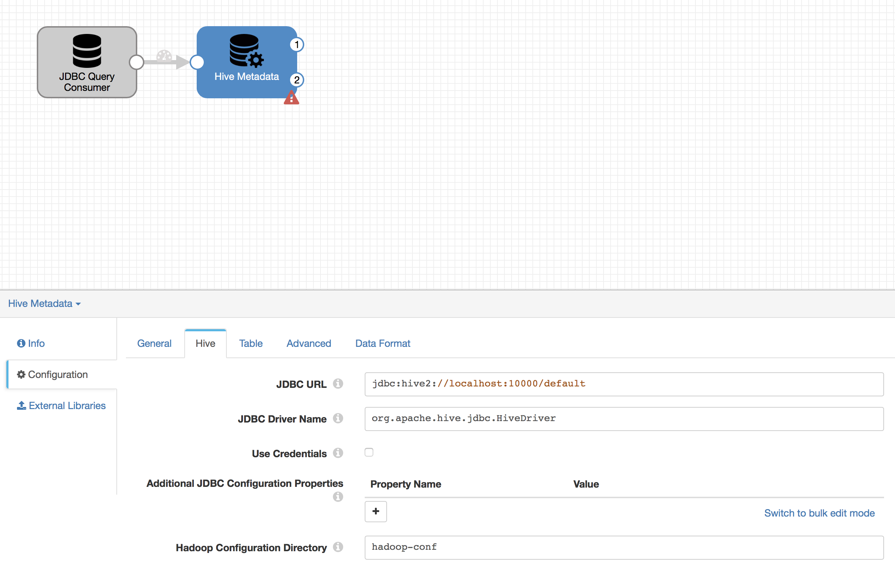
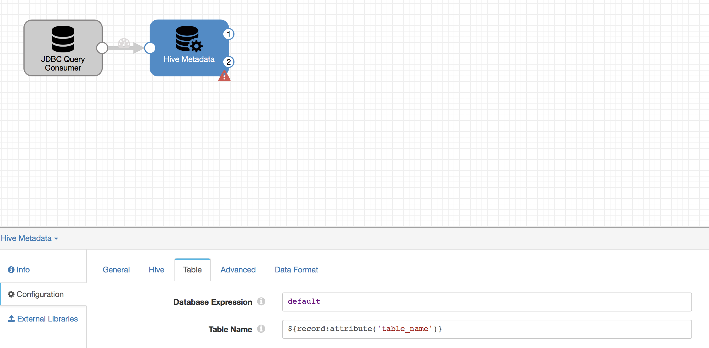
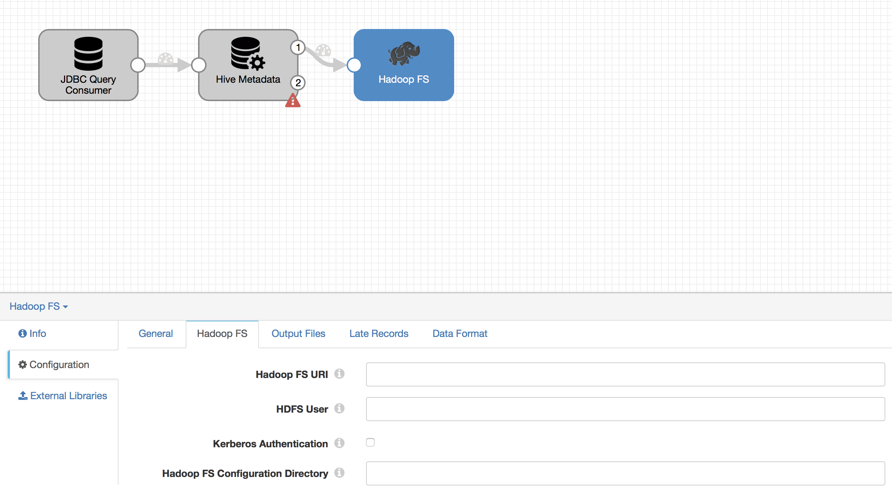
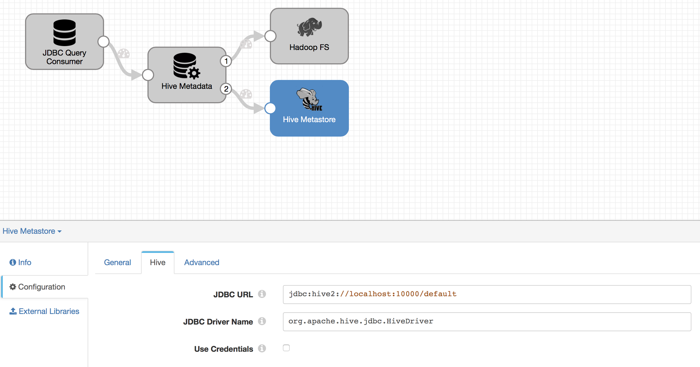
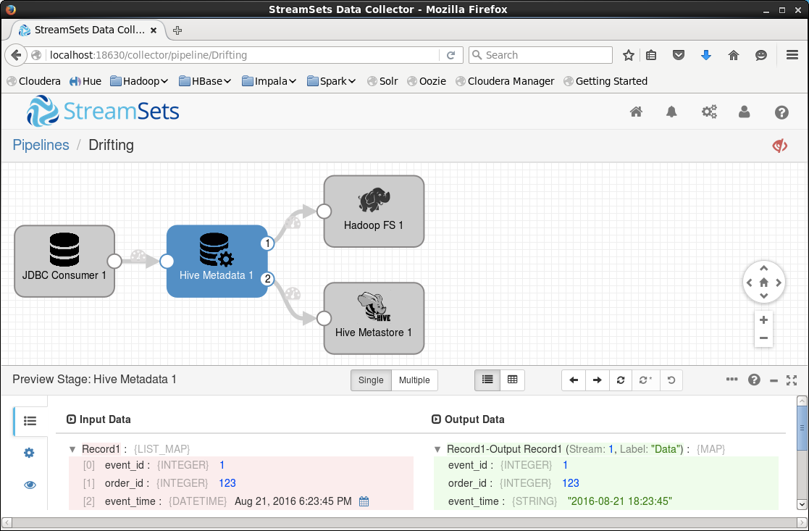
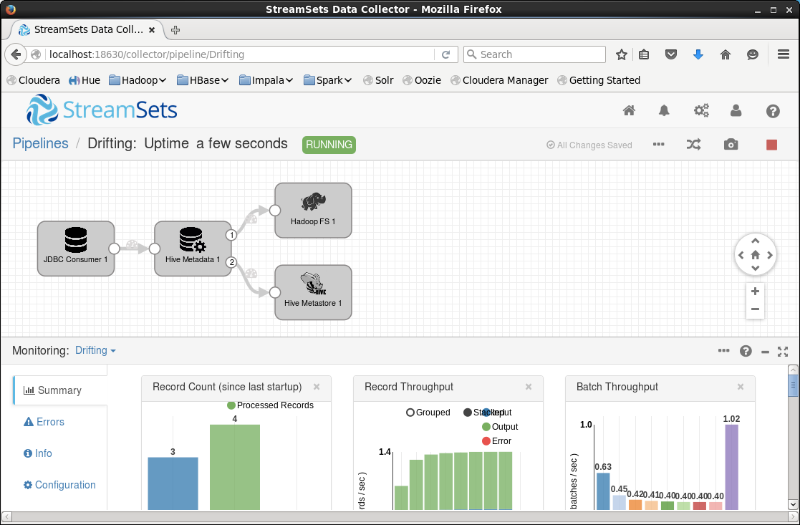
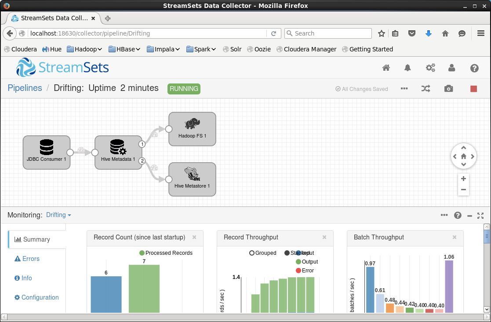
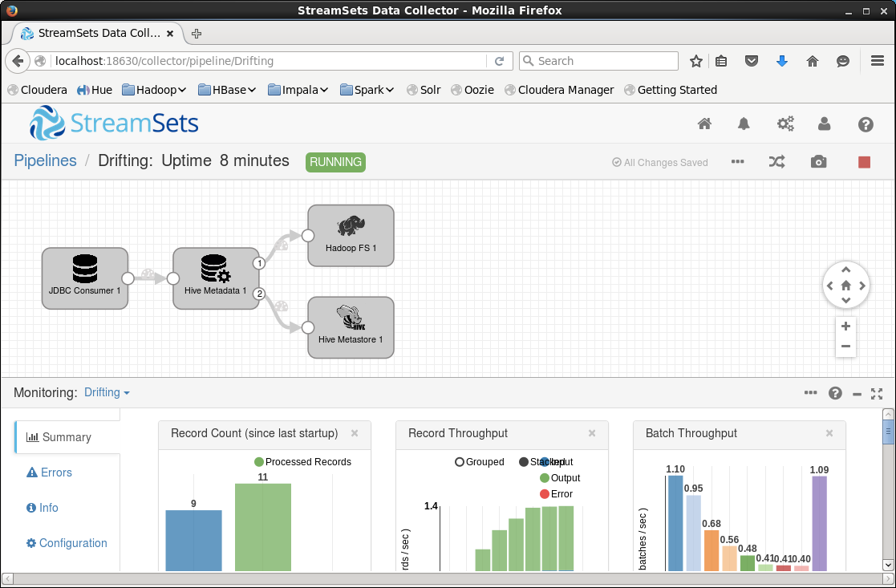

# Ingesting Drifting Data into Hive and Impala

[Data drift](https://streamsets.com/blog/start-with-why-data-drift/), the constant unplanned morphing of data structure and semantics, is a perennial problem for data engineers. Schema changes can break integrations and, in the worst case, silently propagate bad data through the system and lead to decisions being made based on faulty analysis.

In the past, data engineers would have to react to drift manually - looking for changes in the incoming schema, altering Hive tables by hand, and re-submitting broken ingest jobs. The [StreamSets Data Collector](https://streamsets.com/product/) [Drift Synchronization](https://streamsets.com/documentation/datacollector/latest/help/#Hive_Drift_Solution/HiveDriftSolution_title.html) feature addresses schema drift by automatically creating and altering tables in near real-time, making data immediately ready for consumption by end users. This tutorial walks you through setting up Drift Synchronization for a simple use case.

Here's the scenario: we want to ingest shipment records from a table in a relational database to a Hadoop environment where they can be queried with Apache Hive or Apache Impala. We'll create the source table, populate it with some initial data, create a pipeline using Drift Synchronization, and see data flowing into an automatically created Hive table from the Impala shell. Then we'll inject some data drift by adding a few columns to our table to support a new business requirement, and see how this change is propagated through the system, resulting in an updated table structure on the Hadoop side.

This tutorial writes data using the [Avro](http://avro.apache.org/) data format. It is also possible to configure Drift Synchronization with [Parquet](http://parquet.apache.org/) - see the [Parquet Case Study](https://streamsets.com/documentation/datacollector/latest/help/datacollector/UserGuide/Hive_Drift_Solution/HiveDriftSolution_title.html#concept_vl3_v2f_zz) for more details.

## Prerequisites

Drift Synchronization is an advanced feature, so this tutorial skips the basics of installing StreamSets Data Collector (SDC), configuring a JDBC driver etc. If you're new to SDC, you should work through the [basic tutorial](https://streamsets.com/documentation/datacollector/latest/help/#Tutorial/Tutorial-title.html) first.

You will need access to a Hive installation - you can use any of the [Cloudera](https://www.cloudera.com/), [MapR](https://www.mapr.com/) or [Hortonworks](http://hortonworks.com/) distributions, or a plain [Apache distribution](http://hadoop.apache.org/releases.html).

SDC will need to write to Hive and HDFS, so you should [configure a proxy user](https://hadoop.apache.org/docs/r2.7.2/hadoop-project-dist/hadoop-common/Superusers.html) to allow the sdc user to impersonate a user with appropriate access.

You will also need a relational database, and you must have configured SDC to use your database's JDBC driver. This tutorial uses [MySQL](https://www.mysql.com/) as the source database; you should be able to use any database accessible via a JDBC driver.

## Introducing StreamSets Drift Synchronization

Drift Synchronization comprises three SDC stages: the [Hive Metadata](https://streamsets.com/documentation/datacollector/latest/help/datacollector/UserGuide/Processors/HiveMetadata.html#concept_rz5_nft_zv) processor, the [Hive Metastore](https://streamsets.com/documentation/datacollector/latest/help/datacollector/UserGuide/Destinations/HiveMetastore.html#concept_gcr_z2t_zv) destination and either of the [Hadoop FS](https://streamsets.com/documentation/datacollector/latest/help/datacollector/UserGuide/Destinations/HadoopFS-destination.html#concept_awl_4km_zq) or [MapR FS](https://streamsets.com/documentation/datacollector/latest/help/datacollector/UserGuide/Destinations/MapRFS.html#concept_spv_xlc_fv) destinations.

The Hive Metadata processor and Hive Metastore destination work together to reconcile any differences between the incoming record structure and the corresponding table schema in Hive. If the table does not yet exist, it is created. If there are fields in the incoming record that do not exist as columns in the table in Hive, then the Hive schema is updated to match the new record structure.

Why three stages instead of just one? Flexibility and scalability. As you can see, we can write data to either Hadoop FS or MapR FS by just swapping out the data destination. Also, data volume tends to increase far faster than metadata, so we can scale out the data pathway to many pipelines independent of the metadata stream. We can even fan in multiple metadata paths to a single Hive Metastore destination to control the amount of load that SDC puts on the Hive Metastore.

## Creating the Source Table

Open a terminal and run the MySQL shell, logging in to your database. Paste the following code into mysql to create the initial schema: a shipping_events table with a primary key and fields for the shipment status, as well as a few records.

	CREATE TABLE shipping_events (
	    event_id INT(11) NOT NULL AUTO_INCREMENT PRIMARY KEY,
	    order_id INT(11),
	    event_time DATETIME,
	    event_type VARCHAR(32)
	);

	INSERT INTO shipping_events (order_id, event_time, event_type) 
		VALUES (123, '2016-08-21 18:23:45', 'SHIPPED');

	INSERT INTO shipping_events (order_id, event_time, event_type) 
		VALUES (234, '2016-08-22 19:34:56', 'ARRIVED');

	INSERT INTO shipping_events (order_id, event_time, event_type) 
		VALUES (345, '2016-08-23 20:45:12', 'READY');

## Creating a Pipeline

Now let's get some data flowing! In your browser, login to SDC and create a new pipeline. Add a JDBC Query Consumer origin and configure it:

**JDBC tab**

* **JDBC Connection String**: this has the form `jdbc:mysql://localhost:3306/databasename` but might vary depending on your environment.

* **SQL Query**: `SELECT * FROM shipping_events WHERE event_id > ${OFFSET} ORDER BY event_id`

* **Initial Offset**: `0`

* **Offset Column**: `event_id`

Note - in this, and all other tabs, leave unlisted properties with their default configuration.

**Credentials tab**

* **Username**: Your MySQL username

* **Password**: Your MySQL password

**Advanced tab**

* **Create JDBC Namespace Headers**: Enabled

In real-life we might use a longer query interval than the default 10 seconds, balancing resource utilization with data freshness, but we want to be able to see the data flowing in this tutorial! Be careful not to miss the **Create JDBC Namespace Headers** property on the **Advanced** tab - the Hive Metadata processor will not be able to work with the Decimal type without it!

> You may be wondering if other origins will work with the Drift Synchronization. The answer is yes, but some origins work better than others. The solution uses field type information in the incoming records to create corresponding schema in Hive. Database records read from JDBC contain this information, as do records read from files or message queues in the Avro or SDC data formats, but delimited data formats do not. Ingesting a delimited data file, the solution would still create a Hive table, but, by default, all columns would have STRING type.

Configure the pipeline's **Error Records** property according to your preference. Since this is a tutorial, you could discard error records, but in a production system you would write them to a file or queue for later analysis.

Now hit the preview button to check that you can read records from the database. Click the JDBC Consumer stage and you should see three records listed in the preview panel. You can click into them to see the individual fields and their values:

## Working with Hive Metadata

Now that the pipeline is reading data from the database, you can configure the Hive Metadata processor. This processor analyzes the structure of incoming data, comparing it to the Hive Metastore schema and creates metadata records capturing the changes that are required in the Hive table structure.

Note: SDC requires the configuration files for Hadoop and Hive to be accessible in a single directory. Before you add the Hive and Hadoop pipeline stages, create a directory named `hadoop-conf` under SDC's `resources` directory, and link the `core-site.xml`, `hdfs-site.xml` and `hive-site.xml` configuration files from your distribution into the `hadoop-conf` directory.

For example:

    cd <your SDC resources directory>
    mkdir hadoop-conf
    cd hadoop-conf
    ln -s <path to hadoop config>/core-site.xml
    ln -s <path to hadoop config>/hdfs-site.xml
    ln -s <path to hive config>/hive-site.xml
    cd ..
    # Omit the following step if you did not create an sdc system user and group
    chown -R sdc:sdc hadoop-conf

Now you can add the Hive Metadata processor, with its input linked to the JDBC Consumer’s output and configure it thus:

**Hive tab**:

* **JDBC URL**: this has the form `jdbc:hive2://localhost:10000/default` but might vary depending on your environment. In particular:
    * If you are using MapR with the default configuration, you will need to specify a username and password in the URL, thus: `jdbc:hive2://localhost:10000/default;user=<username>;password=<password>`.
    * If you are using Kerberos, you may need to add a principal parameter to specify the Hive Kerberos user.

* **JDBC Driver Name**: for an Apache Hadoop environment, this will be `org.apache.hive.jdbc.HiveDriver`, otherwise you should specify the specific driver class for your distribution.

* **Hadoop Configuration Directory**: `hadoop-conf`

**Table tab**:

* **Database Expression**: `default` -- change this if you wish to use a different Hive database name.

* **Table Name**: `${record:attribute('jdbc.tables')}`

* **Partition Configuration**: hit the ‘-’ button to remove the dt entry. We will not be partitioning data in this tutorial.

Note the use of `${record:attribute('jdbc.tables')}` as the table name - this will pass the MySQL table name through the pipeline to Hive.

Your pipeline should look like this:

The Hive Metadata processor emits data records on its #1 output stream, and metadata on #2. 

Next, create either a Hadoop FS or MapR FS destination depending on your environment, and connect the Hive Metadata processor’s #1 output stream to the new destination’s input stream, like this:

Configure the destination like this:

**Hadoop FS tab:**

* **Hadoop FS URI**: you can leave this empty if SDC should use the default file system connection from the configuration files loaded below. Otherwise, for Hadoop FS specify a URI of the form `hdfs://hostname/` and for MapR FS, `maprfs:///mapr/my.cluster.com/`.

* **HDFS User**: an appropriate HDFS username

* **Kerberos Authentication**: you should enable this if your Hadoop environment is secured

* **Hadoop FS Configuration Directory**: you may need to change this to suit your environment. This directory **must** contain the `core-site.xml` and `hdfs-site.xml` configuration files.

**Output Files tab**:

* **Directory in Header**: Enabled

* **Max Records in File**: `1`

* **Use Roll Attribute**: Enabled

* **Roll Attribute Name**: `roll`

**Data Format tab**:

* **Data Format**: Avro

* **Avro Schema Location**: In Record Header

Note: the destination will continue writing to a file until the first of these five conditions is satisfied:

* The number of records specified in ‘Max Records in File’ has been written (zero means there is no maximum)

* The specified ‘Max File Size’ has been reached (again, zero means there is no maximum)

* No records have been written for the specified ‘Idle Timeout’

* A record with the specified roll header attribute is processed

* The pipeline is stopped

When the Hive Metadata processor detects a schema change, it sets the roll header attribute to signal to the destination that the data file should be ‘rolled’ -- that is, the current file closed and a new file opened.

We set **Max Records in File** to 1 so the destination closes the file immediately after writing every record, since we want to see data immediately. If we left the defaults in place, we might not see some data in Hive until an hour after it was written. This might be appropriate for a production deployment, but would make a very time-consuming tutorial!

To complete the pipeline, add a Hive Metastore destination, its input connected to the Hive Metadata processor’s #2 output, like this:

Configure the Hive Metastore destination:

**Hive tab**:

* **JDBC URL**: set this to the same value as it is in the Hive Metadata processor.

* **JDBC Driver Name**: set this also to the same value as it is in the Hive Metadata processor.

* **Hadoop Configuration Directory**: `hadoop-conf`

**Advanced tab**:

* **Stored as Avro**: Enabled

Now your pipeline is fully configured and ready for action! Hit the validate button to check for any typos, then hit ‘preview’. You should be able to click the different stages and see the input and output records. Note - you will not currently see metadata records on the Hive Metadata processor’s #2 output, but you can see them on the Hive Metastore’s input.

If your pipeline reports an error at validation or preview, check your configuration properties. If it’s still not working, contact us via the [sdc-user Google Group](https://groups.google.com/a/streamsets.com/forum/#!forum/sdc-user) or the [StreamSets Community Slack channel](https://streamsetters-slack.herokuapp.com/) - details are on the [StreamSets Community Page](https://streamsets.com/community/).

## Running the Pipeline

If all is well, it’s time to run the pipeline! Hit the run button, and you should see 3 input records and 4 output records in the monitoring panel. 

Why 4 output records? Well, 3 data records are sent to the Hadoop or MapR FS destination, while 1 metadata record is sent to the Hive Metastore with instructions to create the table.

Let’s use Impala to look at the data in Hive. At present, SDC does not notify Impala of the metadata change, so an invalidate metadata command is required before we query the table for the first time. Examine the schema and query the data like this:

	[quickstart.cloudera:21000] > invalidate metadata;
	Query: invalidate metadata

	Fetched 0 row(s) in 3.49s
	[quickstart.cloudera:21000] > describe shipping_events;
	Query: describe shipping_events
	+------------+--------+-------------------+
	| name       | type   | comment           |
	+------------+--------+-------------------+
	| event_id   | int    | from deserializer |
	| order_id   | int    | from deserializer |
	| event_time | string | from deserializer |
	| event_type | string | from deserializer |
	+------------+--------+-------------------+
	Fetched 3 row(s) in 0.11s
	[quickstart.cloudera:21000] > select * from shipping_events;
	Query: select * from shipping_events
	+----------+----------+---------------------+------------+
	| event_id | order_id | event_time          | event_type |
	+----------+----------+---------------------+------------+
	| 1        | 123      | 2016-08-21 18:23:45 | SHIPPED    |
	| 3        | 345      | 2016-08-23 20:45:12 | READY      |
	| 2        | 234      | 2016-08-22 19:34:56 | ARRIVED    |
	+----------+----------+---------------------+------------+
	Fetched 3 row(s) in 3.68s

## Adding new Records

Now that the pipeline is running, let’s see what happens when we insert more records into the database. Paste the following into the MySQL shell:

	INSERT INTO shipping_events (order_id, event_time, event_type) 
		VALUES (123, '2016-08-24 18:23:45', 'ARRIVED');
	INSERT INTO shipping_events (order_id, event_time, event_type) 
		VALUES (345, '2016-08-25 19:34:56', 'SHIPPED');
	INSERT INTO shipping_events (order_id, event_time, event_type) 
		VALUES (456, '2016-08-26 20:45:12', 'READY');

If you look at the monitoring panel in SDC, after a few seconds you should see the record counts increase to 6 input records and 7 output records:

There were three more data records output, but no more metadata records produced because the schema was unchanged. Go to Impala Shell and query the table - you can use refresh, rather than the more costly invalidate, since the table structure hasn’t changed - we just added new data files:

	[quickstart.cloudera:21000] > refresh shipping_events;
	Query: refresh shipping_events

	Fetched 0 row(s) in 0.32s
	[quickstart.cloudera:21000] > select * from shipping_events;
	Query: select * from shipping_events
	+----------+----------+---------------------+------------+
	| event_id | order_id | event_time          | event_type |
	+----------+----------+---------------------+------------+
	| 6        | 456      | 2016-08-26 20:45:12 | READY      |
	| 4        | 123      | 2016-08-24 18:23:45 | ARRIVED    |
	| 2        | 234      | 2016-08-22 19:34:56 | ARRIVED    |
	| 3        | 345      | 2016-08-23 20:45:12 | READY      |
	| 5        | 345      | 2016-08-25 19:34:56 | SHIPPED    |
	| 1        | 123      | 2016-08-21 18:23:45 | SHIPPED    |
	+----------+----------+---------------------+------------+
	Fetched 6 row(s) in 0.45s

## Changing the Record Structure

Now let’s modify the shipping_events table in MySQL. Paste the following code into the MySQL shell to add latitude and longitude columns:

	ALTER TABLE shipping_events ADD COLUMN latitude DECIMAL(8,6), ADD COLUMN longitude DECIMAL(9,6);

If you look at the SDC monitoring panel, you won’t see any change. Although we altered the table in MySQL, no records have been added, so SDC is unaware of the change. Let’s fix that by adding new records with latitude and longitude fields:

	INSERT INTO shipping_events (order_id, event_time, event_type, latitude, longitude) 
		VALUES (345, '2016-08-27 21:12:23', 'ARRIVED', 37.787763, -122.388264);
	INSERT INTO shipping_events (order_id, event_time, event_type, latitude, longitude) 
		VALUES (456, '2016-08-28 22:23:34', 'SHIPPED', 37.417254, -122.145144);
	INSERT INTO shipping_events (order_id, event_time, event_type, latitude, longitude) 
		VALUES (567, '2016-08-29 23:34:45', 'READY', 37.418700, -121.944967);

After a few seconds, the SDC monitoring panel will show 9 input records, and 11 output records - 3 more data records and 4 more metadata records that previously:

Over in Impala Shell, you will need to refresh Impala’s cache again before you can see the additional columns in the shipping_events table:

	[quickstart.cloudera:21000] > refresh shipping_events;
	Query: refresh shipping_events

	Fetched 0 row(s) in 0.22s
	[quickstart.cloudera:21000] > select * from shipping_events;
	Query: select * from shipping_events
	+----------+----------+---------------------+------------+-----------+-------------+
	| event_id | order_id | event_time          | event_type | latitude  | longitude   |
	+----------+----------+---------------------+------------+-----------+-------------+
	| 1        | 123      | 2016-08-21 18:23:45 | SHIPPED    | NULL      | NULL        |
	| 6        | 456      | 2016-08-26 20:45:12 | READY      | NULL      | NULL        |
	| 4        | 123      | 2016-08-24 18:23:45 | ARRIVED    | NULL      | NULL        |
	| 2        | 234      | 2016-08-22 19:34:56 | ARRIVED    | NULL      | NULL        |
	| 7        | 345      | 2016-08-27 21:12:23 | ARRIVED    | 37.787763 | -122.388264 |
	| 3        | 345      | 2016-08-23 20:45:12 | READY      | NULL      | NULL        |
	| 5        | 345      | 2016-08-25 19:34:56 | SHIPPED    | NULL      | NULL        |
	| 8        | 456      | 2016-08-28 22:23:34 | SHIPPED    | 37.417254 | -122.145144 |
	| 9        | 567      | 2016-08-29 23:34:45 | READY      | 37.418700 | -121.944967 |
	+----------+----------+---------------------+------------+-----------+-------------+
	Fetched 9 row(s) in 0.43s

The Hive table is mirroring the changes to the MySQL table, and data continues to flow, uninterrupted by the drift in the MySQL schema!

## Conclusion

This tutorial showed how StreamSets Drift Synchronization comprises the Hive Metadata processor, the Hive Metastore and either the Hadoop FS or MapR FS destination. You learned how the solution analyzes incoming record structure, reconciling it against the Hive schema and creating and altering Hive tables accordingly while sending data to HDFS or MapR FS.

This tutorial focused on Drift Synchronization and its component stages, but it’s worth noting that Drift Synchronization can be used in combination with any number of other SDC stages. For example, we could perform a lookup on the order_id field to obtain customer data, or call a web service to get city, state and country data for the latitude and longitude.

