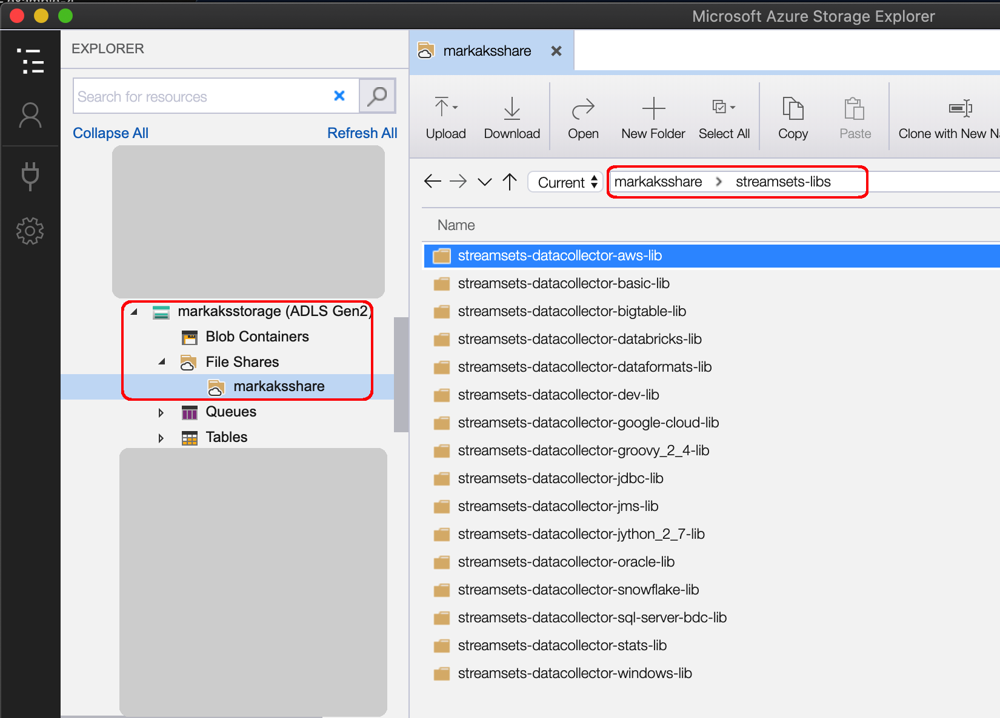

### Loading stage libs from a pre-populated Volume

This example shows how to load resources from a pre-populated Kubernetes [Volume](https://kubernetes.io/docs/concepts/storage/volumes/). (The next example covers how to dynamically populate and use a [Persistent Volume](https://kubernetes.io/docs/concepts/storage/persistent-volumes/)). 

There are many different Volume [types](https://kubernetes.io/docs/concepts/storage/volumes/#types-of-volumes); this example uses an [Azure File Volume](https://docs.microsoft.com/en-us/azure/aks/azure-files-volume). 

A pre-populated Volume can provide resources to multiple SDC Pods at deployment time, including stage libs, hadoop config files, lookup files, JDBC drivers, etc... 

In this example, the Volume has already been populated with a set of SDC stage libs. The [get-stage-libs.sh](get-stage-libs.sh) script provides an example of how to download stage libs.

Here is a view of an Azure File Share populated with a set of stage libs within a <code>streamsets-libs</code>directory:

To access the Azure File share, we need to store the connection properties in a Secret named <code>azure-secret</code>: 

    $ kubectl create secret generic azure-secret \
       --from-literal=azurestorageaccountname=<STORAGE ACCOUNT NAME> \
       --from-literal=azurestorageaccountkey=$<STORAGE ACCOUNT KEY>

Mount the Volume into an SDC deployment and the stage libs will be accessible to SDC Pods. 

Here is an example manifest for a Control Hub-based deployment that mounts the contents of the Azure File Share's <code>/streamsets-libs</code> directory to SDC's <code>/streamsets-libs</code> directory:

    apiVersion: apps/v1
    kind: Deployment
    metadata:
      name: sdc
    spec:
      replicas: 1
      selector:
        matchLabels:
          app: sdc
      template:
        metadata:
          labels:
            app: sdc
        spec:
          containers:
          - name: sdc
            image: streamsets/datacollector:latest
            ports:
            - containerPort: 18630
            env:
            volumeMounts:
            - name: streamsets-libs  
              mountPath: /opt/streamsets-datacollector-3.16.1/streamsets-libs
          volumes:
          - name: streamsets-libs
            azureFile:
              secretName: azure-secret
              shareName: markaksshare/streamsets-libs
              readOnly: true
     

After starting a deployment, one can inspect the installed stage libs in the deployed SDCs. For example, here are Pods for two instances of SDC:

    $ kubectl get pods | grep sdc
    sdc-69bd8dcc78-x2bs2             1/1     Running   0          17m
    sdc-69bd8dcc78-z9wtj             1/1     Running   0          17m

Run an <code>exec</code> command in one of the SDC's containers to see the installed stage-libs:

    $ kubectl exec -it sdc-69bd8dcc78-x2bs2 -- bash -c "ls /opt/streamsets-*/streamsets-libs"
    streamsets-datacollector-aws-lib
    streamsets-datacollector-basic-lib
    streamsets-datacollector-bigtable-lib
    streamsets-datacollector-databricks-lib
    streamsets-datacollector-dataformats-lib
    streamsets-datacollector-dev-lib
    streamsets-datacollector-google-cloud-lib
    streamsets-datacollector-groovy_2_4-lib
    streamsets-datacollector-jdbc-lib
    streamsets-datacollector-jms-lib
    streamsets-datacollector-jython_2_7-lib
    streamsets-datacollector-oracle-lib
    streamsets-datacollector-snowflake-lib
    streamsets-datacollector-sql-server-bdc-lib
    streamsets-datacollector-stats-lib
    streamsets-datacollector-windows-lib
     
This technique will also work for any other resources that need to be shared with SDCs including hadoop-config files, keystores and truststores, etc...     
