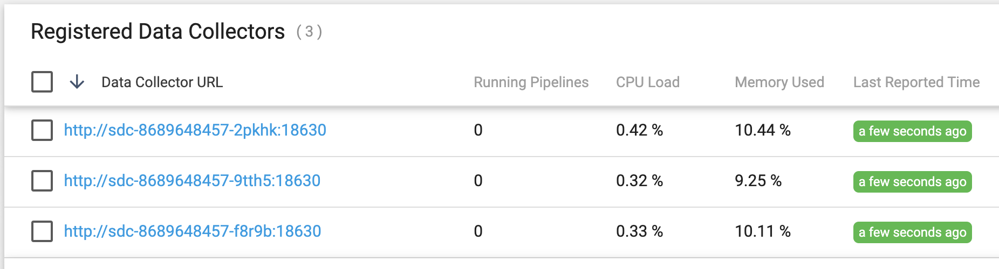
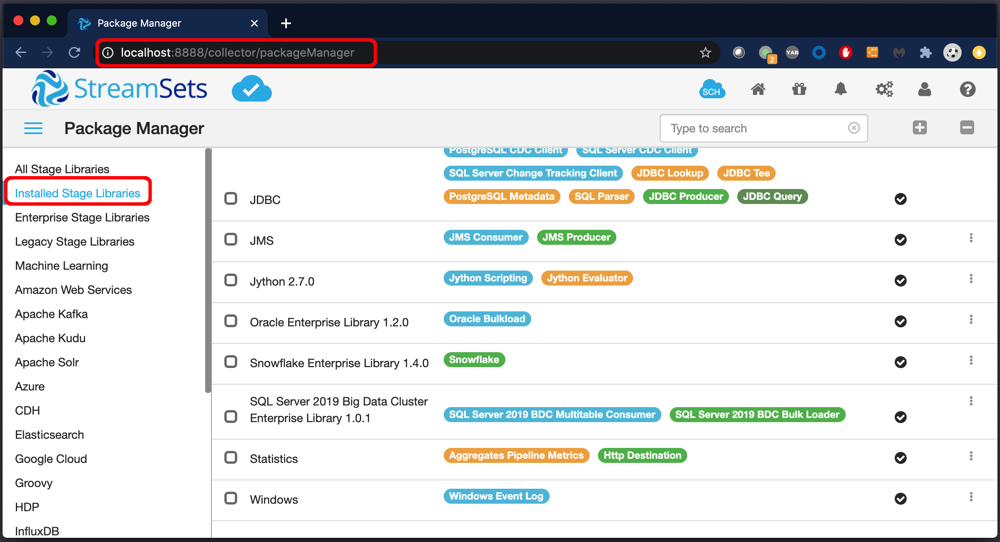

### Loading SDC Stage Libraries from a Persistent Volume
 
This approach uses a  [Persistent Volume](https://kubernetes.io/docs/concepts/storage/persistent-volumes/) to share a set of SDC Stage Libraries with multiple SDC Pods. The stage libs are loaded by SDC Pods at deployment time so there is no need to package them in a custom SDC image in advance (as in the [Custom Docker Image](../2-custom-docker-image) example).

The Persistent Volume is dynamically provisioned by a [Persistent Volume Claim](https://kubernetes.io/docs/concepts/storage/persistent-volumes/#lifecycle-of-a-volume-and-claim) and populated by a [Job](https://kubernetes.io/docs/concepts/workloads/controllers/job/) (using <code>[ReadWriteOnce](https://kubernetes.io/docs/concepts/storage/persistent-volumes/#access-modes)</code> access mode).  The Job downloads a set of stage libs based on a list stored in a ConfigMap. The stage libs on the Persistent Volume are then shared with multiple SDC Pods using <code>ReadOnlyMany</code> access mode.

There are several Persistent Volume [types](https://kubernetes.io/docs/concepts/storage/persistent-volumes/#types-of-persistent-volumes) to choose from, with various capabilities.  For this example, I'll use an [Azure File Volume](https://kubernetes.io/docs/concepts/storage/volumes/#azurefile) for use with an AKS cluster. The specific Persistent Volume type is set in a [Storage Class](https://kubernetes.io/docs/concepts/storage/storage-classes/); all other resources are portable across environments.

#### Step 1: Create a ConfigMap with a list of stage libs to download

Here is an example ConfigMap that contains two lists: one for standard SDC stage libs and one for Enterprise stage libs. Two separate lists are needed because Enterprise stage libs are downloaded from a different URL than standard SDC stage libs:

    apiVersion: v1
    kind: ConfigMap
    metadata:
      name: sdc-stage-libs-list
    data:
      sdc-stage-libs: |
        streamsets-datacollector-aws-lib
        streamsets-datacollector-basic-lib
        streamsets-datacollector-bigtable-lib
        streamsets-datacollector-dataformats-lib
        streamsets-datacollector-dev-lib
        streamsets-datacollector-google-cloud-lib
        streamsets-datacollector-groovy_2_4-lib
        streamsets-datacollector-jdbc-lib
        streamsets-datacollector-jms-lib
        streamsets-datacollector-jython_2_7-lib
        streamsets-datacollector-stats-lib
        streamsets-datacollector-windows-lib
      sdc-enterprise-stage-libs: |
        streamsets-datacollector-databricks-lib-1.0.0  
        streamsets-datacollector-snowflake-lib-1.4.0
        streamsets-datacollector-oracle-lib-1.2.0
        streamsets-datacollector-sql-server-bdc-lib-1.0.1

Create the ConfigMap by executing the command:
<code>$ kubectl apply -f sdc-stage-libs-configmap.yaml</code>

#### Step 2: Create a StorageClass 

Here is an example StorageClass for an Azure File Volume:

    kind: StorageClass
    apiVersion: storage.k8s.io/v1
    metadata:
      name: sdc-stage-libs-sc
    provisioner: kubernetes.io/azure-file
    mountOptions:
      - dir_mode=0777
      - file_mode=0777
      - uid=0
      - gid=0
      - mfsymlinks
      - cache=strict
    parameters:
      skuName: Standard_LRS

Create the StorageClass by executing the command:
<code>$ kubectl apply -f sdc-stage-libs-sc.yaml</code>
      
      
#### Step 3: Create a Persistent Volume Claim

Create a Persistent Volume Claim (PVC) with both <code>ReadWriteOnce</code> and  <code>ReadOnlyMany</code> access modes that requests 5GB of storage and refers to the StorageClass defined above:

    apiVersion: v1
    kind: PersistentVolumeClaim
    metadata:
      name: sdc-stage-libs-pvc
    spec:
      accessModes:
        - ReadWriteOnce
        - ReadOnlyMany
      storageClassName: sdc-stage-libs-sc
      resources:
        requests:
          storage: 5Gi

When this PVC is created, it will dynamically create an Azure File-based Persistent Volume.

Create the PVC by executing the command:
<code>$ kubectl apply -f sdc-stage-libs-pvc.yaml</code>

Inspect the PVC and wait until its status is <code>Bound</code>.  For example here's what I see in my environment:

    $ kubectl get pvc
    NAME                 STATUS   VOLUME                                     CAPACITY   ACCESS MODES
    sdc-stage-libs-pvc   Bound    pvc-721b28aa-6e56-49c6-8f3b-86935941b37e   5Gi        RWO,ROX

#### Step 4: Run a Job to download the SDC Stage Libraries to the Persistent Volume 
Create a [Job](https://kubernetes.io/docs/concepts/workloads/controllers/job/) to populate the Persistent Volume.

An example Job is defined [here](sdc-stage-libs-job.yaml). It spins up a [BusyBox](https://www.busybox.net/about.html) container that uses shell commands to download and extract the stage libs, and writes them to the directory <code>/streamsets-libs</code> in the Persistent Volume.  

As this Job launches the first Pod to use the PVC, it takes advantage of the <code>ReadWriteOnce</code> access mode and writes to the PV. 

Run the Job by executing the command:
<code>$ kubectl apply -f sdc-stage-libs-job.yaml</code>

You can tail the log of the Job's Pod to see the progress of the stage libs downloads:

<code>$ kubectl logs -f sdc-stage-libs-job-4xtln</code>

Make sure the Job completes successfully:

     $ kubectl get jobs
     NAME                 COMPLETIONS   DURATION   AGE
     sdc-stage-libs-job   1/1           73s        98s
    
When the Job completes, the Persistent Volume will be populated with the specified SDC stage libs.    

#### Step 4: Create an SDC Deployment with a VolumeMount for the SDC Stage Libraries

Create a Control Hub-based SDC Deployment that mounts the Persistent Volume using the PVC, using a manifest like this:

    apiVersion: apps/v1
    kind: Deployment
    metadata:
      name: sdc
    spec:
      selector:
        matchLabels:
          app: sdc
      template:
        metadata:
          labels:
            app: sdc
        spec:
          containers:
          - name: sdc
            image: streamsets/datacollector:latest
            ports:
            - containerPort: 18630
            env:
            - name: SDC_JAVA_OPTS
              value: "-Xmx2g -Xms2g"
            volumeMounts:
              - name: sdc-stage-libs
                mountPath: /opt/streamsets-datacollector-3.16.1/streamsets-libs
          volumes:
          - name: sdc-stage-libs
            persistentVolumeClaim:
              claimName: sdc-stage-libs-pvc

Specify three instance of SDC and start the deployment.  These Pods will load the <code>streamsets-libs</code> directory as a read-only file system.

We can see the three SDC Pods are running (along with the completed Job and our Control Agent):

    $ kubectl get pods
    NAME                             READY   STATUS      RESTARTS   AGE
    control-agent-764778f746-pjcpr   1/1     Running     0          168m
    sdc-8689648457-2pkhk             1/1     Running     0          62s
    sdc-8689648457-9tth5             1/1     Running     0          62s
    sdc-8689648457-f8r9b             1/1     Running     0          62s
    sdc-stage-libs-job-4xtln         0/1     Completed   0          5m35s

The three SDC instances will register with Control Hub:

Here we can see (using [<code>kubectl port-forward</code>](https://kubernetes.io/docs/tasks/access-application-cluster/port-forward-access-application-cluster/)) the installed stage libs for one of the SDCs:

 

