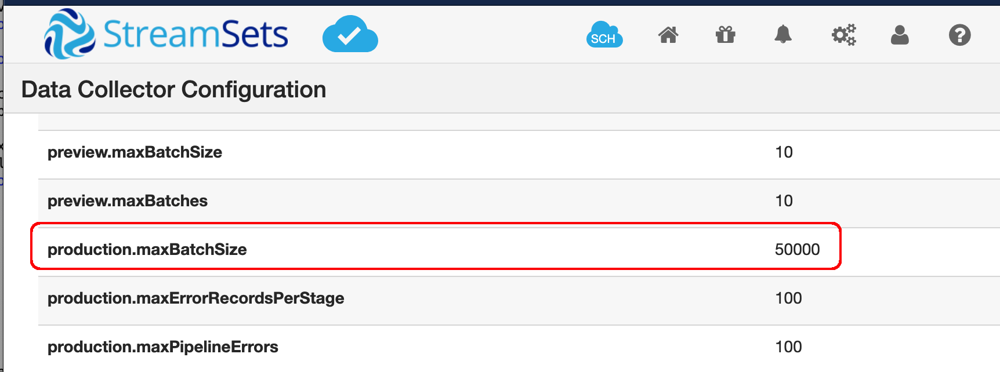

### Loading static and dynamic <code>sdc.properties</code> from separate ConfigMaps

This example splits the monolithic <code>sdc.properties</code> file used in the [previous example](../5-sdc-properties-configmap-1) into two configMaps: one for properties that rarely if ever change (and that can be reused across multiple deployments), and one for dynamic properties targeted for a specific deployment.

Similar to the previous example, start by copying a clean <code>sdc.properties</code> file to a local working directory.

Within that file, edit properties with values that will rarely change, and comment out properties that will need to be set for specific deployments. For example, I'll set these two properties values within the file:

    http.realm.file.permission.check=false
    http.enable.forwarded.requests=true
    
And I will comment out these two properties which I want to set specifically for a given deployment:

    # sdc.base.http.url=http://<hostname>:<port>
    # production.maxBatchSize=1000
    
One final setting:  append the filename <code>sdc-dynamic.properties</code> to the <code>config.includes</code> property in the <code>sdc.properties</code> file, like this:

    config.includes=dpm.properties,vault.properties,credential-stores.properties,sdc-dynamic.properties

That setting will load the dynamic properties described below.

Save the <code>sdc.properties</code> file in a configMap named <code>sdc-static-properties</code> by executing the command:

<code>$ kubectl create configmap sdc-static-properties --from-file=sdc.properties</code>

Once again, the configMap <code>sdc-static-properties</code> can be reused across multiple deployments.

Next, create a manifest named <code>sdc-dynamic-properties.yaml</code> that will contain only properties specific to a given deployment,  For example, my <code>sdc-dynamic-properties.yaml</code> contains  these two properties:

    apiVersion: v1
    kind: ConfigMap
    metadata:
      name: sdc-dynamic-properties
    data:
      sdc-dynamic.properties: |
        sdc.base.http.url=https://sequoia.onefoursix.com
        production.maxBatchSize=50000
    
Create the configMap by executing the command:

<code>$ kubectl apply -f sdc-dynamic-properties.yaml</code>

Add two Volumes to your SDC deployment manifest like this:

    volumes:
    - name: sdc-static-properties
      configMap:
        name: sdc-static-properties
        items:
        - key: sdc.properties
          path: sdc.properties
    - name: sdc-dynamic-properties
      configMap:
        name: sdc-dynamic-properties
        items:
        - key: sdc-dynamic.properties
          path: sdc-dynamic.properties
        
And add two Volume Mounts to the SDC container, the first to overwrite the <code>sdc.properties</code> file and the second to add the referenced <code>sdc-dynamic.properties</code> file

    volumeMounts:
    - name: sdc-static-properties
      mountPath: /etc/sdc/sdc.properties
      subPath: sdc.properties
    - name: sdc-dynamic-properties
      mountPath: /etc/sdc/sdc-dynamic.properties
      subPath: sdc-dynamic.properties

See [sdc.yaml](sdc.yaml) for the an example manifest.

Use [<code>kubectl port-forward</code>](https://kubernetes.io/docs/tasks/access-application-cluster/port-forward-access-application-cluster/) to confirm that the dynamically set properties are picked up by SDC:

 

 
