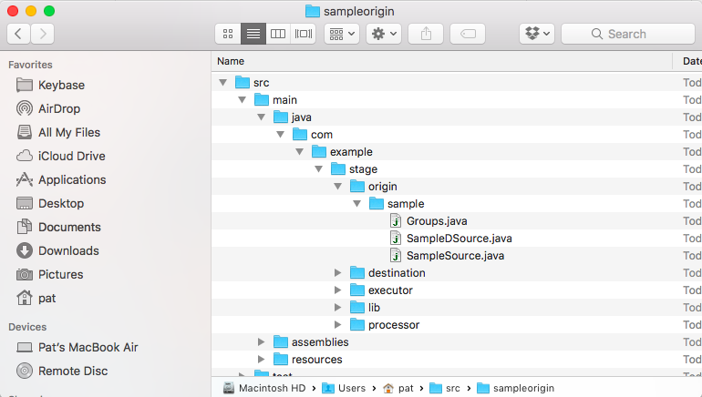

Creating a Custom Multithreaded StreamSets Origin
===================================

In [SDC](https://streamsets.com/products/sdc/) a multithreaded pipeline is a pipeline having an origin that supports parallel execution, so the pipeline can run in multiple threads. This tutorial explains how to get started writing your own custom Streamsets origin that supports parallel execution.  

This tutorial complements the [basic custom origin tutorial](https://github.com/streamsets/tutorials/tree/master/tutorial-origin), which covers the creation of a single threaded origin. You should complete that tutorial before starting on this one.
This tutorial refers to SDC version 2.4.0.0, but the process should apply to newer versions as well.

_Many thanks to Guglielmo Iozzia for contributing this tutorial!_
### What is a Streamsets Origin?
In SDC an origin stage represents the source of data for a pipeline. An origin reads data from some source, producing records to be consumed by the remainder of the pipeline. Several origins are currently available in the SDC libraries and they cover the most popular data sources, but it is possible any way to implement custom origins through the Data Collector APIs.  
### Creating and Building an Origin Template  
The process to create an origin template is the same as described in the basic custom origin tutorial. It requires [Apache Maven](https://maven.apache.org/).  

The first step to do is to create a new custom stage project. From a command shell execute:  
  
```    
$MAVEN_HOME/bin/mvn archetype:generate -DarchetypeGroupId=com.streamsets \
-DarchetypeArtifactId=streamsets-datacollector-stage-lib-tutorial \
-DarchetypeVersion=2.4.0.0 -DinteractiveMode=true  
```  
  
During the execution of this command you will be asked for the groupId, artifactId and version for the project.  
Maven generates a template project starting from the archetype in a directory which name is the provided artifactId. This is the structure for a newly created project:  



Through Maven you can then add the files for the project to be imported in your favourite IDE. For Eclipse, move to the root folder of the project and then execute:  
  
```  
$MAVEN_HOME/bin/mvn eclipse:eclipse  
```  
Maven creates the template files also to implement a custom destination, a custom processor and a custom executor in the *destination*, *executor* and *processor* packages: you can delete them all because the goal here is to implement a new origin only.  
### Modifying the Origin Template Code
#### Extending the Proper Parent Class
The template code contains a class called ```SampleSource.java``` which extends the SDC ```BaseSource``` abstract class. The first change to do is to make the SampleSource class extend ```com.streamsets.pipeline.api.base.BasePushSource```:  

```java  
public abstract class SampleSource extends BasePushSource   
```  
You have then to override the *produce* method for the new parent class  

```java
public void produce(Map<String, String> offsets, int maxBatchSize) throws StageException  
```  
As you can see from its signature, this time there is no single offset, but a Map of offsets and no ```BatchMaker``` argument (because any thread has to start and manage its own ```BatchContext```).  
#### Implementing the Thread Class
You need to add the code for the class (it could be an inner one) that implements the ```java.lang.Runnable``` interface:  

```java  
public class RecordGeneratorThread implements Runnable
```  
Implement a constructor for it. In this example we are going to implement just one constructor, expecting a single argument: an integer to identify at runtime any single thread instance:  

```java
RecordGeneratorThread(int threadId)
```
The action is in the overridden *run* method. There you need to start a  ```com.streamsets.pipeline.api.BatchContext```:  

```java
BatchContext batchContext = getContext().startBatch();
```
generate some records to be added to the ```BatchContext```:  

```java  
while (<some condition>) {
    Record record = batchContext.createRecord("Thread #" + threadId);
    Map<String, Field> map = new HashMap<>();
    map.put("fieldName", Field.create("Some Value"));
    record.set(Field.create(map));
    batchContext.getBatchMaker().addRecord(record);
...
  }
```
and finally processed by the remainder of the pipeline:  

```java
getContext().processBatch(batchContext);
```
#### Thread Configuration
In order to allow setup of the number of threads to start at each pipeline run, you can add a configuration parameter to the ```SampleDSource.java``` class:  

```java
@ConfigDef(
     required = false,
     type = ConfigDef.Type.NUMBER,
     defaultValue = "1",
     label = "Thread Count",
     displayPosition = 10,
     group = "SAMPLE"
)
public int threadCount;
```
This way you make it available in the origin UI. Its value can be made accessible from the Java code at runtime overriding the *getNumberOfThreads* parent method:  

```java
@Override
public int getNumberOfThreads() {
     return threadCount;
}
```
#### Thread Schedule and Execution 
Threads scheduling and execution need to be done in the ```SampleSource``` *produce* method. One way to to this is to use an ```ExecutorService``` with ```Future```:  

```java
ExecutorService executor = Executors.newFixedThreadPool(getNumberOfThreads()); 
List<Future<Runnable>> futures = new ArrayList<>(getNumberOfThreads());
        
// Start the threads
for(int i = 0; i < getNumberOfThreads(); i++) {
      Future future = executor.submit(new RecordGeneratorThread(i));
      futures.add(future);
}
        
// Wait for execution end
for(Future<Runnable> f : futures) {
      try {
          f.get();
      } catch (InterruptedException|ExecutionException e) {
          LOG.error("Record generation threads have been interrupted", e.getMessage());
      }
}
```
Finally terminate the executor:  

```java
executor.shutdownNow();
```
This command also cleans up the threads that have been created previously.  
### Unit Testing
In order to unit testing the code you can use the [JUnit](http://junit.org/junit4/) framework and the facilites provided by the Data Collector SDK. For a multithreaded origin you have to use the ```com.streamsets.pipeline.sdk.PushSourceRunner``` class. You can initialize a shared instance of the runner in the *before* method of your TestCase class:  

```java
PushSourceRunner runner;

@Before
public void before() throws StageException {
   runner = new PushSourceRunner.Builder(SampleDSource.class)
   .addConfiguration("threadCount", 1)
   .addOutputLane("lane")
   .build();
   runner.runInit();  
}
```
Then you can use it across the test methods like in the follow example:  

```java
final List<Record> records = new ArrayList<>();
runner.runProduce(Collections.<String, String>emptyMap(), 1, new PushSourceRunner.Callback() {
	@Override
	public void processBatch(StageRunner.Output output) {
	  records.clear();
	  records.addAll(output.getRecords().get("lane"));
	  runner.setStop();
	}
});
runner.waitOnProduce();

Assert.assertEquals(1, records.size());
```
Finally don't forget to stop it in the *after* method:  

```java
@After
public void after() throws StageException {
    runner.runDestroy();
}
```  
### Build and Deploy  
To generate the final artifact you need to run the following Maven command:  

```
$MAVEN_HOME/bin/mvn clean package
```  
It will generate a tar.gz archive in the *target* folder of the project. Send the archive to the *$SDC-HOME/user-libs* directory of the destination SDC host machine and extract its content:  

```
tar xvfz $SDC-HOME/user-libs/samplestage-1.0-SNAPSHOT.tar.gz
```
Restart SDC in order to make the new origin available for the pipelines.   
### Running the Origin in a Pipeline  
After restarting SDC you will see the new origin available in the origin list and you can use it in any pipeline.   
