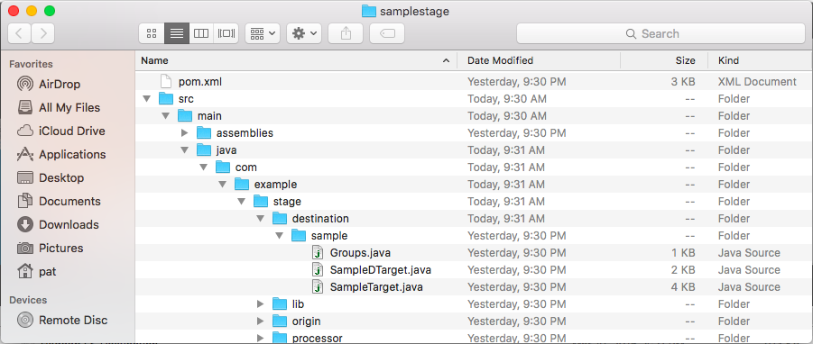
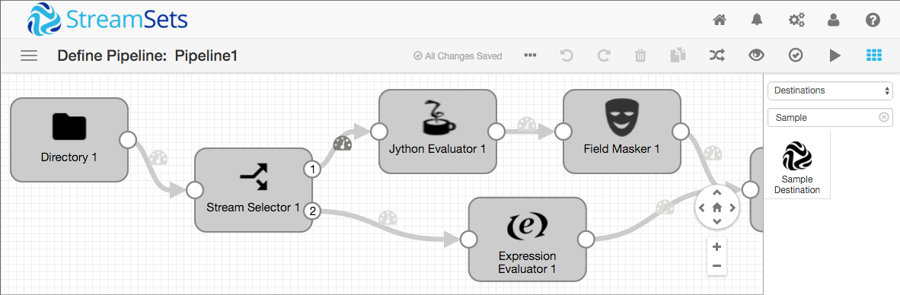
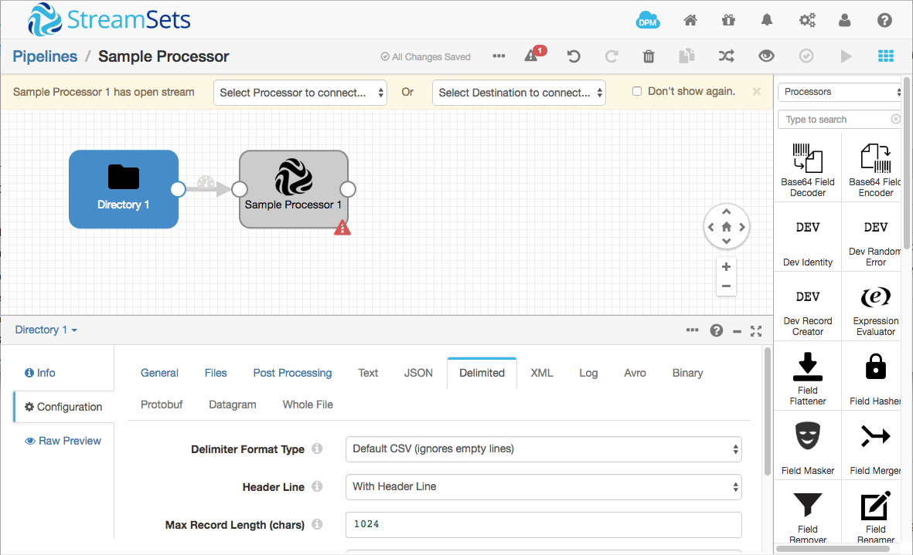
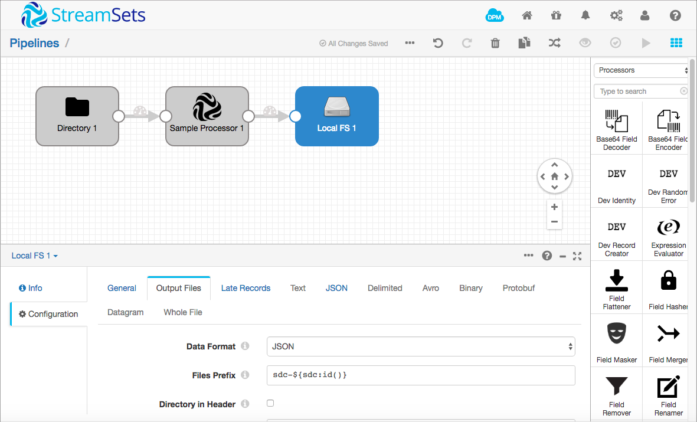
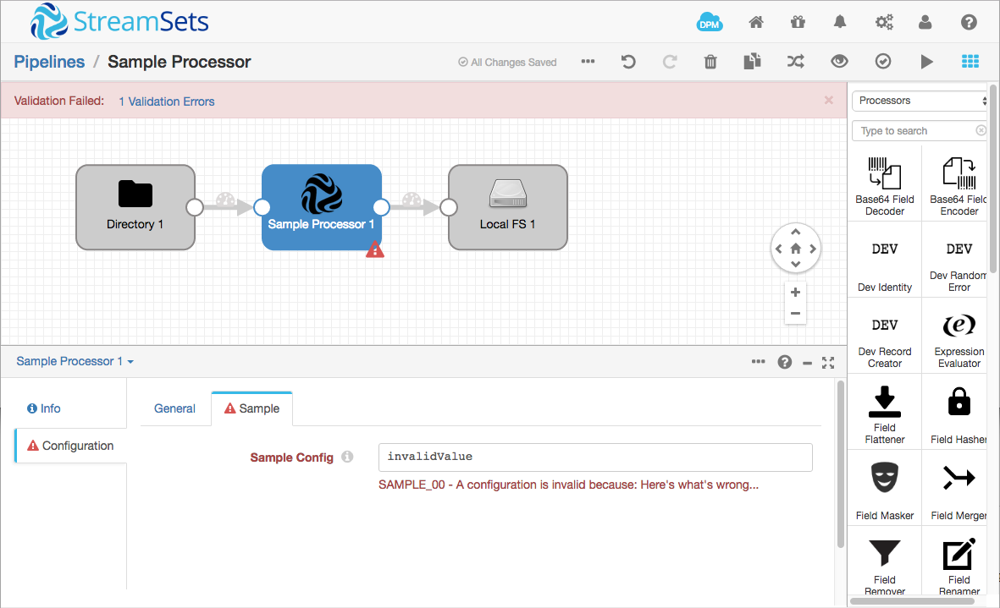
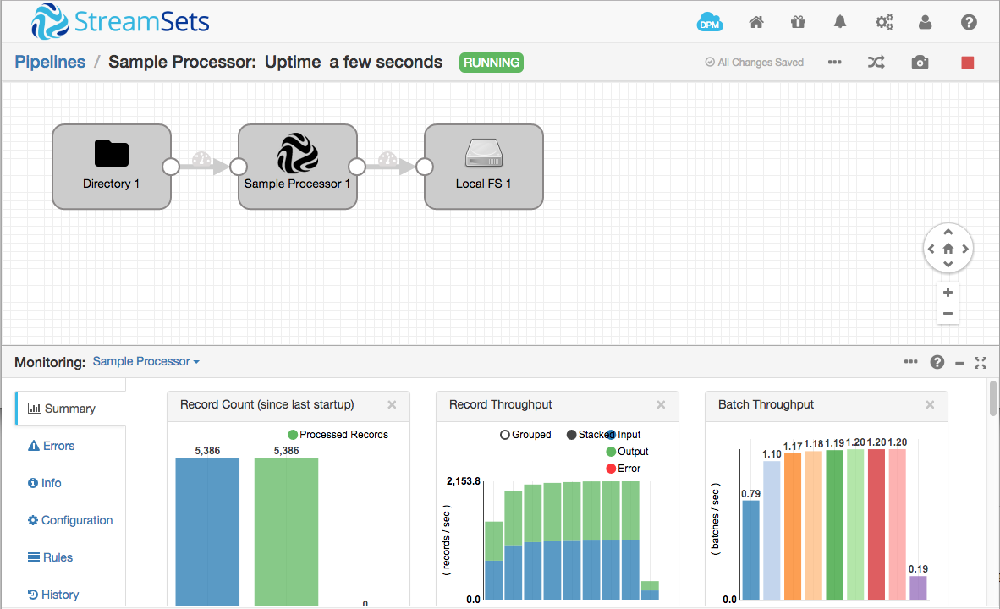
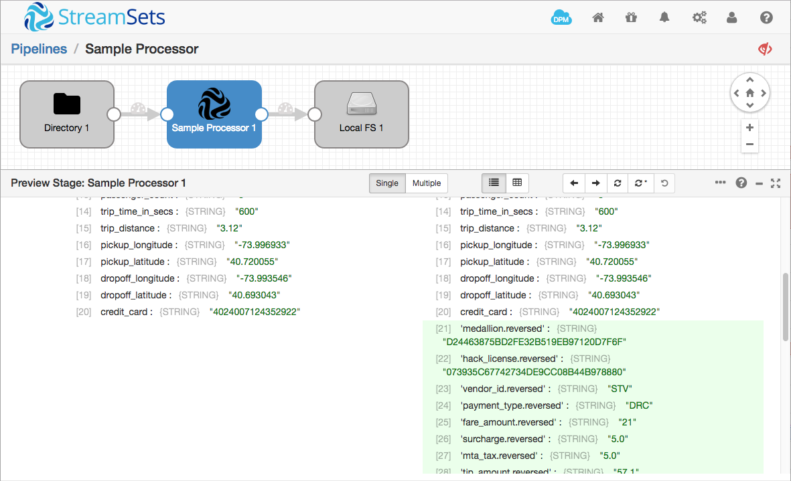
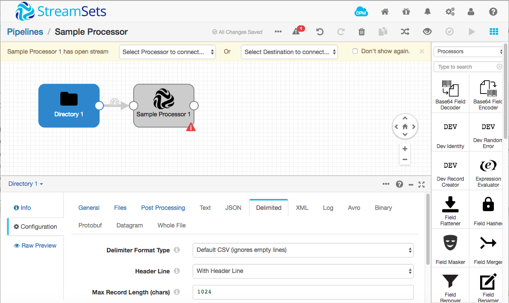
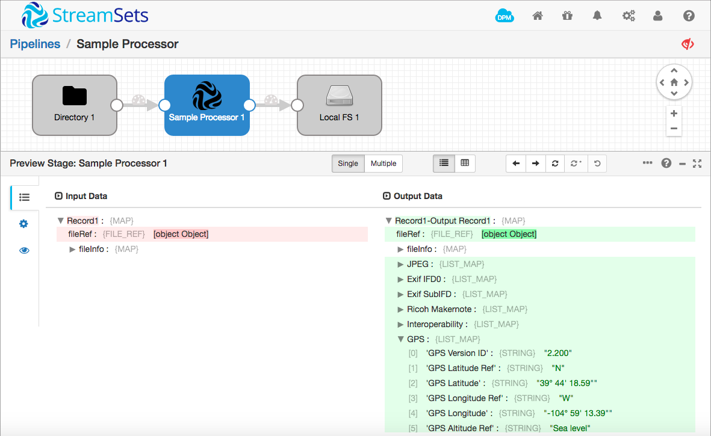
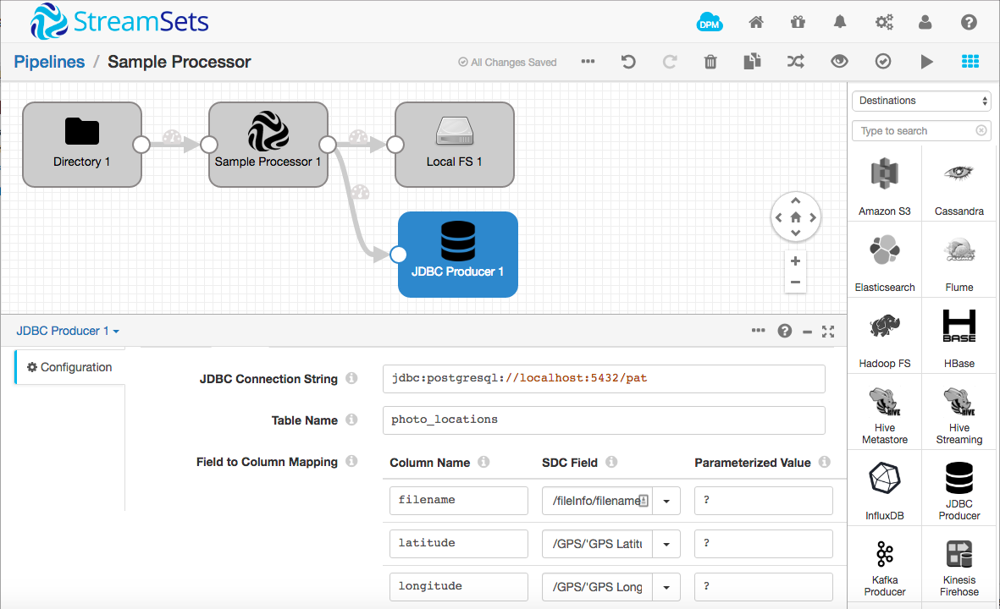

Creating a Custom StreamSets Processor
======================================

This tutorial explains how to get started writing your own custom StreamSets processor. You'll learn how to create a sample processor project, how to extend the sample to read and write record fields, including whole file content, and how to build and run your custom processor in StreamSets Data Collector.

Clone the [StreamSets tutorials project](https://github.com/streamsets/tutorials) to download the [completed custom processor project](sampleprocessor/), or work through this tutorial to create it from scratch.

### What is a StreamSets Processor?

StreamSets Data Collector (SDC) allows you to build continuous data pipelines, each of which consumes record-oriented data from a single *origin*, optionally operates on those records in one or more *processors* and writes data to one or more *destinations*. Origins, processors and destinations are collectively referred to as *stages*.

For example, this pipeline, based on the [SDC taxi data tutorial](https://streamsets.com/documentation/datacollector/latest/help/#Tutorial/Overview.html), uses the Directory origin, four processors, and the Hadoop FS destination:


A processor accepts batches of records as its input. It can add, modify or remove fields, before passing on some or all of the records as its output.

A destination is implemented as one or more Java classes. Typically, one class extends `BaseProcessor` (or one of its subclasses) and handles record processing, with a subclass handling configuration.

### Creating and Building a Processor Template

Follow the documentation to download, install and run StreamSets Data Collector. The [taxi data tutorial](https://streamsets.com/documentation/datacollector/latest/help/#Tutorial/Overview.html) gives an excellent grounding in how SDC works, and also provides a handy supply of test data for your destination. I highly recommend you follow it, if you haven’t already done so.

This tutorial uses version 2.1.0.0, but the instructions should apply to subsequent versions. Please [file an issue](https://github.com/streamsets/tutorials/issues/new) if this is not the case!

Finally, create a new custom stage project using the Maven archetype:

```sh
$ mvn archetype:generate -DarchetypeGroupId=com.streamsets \
-DarchetypeArtifactId=streamsets-datacollector-stage-lib-tutorial \
-DarchetypeVersion=2.1.0.0 -DinteractiveMode=true
[INFO] Scanning for projects...
[INFO]                                                                         
[INFO] ------------------------------------------------------------------------
[INFO] Building Maven Stub Project (No POM) 1
[INFO] ------------------------------------------------------------------------
[INFO] 
[INFO] >>> maven-archetype-plugin:2.4:generate (default-cli) > generate-sources @ standalone-pom >>>
[INFO] 
[INFO] <<< maven-archetype-plugin:2.4:generate (default-cli) < generate-sources @ standalone-pom <<<
[INFO] 
[INFO] --- maven-archetype-plugin:2.4:generate (default-cli) @ standalone-pom ---
[INFO] Generating project in Interactive mode
[INFO] Archetype repository not defined. Using the one from [com.streamsets:streamsets-datacollector-stage-lib-tutorial:1.1.4] found in catalog remote
Define value for property 'groupId': : com.example
Define value for property 'artifactId': : samplestage
Define value for property 'version':  1.0-SNAPSHOT: : 
Define value for property 'package':  com.example: : 
Confirm properties configuration:
groupId: com.example
artifactId: samplestage
version: 1.0-SNAPSHOT
package: com.example
 Y: : 
[INFO] ----------------------------------------------------------------------------
[INFO] Using following parameters for creating project from Archetype: streamsets-datacollector-stage-lib-tutorial:2.1.0.0
[INFO] ----------------------------------------------------------------------------
[INFO] Parameter: groupId, Value: com.example
[INFO] Parameter: artifactId, Value: samplestage
[INFO] Parameter: version, Value: 1.0-SNAPSHOT
[INFO] Parameter: package, Value: com.example
[INFO] Parameter: packageInPathFormat, Value: com/example
[INFO] Parameter: package, Value: com.example
[INFO] Parameter: version, Value: 1.0-SNAPSHOT
[INFO] Parameter: groupId, Value: com.example
[INFO] Parameter: artifactId, Value: samplestage
[INFO] project created from Archetype in dir: /Users/pat/src/samplestage
[INFO] ------------------------------------------------------------------------
[INFO] BUILD SUCCESS
[INFO] ------------------------------------------------------------------------
[INFO] Total time: 59.632 s
[INFO] Finished at: 2016-03-20T21:30:58-07:00
[INFO] Final Memory: 12M/116M
[INFO] ------------------------------------------------------------------------
```

Maven generates a template project from the archetype in a directory with the `artifactId` you provided as its name. As you can see, there is template code for an origin, a processor and a destination.



Now you can build the template:

```sh
$ cd samplestage
$ mvn clean package -DskipTests
[INFO] Scanning for projects...
[INFO]                                                                         
[INFO] ------------------------------------------------------------------------
[INFO] Building samplestage 1.0-SNAPSHOT
[INFO] ------------------------------------------------------------------------
...output omitted…
[INFO] Building tar : /Users/pat/src/samplestage/target/samplestage-1.0-SNAPSHOT.tar.gz
...output omitted...
```

Extract the tarball to the SDC `user-libs` directory, restart SDC, and you should see the sample stages in the stage library:

```sh
$ cd ~/streamsets-datacollector-2.1.0.0/user-libs/
$ tar xvfz /Users/pat/src/samplestage/target/samplestage-1.0-SNAPSHOT.tar.gz
x samplestage/lib/samplestage-1.0-SNAPSHOT.jar
```



### Understanding the Processor Template Code

Let’s walk through the template code, starting with `SampleProcessor.java`.

As mentioned above, processors extend `BaseProcessor` or one of its subclasses. In the template, `SampleProcessor` extends `SingleLaneRecordProcessor`, a convenience `Processor` implementation that:
* Handles one record at the time (instead of a batch) 
* Has built-in record error handling for `OnRecordErrorException`
* Writes all records to a single output stream

```java
public abstract class SampleProcessor extends SingleLaneRecordProcessor {
```

An abstract method allows the destination to get configuration data from its subclass:

```java
  /**
   * Gives access to the UI configuration of the stage provided by the {@link SampleDProcessor} class.
   */
  public abstract String getConfig();
```

SDC calls the `init()` method when validating and running a pipeline. The sample shows how to report configuration errors.

```java
  /** {@inheritDoc} */
  @Override
  protected List<ConfigIssue> init() {
    // Validate configuration values and open any required resources.
    List<ConfigIssue> issues = super.init();

    if (getConfig().equals("invalidValue")) {
      issues.add(
          getContext().createConfigIssue(
              Groups.SAMPLE.name(), "config", Errors.SAMPLE_00, "Here's what's wrong..."
          )
      );
    }

    // If issues is not empty, the UI will inform the user of each configuration issue in the list.
    return issues;
  }
```

SDC calls `destroy()` during validation, and when a pipeline is stopped:

```java
  /** {@inheritDoc} */
  @Override
  public void destroy() {
    // Clean up any open resources.
    super.destroy();
  }
```

The `process()` method is called for each record that flows through the processor. The sample simply writes the incoming record to the output stream:

```java
  /** {@inheritDoc} */
  @Override
  protected void process(Record record, SingleLaneBatchMaker batchMaker) throws StageException {
    // TODO: Implement your record processing here, then add to the output batch.

    // This example is a no-op
    batchMaker.addRecord(record);
  }
```

### Running the Sample Processor in a Pipeline

Let’s run a pipeline with the sample processor, then extend it to do more. For simplicity, we’ll just use the Directory origin to read records from the NYC Taxi Data file.

Follow [the tutorial](https://streamsets.com/documentation/datacollector/latest/help/#Tutorial/Overview.html) as far as creating the origin - your pipeline should look like this:


Now select 'Processors' in the Stage Library on the right of the Data Collector console, drag the Sample Processor onto the canvas and connect the Directory to it:



To complete the pipeline, we'll add a Local FS destination to write records to disk. Select 'Destinations' in the Stage Library, drag the Local FS destination onto the canvas, and connect the Sample Processor to it. Now click the Local FS destination to select it, click **Configuration** on the bottom left, then the **Output Files** tab. Set **Data Format** to **JSON**, then edit **Directory Template** and set it to an appropriate location on your local file system.



Validate the pipeline - you should see the ‘Validation Successful’ message. We can experiment with configuration validation. Select the Sample Processor, click the ‘Sample’ tab, and change the **Sample Config** value from `default` to `invalidValue`. Hit the validate icon again, and you’ll see the expected error:



Reset the **Sample Config** value to `default` (or anything except `invalidValue`!), and try running the pipeline. You should see that all 5,386 records are processed by the pipeline:



You can check the output file to verify that the records were written as expected:

```sh
$ cd /tmp/out/2016-10-14-15/
$ ls
_tmp_sdc-1f8cec21-cba5-444b-afdb-b624bc8aea81
$ head _tmp_sdc-1f8cec21-cba5-444b-afdb-b624bc8aea81 
{"medallion":"F6F7D02179BE915B23EF2DB57836442D","hack_license":"088879B44B80CC9ED43724776C539370","vendor_id":"VTS","payment_type":"CRD","fare_amount":"12","surcharge":"0.5","mta_tax":"0.5","tip_amount":"1.75","tolls_amount":"0","total_amount":"14.75","rate_code":"1","pickup_datetime":"2013-01-13 04:36asdf","dropoff_datetime":"2013-01-13 04:46asdf","passenger_count":"5","trip_time_in_secs":"600","trip_distance":"3.12","pickup_longitude":"-73.996933","pickup_latitude":"40.720055","dropoff_longitude":"-73.993546","dropoff_latitude":"40.693043","credit_card":"4024007124352922"}
 {"medallion":"BE386D8524FCD16B3727DCF0A32D9B25","hack_license":"4EB96EC9F3A42794DEE233EC8A2616CE","vendor_id":"VTS","payment_type":"CRD","fare_amount":"12","surcharge":"0.5","mta_tax":"0.5","tip_amount":"3.12","tolls_amount":"0","total_amount":"16.12","rate_code":"1","pickup_datetime":"2013-01-13 04:37:00","dropoff_datetime":"2013-01-13 04:48:00","passenger_count":"2","trip_time_in_secs":"660","trip_distance":"3.39","pickup_longitude":"-74.000313","pickup_latitude":"40.730068","dropoff_longitude":"-73.987373","dropoff_latitude":"40.768406","credit_card":"5163294842280902"}
 {"medallion":"E9FF471F36A91031FE5B6D6228674089","hack_license":"72E0B04464AD6513F6A613AABB04E701","vendor_id":"VTS","payment_type":"CRD","fare_amount":"5.5","surcharge":"0.5","mta_tax":"0.5","tip_amount":"1.2","tolls_amount":"0","total_amount":"7.7","rate_code":"1","pickup_datetime":"2013-01-13 04:41:00","dropoff_datetime":"2013-01-13 04:45:00","passenger_count":"1","trip_time_in_secs":"240","trip_distance":"1.16","pickup_longitude":"-73.997292","pickup_latitude":"40.720982","dropoff_longitude":"-74.000443","dropoff_latitude":"40.732376","credit_card":"4532038713619608"}
 {"medallion":"89D227B655E5C82AECF13C3F540D4CF4","hack_license":"BA96DE419E711691B9445D6A6307C170","vendor_id":"CMT","payment_type":"CSH","fare_amount":"6.5","surcharge":"0","mta_tax":"0.5","tip_amount":"0","tolls_amount":"0","total_amount":"7","rate_code":"1","pickup_datetime":"2013-01-01 15:11:48","dropoff_datetime":"2013-01-01 15:18:10","passenger_count":"4","trip_time_in_secs":"382","trip_distance":"1","pickup_longitude":"-73.978165","pickup_latitude":"40.757977","dropoff_longitude":"-73.989838","dropoff_latitude":"40.751171","credit_card":""}
 {"medallion":"0BD7C8F5BA12B88E0B67BED28BEA73D8","hack_license":"9FD8F69F0804BDB5549F40E9DA1BE472","vendor_id":"CMT","payment_type":"CSH","fare_amount":"6","surcharge":"0.5","mta_tax":"0.5","tip_amount":"0","tolls_amount":"0","total_amount":"7","rate_code":"1","pickup_datetime":"2013-01-06 00:18:35","dropoff_datetime":"2013-01-06 00:22:54","passenger_count":"1","trip_time_in_secs":"259","trip_distance":"1.5","pickup_longitude":"-74.006683","pickup_latitude":"40.731781","dropoff_longitude":"-73.994499","dropoff_latitude":"40.75066","credit_card":""}
 {"medallion":"0BD7C8F5BA12B88E0B67BED28BEA73D8","hack_license":"9FD8F69F0804BDB5549F40E9DA1BE472","vendor_id":"CMT","payment_type":"CSH","fare_amount":"5.5","surcharge":"1","mta_tax":"0.5","tip_amount":"0","tolls_amount":"0","total_amount":"7","rate_code":"1","pickup_datetime":"2013-01-05 18:49:41","dropoff_datetime":"2013-01-05 18:54:23","passenger_count":"1","trip_time_in_secs":"282","trip_distance":"1.1","pickup_longitude":"-74.004707","pickup_latitude":"40.73777","dropoff_longitude":"-74.009834","dropoff_latitude":"40.726002","credit_card":""}
 {"medallion":"DFD2202EE08F7A8DC9A57B02ACB81FE2","hack_license":"51EE87E3205C985EF8431D850C786310","vendor_id":"CMT","payment_type":"CSH","fare_amount":"5","surcharge":"0.5","mta_tax":"0.5","tip_amount":"0","tolls_amount":"0","total_amount":"6","rate_code":"1","pickup_datetime":"2013-01-07 23:54:15","dropoff_datetime":"2013-01-07 23:58:20","passenger_count":"2","trip_time_in_secs":"244","trip_distance":"0.7","pickup_longitude":"-73.974602","pickup_latitude":"40.759945","dropoff_longitude":"-73.984734","dropoff_latitude":"40.759388","credit_card":""}
 {"medallion":"DFD2202EE08F7A8DC9A57B02ACB81FE2","hack_license":"51EE87E3205C985EF8431D850C786310","vendor_id":"CMT","payment_type":"CSH","fare_amount":"9.5","surcharge":"0.5","mta_tax":"0.5","tip_amount":"0","tolls_amount":"0","total_amount":"10.5","rate_code":"1","pickup_datetime":"2013-01-07 23:25:03","dropoff_datetime":"2013-01-07 23:34:24","passenger_count":"1","trip_time_in_secs":"560","trip_distance":"2.1","pickup_longitude":"-73.97625","pickup_latitude":"40.748528","dropoff_longitude":"-74.002586","dropoff_latitude":"40.747868","credit_card":""}
 {"medallion":"20D9ECB2CA0767CF7A01564DF2844A3E","hack_license":"598CCE5B9C1918568DEE71F43CF26CD2","vendor_id":"CMT","payment_type":"CSH","fare_amount":"9.5","surcharge":"0","mta_tax":"0.5","tip_amount":"0","tolls_amount":"0","total_amount":"10","rate_code":"1","pickup_datetime":"2013-01-07 15:27:48","dropoff_datetime":"2013-01-07 15:38:37","passenger_count":"1","trip_time_in_secs":"648","trip_distance":"1.7","pickup_longitude":"-73.966743","pickup_latitude":"40.764252","dropoff_longitude":"-73.983322","dropoff_latitude":"40.743763","credit_card":""}
 {"medallion":"496644932DF3932605C22C7926FF0FE0","hack_license":"513189AD756FF14FE670D10B92FAF04C","vendor_id":"CMT","payment_type":"CSH","fare_amount":"6","surcharge":"0","mta_tax":"0.5","tip_amount":"0","tolls_amount":"0","total_amount":"6.5","rate_code":"1","pickup_datetime":"2013-01-08 11:01:15","dropoff_datetime":"2013-01-08 11:08:14","passenger_count":"1","trip_time_in_secs":"418","trip_distance":"0.8","pickup_longitude":"-73.995804","pickup_latitude":"40.743977","dropoff_longitude":"-74.007416","dropoff_latitude":"40.744343","credit_card":""}
```

### Creating an Image Metadata Processor

[metadata-extractor](https://github.com/drewnoakes/metadata-extractor/) "is a straightforward Java library for reading metadata from image files." We'll use metadata-extractor to build a processor that extracts the metadata from an image file and adds it to the record as attributes. We’ll build our processor’s functionality in stages, so you can see how the pieces fit together:

1. Write information to the SDC log
2. Read and write record fields
3. Access whole file data

### Writing to the SDC Log

The first step is to write some diagnostic data to the SDC log file.

Open the sample project in your IDE of choice - IntelliJ works well with Maven projects - and look at `SampleProcessor.java`. We’ll add some logging to the process method.

Let’s import the log classes and get a log object as a class variable:

```java
import org.slf4j.Logger;
import org.slf4j.LoggerFactory;

public abstract class SampleProcessor extends SingleLaneRecordProcessor {
    private static final Logger LOG = LoggerFactory.getLogger(SampleProcessor.class);
```

Add a line to top of the process method:

```java
  protected void process(Record record, SingleLaneBatchMaker batchMaker) throws StageException {
    LOG.info("Processing a record: {}", record);

    // This example is a no-op
    batchMaker.addRecord(record);
  }
```

Now build the destination project again, extract the tarball to the user-libs directory as before, and restart SDC. In another terminal window, tail the SDC log file:

```sh
$ tail -f ~/streamsets-datacollector-2.1.0.0/log/sdc.log
```

Stop the pipeline if it’s still running, reset the origin, and run it again. You should see *lots* of log output in the terminal window:

```
2016-10-14 08:19:35,549 [user:*admin] [pipeline:Sample Processor] [thread:ProductionPipelineRunnable-Sample Processor] DEBUG ProductionPipeline - Running
2016-10-14 08:19:35,549 [user:*admin] [pipeline:Sample Processor] [thread:ProductionPipelineRunnable-Sample Processor] DEBUG ProductionObserver - Reconfiguring
2016-10-14 08:19:35,549 [user:*admin] [pipeline:Sample Processor] [thread:ProductionPipelineRunnable-Sample Processor] DEBUG ProductionObserver - Reconfigured
2016-10-14 08:19:35,550 [user:*admin] [pipeline:Sample Processor] [thread:ProductionPipelineRunnable-Sample Processor] DEBUG DirectorySpooler - Polling for file, waiting '600000' ms
2016-10-14 08:19:35,550 [user:*admin] [pipeline:Sample Processor] [thread:ProductionPipelineRunnable-Sample Processor] DEBUG DirectorySpooler - Polling for file returned '/Users/pat/Downloads/nyc_taxi_data.csv'
2016-10-14 08:19:35,704 [user:*admin] [pipeline:Sample Processor] [thread:ProductionPipelineRunnable-Sample Processor] INFO  SampleProcessor - Processing a record: Record[headers='HeaderImpl[nyc_taxi_data.csv::285]' data='Field[LIST_MAP:{medallion=Field[STRING:F6F7D02179BE915B23EF2DB57836442D], hack_license=Field[STRING:088879B44B80CC9ED43724776C539370], vendor_id=Field[STRING:VTS], payment_type=Field[STRING:CRD], fare_amount=Field[STRING:12], surcharge=Field[STRING:0.5], mta_tax=Field[STRING:0.5], tip_amount=Field[STRING:1.75], tolls_amount=Field[STRING:0], total_amount=Field[STRING:14.75], rate_code=Field[STRING:1], pickup_datetime=Field[STRING:2013-01-13 04:36asdf], dropoff_datetime=Field[STRING:2013-01-13 04:46asdf], passenger_count=Field[STRING:5], trip_time_in_secs=Field[STRING:600], trip_distance=Field[STRING:3.12], pickup_longitude=Field[STRING:-73.996933], pickup_latitude=Field[STRING:40.720055], dropoff_longitude=Field[STRING:-73.993546], dropoff_latitude=Field[STRING:40.693043], credit_card=Field[STRING:4024007124352922]}]']
2016-10-14 08:19:35,708 [user:*admin] [pipeline:Sample Processor] [thread:ProductionPipelineRunnable-Sample Processor] INFO  SampleProcessor - Processing a record: Record[headers='HeaderImpl[nyc_taxi_data.csv::498]' data='Field[LIST_MAP:{medallion=Field[STRING:BE386D8524FCD16B3727DCF0A32D9B25], hack_license=Field[STRING:4EB96EC9F3A42794DEE233EC8A2616CE], vendor_id=Field[STRING:VTS], payment_type=Field[STRING:CRD], fare_amount=Field[STRING:12], surcharge=Field[STRING:0.5], mta_tax=Field[STRING:0.5], tip_amount=Field[STRING:3.12], tolls_amount=Field[STRING:0], total_amount=Field[STRING:16.12], rate_code=Field[STRING:1], pickup_datetime=Field[STRING:2013-01-13 04:37:00], dropoff_datetime=Field[STRING:2013-01-13 04:48:00], passenger_count=Field[STRING:2], trip_time_in_secs=Field[STRING:660], trip_distance=Field[STRING:3.39], pickup_longitude=Field[STRING:-74.000313], pickup_latitude=Field[STRING:40.730068], dropoff_longitude=Field[STRING:-73.987373], dropoff_latitude=Field[STRING:40.768406], credit_card=Field[STRING:5163294842280902]}]']
2016-10-14 08:19:35,709 [user:*admin] [pipeline:Sample Processor] [thread:ProductionPipelineRunnable-Sample Processor] INFO  SampleProcessor - Processing a record: Record[headers='HeaderImpl[nyc_taxi_data.csv::709]' data='Field[LIST_MAP:{medallion=Field[STRING:E9FF471F36A91031FE5B6D6228674089], hack_license=Field[STRING:72E0B04464AD6513F6A613AABB04E701], vendor_id=Field[STRING:VTS], payment_type=Field[STRING:CRD], fare_amount=Field[STRING:5.5], surcharge=Field[STRING:0.5], mta_tax=Field[STRING:0.5], tip_amount=Field[STRING:1.2], tolls_amount=Field[STRING:0], total_amount=Field[STRING:7.7], rate_code=Field[STRING:1], pickup_datetime=Field[STRING:2013-01-13 04:41:00], dropoff_datetime=Field[STRING:2013-01-13 04:45:00], passenger_count=Field[STRING:1], trip_time_in_secs=Field[STRING:240], trip_distance=Field[STRING:1.16], pickup_longitude=Field[STRING:-73.997292], pickup_latitude=Field[STRING:40.720982], dropoff_longitude=Field[STRING:-74.000443], dropoff_latitude=Field[STRING:40.732376], credit_card=Field[STRING:4532038713619608]}]']
...LOTS more output!...
```

Now we're generating some log output, let's try operating on the record fields.

### Reading and Writing Record Fields

As a first exercise, just for fun, we'll simply iterate through the record fields, reversing each one. 

The `process` method in `SampleProcessor.java` accepts a single record and, by default, simply writes it to the current batch. Let's iterate through the record's fields, and, for each string field, add a new field containing the reversed string:

```java
  protected void process(Record record, SingleLaneBatchMaker batchMaker) throws StageException {
    LOG.info("Input record: {}", record);

    for (String fieldPath : record.getEscapedFieldPaths()) {
      Field field = record.get(fieldPath);
      if (field.getType() == Field.Type.STRING) {
        String reversed = (new StringBuilder(field.getValueAsString())).reverse().toString();
        record.set(fieldPath + ".reversed", Field.create(reversed));
      }
    }

    LOG.info("Output record: {}", record);

    batchMaker.addRecord(record);
  }
```

Now restart SDC, but, instead of resetting the origin and rerunning the pipeline, click the preview button. In the Preview Configuration dialog, just click **Run Preview**, and then select the Sample Processor. Expand the first record in the preview pane, and you should see the new reversed fields:



Looking in the log, you should see similar evidence of the processor in action:

```
2016-10-14 11:20:51,913 [user:*admin] [pipeline:Sample Processor] [thread:preview-pool-1-thread-2] INFO  SampleProcessor - Input record: Record[headers='HeaderImpl[nyc_taxi_data.csv::2035]' data='Field[LIST_MAP:{medallion=Field[STRING:496644932DF3932605C22C7926FF0FE0], hack_license=Field[STRING:513189AD756FF14FE670D10B92FAF04C], vendor_id=Field[STRING:CMT], payment_type=Field[STRING:CSH], fare_amount=Field[STRING:6], surcharge=Field[STRING:0], mta_tax=Field[STRING:0.5], tip_amount=Field[STRING:0], tolls_amount=Field[STRING:0], total_amount=Field[STRING:6.5], rate_code=Field[STRING:1], pickup_datetime=Field[STRING:2013-01-08 11:01:15], dropoff_datetime=Field[STRING:2013-01-08 11:08:14], passenger_count=Field[STRING:1], trip_time_in_secs=Field[STRING:418], trip_distance=Field[STRING:0.8], pickup_longitude=Field[STRING:-73.995804], pickup_latitude=Field[STRING:40.743977], dropoff_longitude=Field[STRING:-74.007416], dropoff_latitude=Field[STRING:40.744343], credit_card=Field[STRING:]}]']
2016-10-14 11:20:51,913 [user:*admin] [pipeline:Sample Processor] [thread:preview-pool-1-thread-2] INFO  SampleProcessor - Output record: Record[headers='HeaderImpl[nyc_taxi_data.csv::2035]' data='Field[LIST_MAP:{medallion=Field[STRING:496644932DF3932605C22C7926FF0FE0], hack_license=Field[STRING:513189AD756FF14FE670D10B92FAF04C], vendor_id=Field[STRING:CMT], payment_type=Field[STRING:CSH], fare_amount=Field[STRING:6], surcharge=Field[STRING:0], mta_tax=Field[STRING:0.5], tip_amount=Field[STRING:0], tolls_amount=Field[STRING:0], total_amount=Field[STRING:6.5], rate_code=Field[STRING:1], pickup_datetime=Field[STRING:2013-01-08 11:01:15], dropoff_datetime=Field[STRING:2013-01-08 11:08:14], passenger_count=Field[STRING:1], trip_time_in_secs=Field[STRING:418], trip_distance=Field[STRING:0.8], pickup_longitude=Field[STRING:-73.995804], pickup_latitude=Field[STRING:40.743977], dropoff_longitude=Field[STRING:-74.007416], dropoff_latitude=Field[STRING:40.744343], credit_card=Field[STRING:], medallion.reversed=Field[STRING:0EF0FF6297C22C5062393FD239446694], hack_license.reversed=Field[STRING:C40FAF29B01D076EF41FF657DA981315], vendor_id.reversed=Field[STRING:TMC], payment_type.reversed=Field[STRING:HSC], fare_amount.reversed=Field[STRING:6], surcharge.reversed=Field[STRING:0], mta_tax.reversed=Field[STRING:5.0], tip_amount.reversed=Field[STRING:0], tolls_amount.reversed=Field[STRING:0], total_amount.reversed=Field[STRING:5.6], rate_code.reversed=Field[STRING:1], pickup_datetime.reversed=Field[STRING:51:10:11 80-10-3102], dropoff_datetime.reversed=Field[STRING:41:80:11 80-10-3102], passenger_count.reversed=Field[STRING:1], trip_time_in_secs.reversed=Field[STRING:814], trip_distance.reversed=Field[STRING:8.0], pickup_longitude.reversed=Field[STRING:408599.37-], pickup_latitude.reversed=Field[STRING:779347.04], dropoff_longitude.reversed=Field[STRING:614700.47-], dropoff_latitude.reversed=Field[STRING:343447.04], credit_card.reversed=Field[STRING:]}]']
```

As an optional exercise, review the [Custom Destination Tutorial](../tutorial-destination/readme.md) and see if you can extend the processor to allow configuration of the suffix we add to the field paths. 

### Accessing Whole File Data

Now you know enough to create a basic processor that creates new fields based on existing values. Let's go a step further. As well as parsing various formats of input files into records, [SDC can ingest whole files](https://streamsets.com/documentation/datacollector/latest/help/#Pipeline_Design/WholeFile.html). We'll modify our field reverser to read metadata from image files, writing the metadata to the record.

The first step is to add a dependency for [metadata-extractor](https://github.com/drewnoakes/metadata-extractor/) to the processor's `pom.xml`:

```xml
    <dependency>
      <groupId>com.streamsets</groupId>
      <artifactId>streamsets-datacollector-api</artifactId>
      <version>2.1.0.0</version>
      <scope>provided</scope>
    </dependency>

    <!-- 
      Insert the following dependency after streamsets-datacollector-api
      but before slf4j-api
    -->
    <dependency>
      <groupId>com.drewnoakes</groupId>
      <artifactId>metadata-extractor</artifactId>
      <version>2.9.1</version>
    </dependency>

    <dependency>
      <groupId>org.slf4j</groupId>
      <artifactId>slf4j-api</artifactId>
      <version>${slf4j.version}</version>
      <scope>provided</scope>
    </dependency>
```

When SDC ingests whole files, it creates two fields in the root of the record: `fileInfo` and `fileRef`. The `fileInfo` field contains file metadata such as the filename, while `fileRef` is a reference to the actual file content. Getting the file content, then feeding it to metadata-extractor is straightforward - replace the existing implementation of `process()` with the following code:

```java
  protected void process(Record record, SingleLaneBatchMaker batchMaker) throws StageException {
    LOG.info("Input record: {}", record);

    FileRef fileRef = record.get("/fileRef").getValueAsFileRef();
    Metadata metadata;
    try {
      metadata = ImageMetadataReader.readMetadata(fileRef.createInputStream(getContext(), InputStream.class));
    } catch (ImageProcessingException | IOException e) {
      String filename = record.get("/fileInfo/filename").getValueAsString();
      LOG.info("Exception getting metadata from {}", filename, e);
      throw new OnRecordErrorException(record, Errors.SAMPLE_02, e);
    }

    // A Metadata object contains multiple Directory objects
    for (Directory directory : metadata.getDirectories()) {
      // Each Directory stores values in Tag objects
      for (Tag tag : directory.getTags()) {
        LOG.info("TAG: {}", tag);
      }
      // Each Directory may also contain error messages
      if (directory.hasErrors()) {
        for (String error : directory.getErrors()) {
          LOG.info("ERROR: {}", error);
        }
      }
    }

    LOG.info("Output record: {}", record);

    batchMaker.addRecord(record);
  }

```

For this first iteration, we'll just write the metadata to the SDC log.

Build the processor and extract it into the SDC `user-libs` directory. Before previewing or running the pipeline, we'll need to reconfigure the Directory origin to ingest whole files and the Local FS destination to write them. Create an empty directory for image files, then configure the Directory origin with that directory name and a **File Name Pattern** of `*`:



Reconfigure the Local FS destination **Data Format** to **Whole File**.

There is one final task to perform before we can process records. The default security policy for custom stages is quite restrictive. In particular, if you try to run this code, you will see the error:

```
java.security.AccessControlException: access denied ("java.io.FilePermission" "/Users/pat/images/image1.png" "read")
```

We need to edit the SDC security policy to allow the process to read files. Open `~/streamsets-datacollector-2.1.0.0/etc/sdc-security.policy` in your favorite editor and add a new section:

```
grant codebase "file://${sdc.dist.dir}/user-libs/sampleprocessor/-" {
  permission java.io.FilePermission "/Users/pat/images/*", "read";
};
```

Restart SDC after editing the security policy file and start your pipeline. Drop an image file into the directory and then check the log. You should see output similar to:

```
2016-10-15 20:08:16,839 [user:*admin] [pipeline:Sample Processor] [thread:ProductionPipelineRunnable-Sample Processor] INFO  SampleProcessor - TAG: [JPEG] Compression Type - Baseline
2016-10-15 20:08:16,839 [user:*admin] [pipeline:Sample Processor] [thread:ProductionPipelineRunnable-Sample Processor] INFO  SampleProcessor - TAG: [JPEG] Data Precision - 8 bits
2016-10-15 20:08:16,839 [user:*admin] [pipeline:Sample Processor] [thread:ProductionPipelineRunnable-Sample Processor] INFO  SampleProcessor - TAG: [JPEG] Image Height - 3024 pixels
2016-10-15 20:08:16,839 [user:*admin] [pipeline:Sample Processor] [thread:ProductionPipelineRunnable-Sample Processor] INFO  SampleProcessor - TAG: [JPEG] Image Width - 4032 pixels
2016-10-15 20:08:16,839 [user:*admin] [pipeline:Sample Processor] [thread:ProductionPipelineRunnable-Sample Processor] INFO  SampleProcessor - TAG: [JPEG] Number of Components - 3
2016-10-15 20:08:16,839 [user:*admin] [pipeline:Sample Processor] [thread:ProductionPipelineRunnable-Sample Processor] INFO  SampleProcessor - TAG: [JPEG] Component 1 - Y component: Quantization table 0, Sampling factors 2 horiz/2 vert
2016-10-15 20:08:16,839 [user:*admin] [pipeline:Sample Processor] [thread:ProductionPipelineRunnable-Sample Processor] INFO  SampleProcessor - TAG: [JPEG] Component 2 - Cb component: Quantization table 1, Sampling factors 1 horiz/1 vert
2016-10-15 20:08:16,839 [user:*admin] [pipeline:Sample Processor] [thread:ProductionPipelineRunnable-Sample Processor] INFO  SampleProcessor - TAG: [JPEG] Component 3 - Cr component: Quantization table 1, Sampling factors 1 horiz/1 vert
2016-10-15 20:08:16,839 [user:*admin] [pipeline:Sample Processor] [thread:ProductionPipelineRunnable-Sample Processor] INFO  SampleProcessor - TAG: [Exif IFD0] Make - Apple
2016-10-15 20:08:16,839 [user:*admin] [pipeline:Sample Processor] [thread:ProductionPipelineRunnable-Sample Processor] INFO  SampleProcessor - TAG: [Exif IFD0] Model - iPhone 6s Plus
2016-10-15 20:08:16,839 [user:*admin] [pipeline:Sample Processor] [thread:ProductionPipelineRunnable-Sample Processor] INFO  SampleProcessor - TAG: [Exif IFD0] Orientation - Right side, top (Rotate 90 CW)
2016-10-15 20:08:16,839 [user:*admin] [pipeline:Sample Processor] [thread:ProductionPipelineRunnable-Sample Processor] INFO  SampleProcessor - TAG: [Exif IFD0] X Resolution - 72 dots per inch
2016-10-15 20:08:16,839 [user:*admin] [pipeline:Sample Processor] [thread:ProductionPipelineRunnable-Sample Processor] INFO  SampleProcessor - TAG: [Exif IFD0] Y Resolution - 72 dots per inch
...lots more metadata...
```

The metadata directories and tags map neatly to a hierarchy of fields in SDC. We can create a ListMap for each directory and a string field for each tag. Replace the metadata loop with the following:

```
    for (Directory directory : metadata.getDirectories()) {
      LinkedHashMap<String, Field> listMap = new LinkedHashMap<>();

      for (Tag tag : directory.getTags()) {
        listMap.put(tag.getTagName(), Field.create(tag.getDescription()));
      }

      if (directory.hasErrors()) {
        for (String error : directory.getErrors()) {
          LOG.info("ERROR: {}", error);
        }
      }

      record.set("/" + directory.getName(), Field.createListMap(listMap));
    }
```

Rebuild the processor, extract it to user-libs, restart SDC, and preview the pipeline. You should see the new fields:



Now you have the image metadata as record fields, you can use it in any way you choose. One common use case is to write image metadata to a database - I created a table in Postgres and used the JDBC Producer destination to populate it with the filename, latitude and longitude at the same time as writing the image files to disk. Note the use of quotes when specifying field names containing spaces:



```
pat=# select * from photo_locations;
   filename   |    latitude    |    longitude     
--------------+----------------+------------------
 R0010812.JPG | 39° 44' 18.59" | -104° 59' 13.39"
(1 row)
```

### Conclusion

You’ve covered a lot of ground in this tutorial:

* You created a template SDC stage project from the Maven archetype
* You installed the stages into SDC
* You progressively modified the process to extract metadata from image files and write it into the records as fields

You should be able to apply the principles you’ve learned to making your own processor stages now. Going further, you should change the icon for the processor, as well as the Java class names. These are left as an exercise for the reader.

If you encounter any problems, please, [file an issue in the tutorials project](https://github.com/streamsets/tutorials/issues/new).

