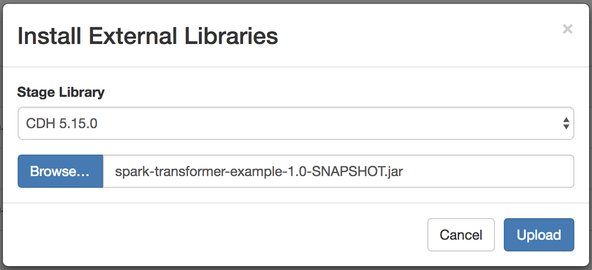
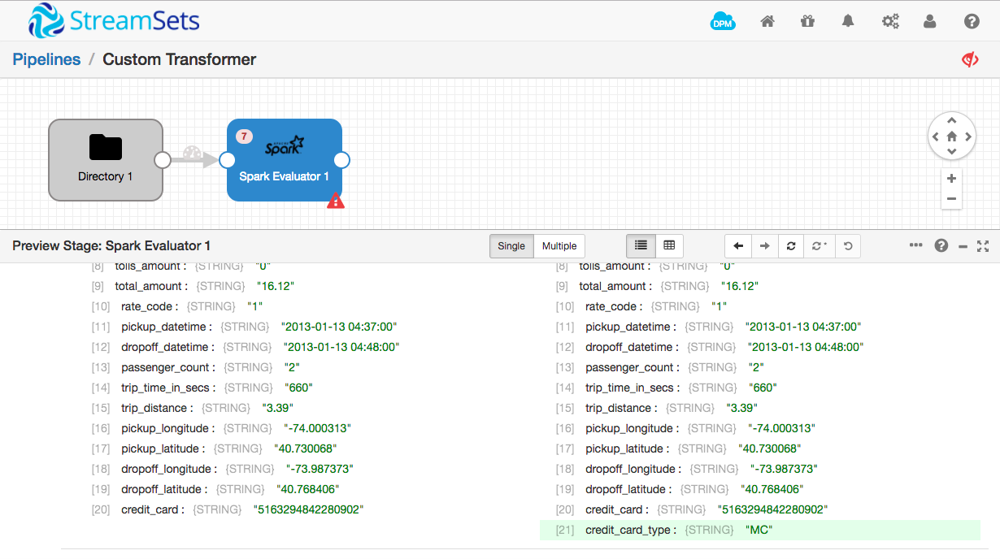
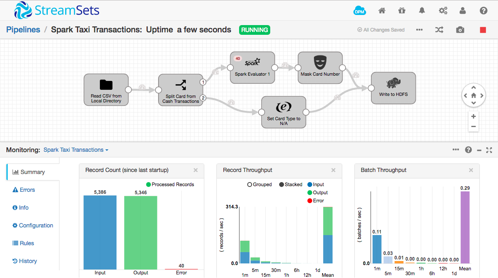

Creating a StreamSets Spark Transformer in Java
===============================================

The [Spark Evaluator](https://streamsets.com/documentation/datacollector/latest/help/#Processors/Spark.html#concept_cpx_1lm_zx) stage allows you to implement custom processing in an [Apache Spark](http://spark.apache.org/) application. The Spark Application runs for the lifetime of the pipeline, processing batches of records as they arrive. You can configure the number of threads to run in the Spark Application, allowing you to take advantage of parallel processing. Your application can use the Spark libraries, manipulate data via RDDs, and call existing Java library code.

This tutorial explains how to create a simple Apache Spark application, using Java, that will compute the type of a credit card from its number, and configure the Spark Evaluator to use it. A [companion tutorial](../tutorial-spark-transformer-scala/readme.md) explains how to implement the same functionality in Scala.

Prerequisites
-------------

Note: issues exist in some versions of Data Collector prior to 3.4.2 that prevent the Spark Evaluator from functioning correctly. Please ensure you are using Data Collector 3.4.2 or later.

* [Download](https://streamsets.com/opensource/) and [install](https://streamsets.com/documentation/datacollector/latest/help/#Install_Config/InstallationAndConfig.html#concept_gbn_4lv_1r) StreamSets Data Collector. This tutorial uses Data Collector 3.4.2, but the instructions should apply to subsequent versions. Please [file an issue](https://github.com/streamsets/tutorials/issues/new) if this is not the case.
* [Install a stage library](https://streamsets.com/documentation/datacollector/latest/help/datacollector/UserGuide/Installation/AddtionalStageLibs.html#concept_fb2_qmn_bz) that supports the Spark Evaluator. The Spark Evaluator is available in several CDH and MapR stage libraries; this tutorial uses CDH 5.15. To verify the Spark version that a stage library includes, see the CDH or MapR documentation. For more information about the stage libraries that include the Spark Evaluator, see [Available Stage Libraries](https://streamsets.com/documentation/datacollector/latest/help/datacollector/UserGuide/Installation/AddtionalStageLibs.html#concept_evs_xkm_s5). Note that the Spark Evaluator does _not_ currently work with CDH 6.0.
* Oracle [Java Development Kit](http://www.oracle.com/technetwork/java/javase/downloads/index.html) (JDK) 1.8 or later is needed to compile Java code and build JAR files.
* [Maven](https://maven.apache.org/download.cgi) 3.3.9 or higher is needed to manage the JAR file build process.

The stage libraries that include the Spark Evaluator also include all necessary Spark dependencies. You do *not* need to download or install a Spark distribution.

Implementing a Skeleton Transformer
-----------------------------------

The main class of the Spark Application must extend the [`com.streamsets.pipeline.spark.api.SparkTransformer`](https://github.com/streamsets/datacollector-plugin-api/blob/master/streamsets-datacollector-spark-api/src/main/java/com/streamsets/pipeline/spark/api/SparkTransformer.java) abstract class, implementing the `transform(JavaRDD<Record> recordRDD)` and, optionally, `init(JavaSparkContext context, List<String> parameters)` and `destroy()` methods.

Here's a minimal implementation that simply returns its input as its output:

    package com.streamsets.spark;

    import com.streamsets.pipeline.api.Record;
    import com.streamsets.pipeline.spark.api.SparkTransformer;
    import com.streamsets.pipeline.spark.api.TransformResult;
    import org.apache.spark.api.java.JavaPairRDD;
    import org.apache.spark.api.java.JavaRDD;
    import org.apache.spark.api.java.JavaSparkContext;
    import org.apache.spark.api.java.function.Function;
    import scala.Tuple2;

    import java.io.Serializable;
    import java.util.List;

    public class CustomTransformer extends SparkTransformer implements Serializable {
      private transient JavaSparkContext javaSparkContext;

      @Override
      public void init(JavaSparkContext javaSparkContext, List<String> params) {
        this.javaSparkContext = javaSparkContext;
      }

      @Override
      public TransformResult transform(JavaRDD<Record> records) {
        // Create an empty errors JavaPairRDD
        JavaRDD<Tuple2<Record,String>> emptyRDD = javaSparkContext.emptyRDD();
        JavaPairRDD<Record, String> errors = JavaPairRDD.fromJavaRDD(emptyRDD);

        // Apply a map to the incoming records
        JavaRDD<Record> result = records.map(new Function<Record, Record>() {
          @Override
          public Record call(Record record) throws Exception {
            // Just return the incoming record
            return record;
          }
        });
        return new TransformResult(result, errors);
      }
    }

Create a new directory for your Spark Transformer project, and save the above code there as `src/main/java/com/streamsets/spark/CustomTransformer.java`. You will also need a pom.xml file in the project directory itself. Note that you will need to set the `streamsets-datacollector-spark-api` version to match your version of Data Collector, and the Spark core library `artifactId` and `version` to match that used by the stage library you are using. In this tutorial, I'm using CDH 5.15; looking in the `$SDC_HOME/streamsets-libs/streamsets-datacollector-cdh_5_15-lib/lib/` directory, I can see that the Spark core jar file is `spark-core_2.11-2.1.0.cloudera1.jar`. We don't need to reference the Cloudera-specific version, so we set `artifactId` to `spark-core_2.11` with a version of `2.1.0`. If you are using a different stage library, you will need to change these values to match your Spark core jar file.

    <?xml version="1.0" encoding="UTF-8"?>
    <project xmlns="http://maven.apache.org/POM/4.0.0"
             xmlns:xsi="http://www.w3.org/2001/XMLSchema-instance"
             xsi:schemaLocation="http://maven.apache.org/POM/4.0.0 http://maven.apache.org/xsd/maven-4.0.0.xsd">
      <modelVersion>4.0.0</modelVersion>

      <groupId>com.streamsets.SparkTransformerExample</groupId>
      <artifactId>spark-transformer-example</artifactId>
      <description>Spark Transformer Example</description>
      <version>1.0-SNAPSHOT</version>

      <dependencies>
        <dependency>
          <groupId>com.streamsets</groupId>
          <artifactId>streamsets-datacollector-spark-api</artifactId>
          <version>3.4.2</version>
        </dependency>
        <!-- CDH 5.15 uses Spark 2.1.0 -->
        <dependency>
          <groupId>org.apache.spark</groupId>
          <artifactId>spark-core_2.11</artifactId>
          <version>2.1.0</version>
        </dependency>
      </dependencies>

      <!-- Need to build to JDK 1.8 -->
      <build>
        <plugins>
          <plugin>
            <groupId>org.apache.maven.plugins</groupId>
            <artifactId>maven-compiler-plugin</artifactId>
            <version>3.3</version>
            <configuration>
              <source>1.8</source>
              <target>1.8</target>
            </configuration>
          </plugin>
        </plugins>
      </build>  
    </project>

Now build the project with `mvn clean package`:

    $ mvn clean package
    [INFO] Scanning for projects...
    [INFO]                                                                         
    [INFO] ------------------------------------------------------------------------
    [INFO] Building spark-transformer-example 1.0-SNAPSHOT
    [INFO] ------------------------------------------------------------------------
    ...output omitted...
    [INFO] Building jar: /Users/pat/src/spark-transformer-example/target/spark-transformer-example-1.0-SNAPSHOT.jar
    [INFO] ------------------------------------------------------------------------
    [INFO] BUILD SUCCESS
    [INFO] ------------------------------------------------------------------------
    [INFO] Total time: 7.984 s
    [INFO] Finished at: 2016-12-01T18:29:10-08:00
    [INFO] Final Memory: 37M/207M
    [INFO] ------------------------------------------------------------------------

You should see a jar file in the `target` directory:

    $ ls target
    classes                     maven-archiver                  spark-transformer-example-1.0-SNAPSHOT.jar
    generated-sources           maven-status

Make a note of the location of the jar file, as you'll be installing it in the next step.

Creating a Pipeline Using a Spark Transformer
---------------------------------------------

Since the skeleton Spark Transformer simply passes records through unchanged, you could drop it into any pipeline to test it. Since we'll be extending the skeleton to operate on credit card data, we'll build a simple pipeline to read in a CSV file based on the New York City taxi transaction dataset.

1. Download the sample CSV file from [here](https://www.streamsets.com/documentation/datacollector/sample_data/tutorial/nyc_taxi_data.csv).

2. In the Data Collector home screen, click the **Create New Pipeline** button, enter a suitable name and description and click **Save**. 

3. In the Properties panel, click the **Error Records** tab; for the **Error Records** property, select **Write to File**.
This writes error records to a file so you can deal with error records without having to stop the pipeline.

4. Click the **Error Records - Write to File** tab and set **Directory** to an appropriate location on your machine. Note - this directory must exist for the pipeline to be started.

5. Click **Select Origin > Directory**, or, in the stage library, click the **Directory** origin to add a Directory origin to the pipeline.

6. In the Properties panel, click the **Files** tab and configure the following properties.
Use the defaults for properties that aren't listed:

  | Files Property | Value |
  | --- | --- |
  | Files Directory | Directory where you saved the sample CSV file. |
  | File Name Pattern | `nyc_taxi_data.csv` |

7. Click the **Data Format** tab and configure the following. 
Use the defaults for properties that aren't listed:

  | Data Format Property | Value |
  | --- | --- |
  | Data Format  | **Delimited** |
  | Header Line | **With Header Line** |

8. Click **Select Processor > Spark Evaluator**, or, in the stage library, click the **Spark Evaluator** processor, then in the **General** tab, set the stage library to **CDH 5.15.0**, or whichever stage library you installed.

9. Click the **Spark** tab and configure the following. 
Use the defaults for properties that aren't listed:

  | Data Format Property | Value |
  | --- | --- |
  | Parallelism  | For best performance, set this to the number of CPU cores in your machine |
  | Spark Transformer Class | `com.streamsets.spark.CustomTransformer` |

10. Click the **External Libraries** tab on the left and click the upload icon . Click browse and select the jar file you created in the previous step:

Note that your Spark Transformer is now available wherever you use the Spark Evaluator - not just in this pipeline.

Your pipeline should look like this:

Don't worry about the fact that the Spark Evaluator has an open output stream; you can still preview the pipeline interactively to check that the Spark Transformer is correctly loaded. Click the preview icon above the pipeline canvas, click **Run Preview**, and then click the Spark Evaluator stage. Open up the first record in the preview panel and you will see the unmodified data:

### Troubleshooting

    SPARK_01 - Specified class: 'com.streamsets.spark.CustomTransformer' was not found in classpath

If you see the above error message, check all the steps in [Installing a Spark Transformer](#installing-a-spark-transformer) above. If it still doesn't work, feel free to reach out for help on the [sdc-user Google Group](https://groups.google.com/a/streamsets.com/d/forum/sdc-user) or [our community Slack team](https://groups.google.com/a/streamsets.com/d/forum/sdc-user).

    SPARK_07 - Spark job failed with error: null

    java.lang.InterruptedException

If you see either of the above error messages, the most likely problem is that Spark is taking too long to start. Increase **Preview Timeout** and try again.

Extending the Spark Transformer
-------------------------------

Now that we have a very basic 'do nothing' sample working, we can extend it. We'll reimplement the Jython script from the ['Taxi Transactions' tutorial](https://streamsets.com/documentation/datacollector/latest/help/datacollector/UserGuide/Tutorial/Overview.html) as a Spark Transformer. The script examines the value in the `credit_card` field and sets a `credit_card_type` field according to a set of [credit card issuer prefixes](https://en.wikipedia.org/wiki/Payment_card_number#Issuer_identification_number_.28IIN.29) - '4' for Visa, '51', '52', '53', '54' or '55' for Mastercard etc.

Let's start with a basic implementation. Add these imports near the top of `CustomTransformer.java`:

    import com.streamsets.pipeline.api.Field;
    import java.util.HashMap;
    import java.util.Map;

Add the following code at the top of the `CustomTransformer` class, just before the `javaSparkContext` member variable:

    private static final String VALUE_PATH = "/credit_card";
    private static final String RESULT_PATH = "/credit_card_type";
    private static HashMap<String, String[]> ccTypes;
    static {
      // Create a map of card type to list of prefixes
      ccTypes = new HashMap<>();
      ccTypes.put("Visa", new String[]{"4"});
      ccTypes.put("Mastercard", new String[]{"51","52","53","54","55"});
      ccTypes.put("AMEX", new String[]{"34","37"});
      ccTypes.put("Diners Club", new String[]{"300","301","302","303","304","305","36","38"});
      ccTypes.put("Discover", new String[]{"6011","65"});
      ccTypes.put("JCB", new String[]{"2131","1800","35"});
      ccTypes.put("Other", new String[]{""});
    }

Now replace the `transform()` method with the following:

    @Override
    public TransformResult transform(JavaRDD<Record> records) {
      // Create an empty errors JavaPairRDD
      JavaRDD<Tuple2<Record,String>> emptyRDD = javaSparkContext.emptyRDD();
      JavaPairRDD<Record, String> errors = JavaPairRDD.fromJavaRDD(emptyRDD);

      // Apply a map to the incoming records
      JavaRDD<Record> result = records.map(new Function<Record, Record>() {
        public Record call(Record record) throws Exception {
          // Get the credit card number from the record
          String creditCard = record.get(VALUE_PATH).getValueAsString();

          // Look through the map of credit card types
          for (Map.Entry<String, String[]> entry : ccTypes.entrySet()) {
            // Find the first matching prefix
            for (String prefix : entry.getValue()) {
              if (creditCard.startsWith(prefix)) {
                // Set the credit card type
                record.set(RESULT_PATH, Field.create(entry.getKey()));
                return record;
              }
            }
          }

          return record;
        }
      });
      return new TransformResult(result, errors);
    }

Your code should look like [this](https://gist.github.com/metadaddy/0447075d0bfe5345ffedbd8d6c870ca0) when you're done.

Finally, repeat the process of building the project, installing the new JAR file, and restarting Data Collector.

Preview the pipeline again and you will see that, this time, a new field has been added to each record, containing the credit card type:

Validating Input Records and Reporting Errors
---------------------------------------------

If you look at each of the first ten records, you will notice that some are cash transactions (`payment_type` is `CSH`) and do not contain credit card numbers. Since the non-existent number doesn't match any of the defined prefixes, the credit card type is set to `Other`. This isn't quite right. Let's stipulate that the transformer should only be called on records with a credit card number, and flag the record as an error if the credit card number is not present.

Add the following imports to the top of CustomTransformer.java

    import org.apache.spark.api.java.function.PairFlatMapFunction;
    import java.util.Iterator;
    import java.util.LinkedList;

Add the following method to the CustomTransformer class:

    private static Boolean validateRecord(Record record) {
      // We need a field to operate on!
      Field field = record.get(VALUE_PATH);
      if (field == null) {
        return false;
      }

      // The field must contain a value!
      String val = field.getValueAsString();
      return val != null && val.length() > 0;
    }

Now replace the two lines of code that create the empty RDD of error records, at the top of `transform()`, with the following:

    // Validate incoming records
    JavaPairRDD<Record, String> errors = records.mapPartitionsToPair(
      new PairFlatMapFunction<Iterator<Record>, Record, String>() {
        public Iterator<Tuple2<Record, String>> call(Iterator<Record> recordIterator) throws Exception {
          List<Tuple2<Record, String>> errors = new LinkedList<>();
          // Iterate through incoming records
          while (recordIterator.hasNext()) {
            Record record = recordIterator.next();
            // Validate each record
            if (!validateRecord(record)) {
              // We have a problem - flag the record as an error
              errors.add(new Tuple2<>(record, "Credit card number is missing"));
            }
          }
          return errors.iterator();
        }
      });

This code creates an RDD of records and error messages. The `validateRecord` method is called on each record and, if it returns false, the record is flagged as an error, with an appropriate message.

We'll also need to filter the invalid records out of the RDD on which transform is operating (unfortunately, there is no way of creating an RDD of errors and operating on the records in one shot). Replace these two lines of code:

    // Apply a map to the incoming records
    JavaRDD<Record> result = records.map(new Function<Record, Record>() {

With these lines:

    // Filter out invalid records before applying the map
    JavaRDD<Record> result = records.filter(new Function<Record, Boolean>() {
      // Only operate on valid records
      public Boolean call(Record record) throws Exception {
        return validateRecord(record);
      }
    }).map(new Function<Record, Record>() {

The `transform()` method should now look like this:

    @Override
    public TransformResult transform(JavaRDD<Record> records) {
      // Validate incoming records
      JavaPairRDD<Record, String> errors = records.mapPartitionsToPair(
        new PairFlatMapFunction<Iterator<Record>, Record, String>() {
          public Iterator<Tuple2<Record, String>> call(Iterator<Record> recordIterator) throws Exception {
            List<Tuple2<Record, String>> errors = new LinkedList<>();
            // Iterate through incoming records
            while (recordIterator.hasNext()) {
              Record record = recordIterator.next();
              // Validate each record
              if (!validateRecord(record)) {
                // We have a problem - flag the record as an error
                errors.add(new Tuple2<>(record, "Credit card number is missing"));
              }
            }
            return errors.iterator();
          }
        });

      // Filter out invalid records before applying the map
      JavaRDD<Record> result = records.filter(new Function<Record, Boolean>() {
        // Only operate on valid records
        public Boolean call(Record record) throws Exception {
          return validateRecord(record);
        }
      }).map(new Function<Record, Record>() {
        public Record call(Record record) throws Exception {
          // Get the credit card number from the record
          String creditCard = record.get(VALUE_PATH).getValueAsString();

          // Look through the map of credit card types
          for (Map.Entry<String, String[]> entry : ccTypes.entrySet()) {
            // Find the first matching prefix
            for (String prefix : entry.getValue()) {
              if (creditCard.startsWith(prefix)) {
                // Set the credit card type
                record.set(RESULT_PATH, Field.create(entry.getKey()));
                return record;
              }
            }
          }

          return record;
        }
      });
      return new TransformResult(result, errors);
    }

The file as a whole should now look like [this](https://gist.github.com/metadaddy/5d6056e99f26a3b730e516df3cc66950).

Repeat the build, install, restart cycle, and preview the pipeline. This time, you should see 7 errors reported by the Spark Evaluator stage. Click on the Spark Evaluator and you will see the error message reported against records with missing credit card numbers:

Configuring the Spark Transformer
---------------------------------

Now that our transformer is validating its input, there's one final enhancement we can make. Right now, the mapping of credit card type to prefix is stored in the Java code. This means that, if we want to add another prefix or type, we have to recompile the transformer jar and copy it to all Data Collector instances that use it. It would be much better to have the list of prefixes in the pipeline configuration.

If you look at the Spark tab for the Spark Evaluator stage, you'll see the **Init Method Arguments** property. This is a list of strings that is passed to the transformer's `init()` method when the pipeline starts. We can populate this list with our mappings, and parse it in `init()`.

Remove the definition of `ccTypes`, and the static initializer block, and replace it with the following:

    private HashMap<String, String[]> ccTypes = new HashMap<>();

Also remove the definition of `javaSparkContext` (we don't need it any more), and then replace `init()` with:

    @Override
    public void init(JavaSparkContext javaSparkContext, List<String> params) {
      // Params are in form "MasterCard=51,52,53,54,55"
      for (String param : params) {
        // Parse the credit card type and list of prefixes
        String key = param.substring(0, param.indexOf('='));
        String prefixes[] = param.substring(param.indexOf('=') + 1, param.length()).split(",");
        ccTypes.put(key, prefixes);
      }
    }

The `CustomTransformer.java` file should now look like [this](https://gist.github.com/metadaddy/c74fe6e48ca23b7b79191a734b316c4b).

Since `ccTypes` is still a map of strings to arrays of strings, we don't need to modify the `transform()` method at all. Repeat the build, copy, restart process but, before you preview the pipeline, click the Spark Evaluator, and select the **Spark** tab in the configuration panel. Under **Init Method Arguments**, click **Switch to bulk edit mode** then paste in the following JSON:

    [
      "Visa=4",
      "Mastercard=51,52,53,54,55",
      "AMEX=34,37",
      "Diners Club=300,301,302,303,304,305,36,38",
      "Discover=6011,65",
      "JCB=2131,1800,35",
      "Other="
    ]

This is the data that will be passed to the transformer's `init()` method at pipeline startup.

Preview the pipeline and you should see that the credit card type is correctly computed, as before. Cancel the preview, click into the Spark Evaluator's Spark tab, and change `Mastercard` to `MC`. Preview again, and you should see that the credit card type for the second record is now `MC`:

Going Further
-------------

If you've done the [NYC Taxi Transactions tutorial](https://streamsets.com/documentation/datacollector/latest/help/#Tutorial/Overview.html) in the Data Collector documentation, you might have realized that this transformer is a drop-in replacement for the Jython script in that pipeline. Try duplicating that pipeline and replacing the Jython Evaluator with a Spark Evaluator, configuring it as above. Since this pipeline uses Stream Selector to split card from cash transactions, you should not see any errors when previewing the first 10 records. If you run the pipeline on the entire input data set, however, you will see that some records have the 'CRD' payment type but no credit card number. The transformer is correctly flagging erroneous records.

