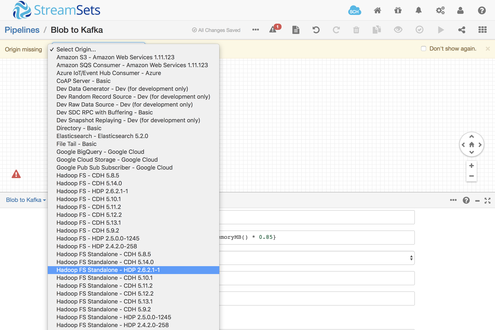
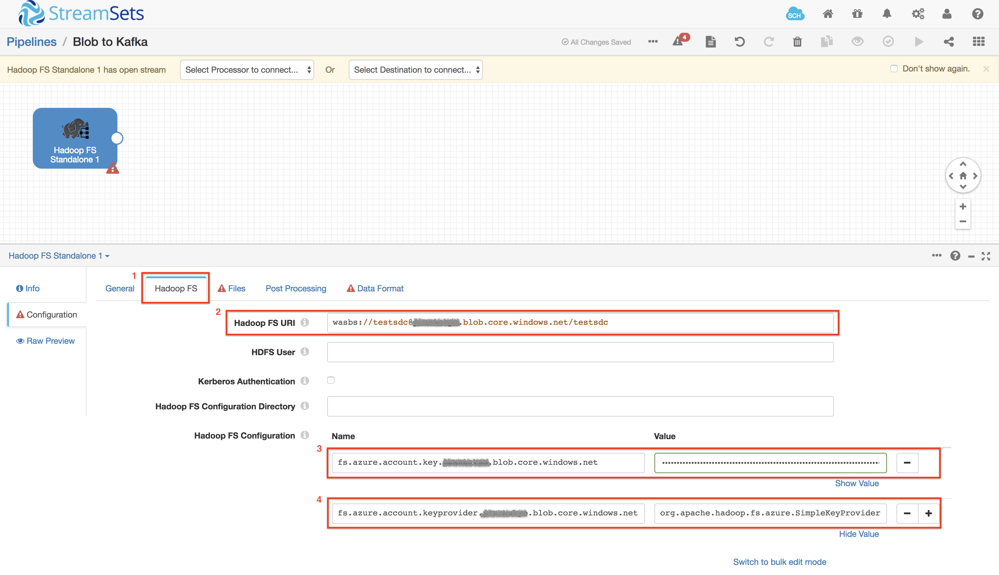
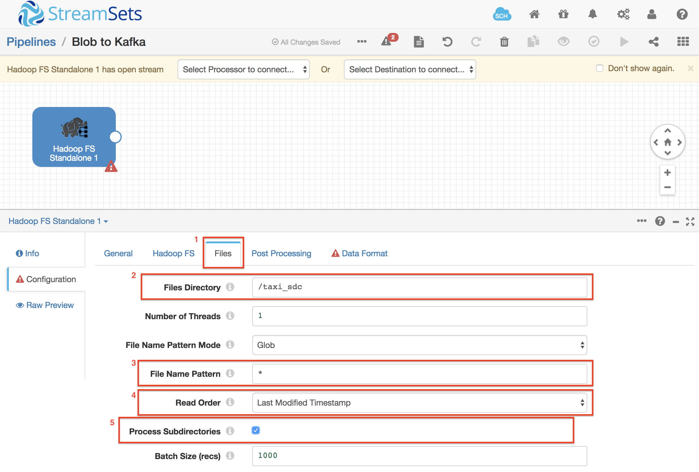
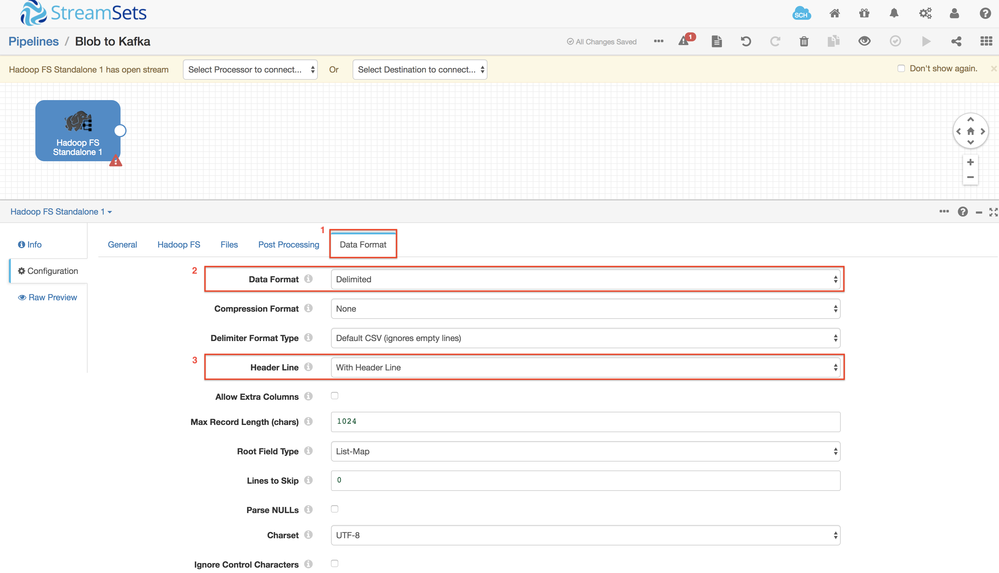
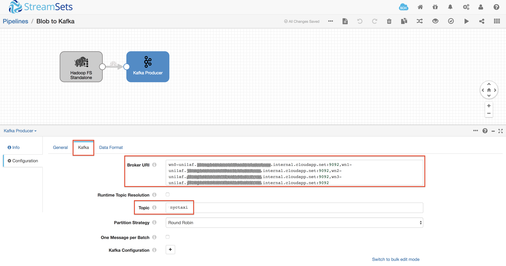
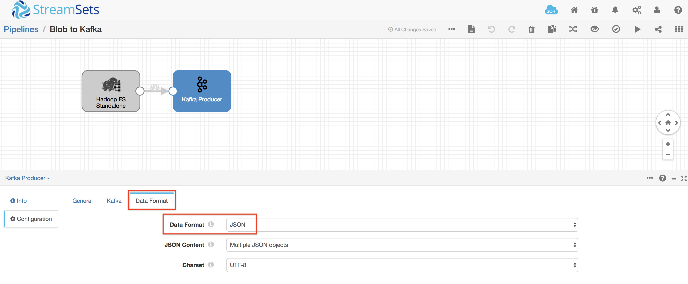
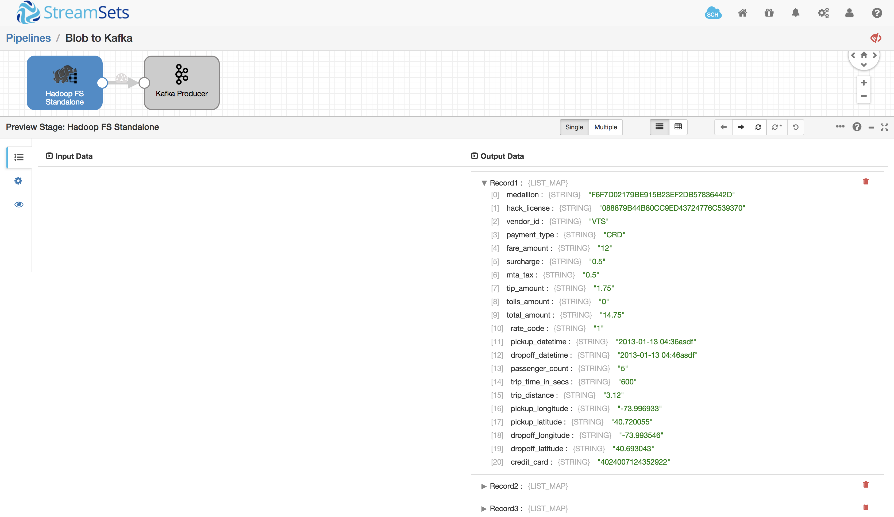

# Ingesting Data from Blob Storage into Apache Kafka on HDInsight

[Azure Blob Storage](https://azure.microsoft.com/en-us/services/storage/blobs/ "Azure Blob Storage") can handle all your unstructured data, scaling up or down as required. You no longer have to manage it, you only pay for what you use, and you save money over on-premises storage options.

[Apache Kafka](https://docs.microsoft.com/en-us/azure/hdinsight/kafka/apache-kafka-introduction) is an open-source, distributed streaming platform. It's often used as a message broker, as it provides functionality similar to a publish-subscribe message queue. [Apache Kafka on HDInsight](https://azure.microsoft.com/en-us/services/hdinsight/apache-kafka/) is a managed service that provides a simplified configuration for Apache Kafka.

## Goal

In this tutorial, you will learn how to leverage Azure services with StreamSets to read data from Blob Storage and send data into Apache Kafka on HDInsight cluster.

## Prerequisites

[Install and configure StreamSets Data Collector and the necessary Azure services](readme.md).

You can download sample data for this tutorial from the following location: https://www.streamsets.com/documentation/datacollector/sample_data/tutorial/nyc_taxi_data.csv and copy into your Blob Storage.

## Creating the Kafka Topic

When working with HDInsight Kafka, we need to pre-create the Kafka topic. Ssh into the terminal for StreamSets Data Collector on HDInsight and run the following command to create a Kafka topic. Remember to replace the zookeeper_url with your own uri for zookeeper.

	/usr/hdp/current/kafka-broker/bin/kafka-topics.sh --create --replication-factor 3 --partitions 3 --topic nyctaxi --zookeeper <zookeeper_uri>

## Creating a Pipeline

Now let's get some data flowing! In your browser, login to StreamSets Data Collector (SDC) and create a new pipeline.

Select Origin from the Drop down list: `Hadoop FS Standalone - HDP 2.6.2.1-1`

**Hadoop FS tab**

* **Hadoop FS URI**: this has the form `wasb[s]://<BlobStorageContainerName>@<StorageAccountName>.blob.core.windows.net/<path>`

* **Hadoop FS Configuration**
	* **fs.azure.account.key.<storage_account_name>.blob.core.windows.net** = `<your storage account key>`
	* **fs.azure.account.keyprovider.<storage_account_name>.blob.core.windows.net** = `org.apache.hadoop.fs.azure.SimpleKeyProvider`

**Files**

* **Files Directory**: `<Blob Storage path for the sample file>`

* **File Name Pattern**: `*`

* **Read Order**: `Last Modified Timestamp`

**Data Format tab**

* **Data Format**: `Delimited`

* **Header Line**: `With Header Line`

Now, let’s send this data to Kafka.
In the Select Destination to connect dropdown, select `Kafka Producer` with the associated HDP version of the HDInsight Kafka cluster. Configure Kafka as follows:

**Kafka tab**

* **Broker URI**: `<Your HDInsight Kafka Broker URI>`

* **Topic**: `nyctaxi`

**Kafka Data Format tab**

* **Data Format**: `JSON`

Configure the pipeline's **Error Records** property according to your preference. Since this is a tutorial, you could discard error records, but in a production system you would write them to a file or queue for analysis later.

Now your pipeline is fully configured and ready for action! Hit the validate button  to check the connections. If successful, hit the preview button  to check that you can read records from the Blob Store file. Click the Hadoop FS stage and you should see ten records listed in the preview panel. You can click into them to see the individual fields and their values:

If your pipeline reports an error at validation or preview, check your configuration properties. If it’s still not working, contact us via the [sdc-user Google Group](https://groups.google.com/a/streamsets.com/forum/#!forum/sdc-user) or the [StreamSets Community Slack channel](https://streamsetters-slack.herokuapp.com/) - details are on the [StreamSets Community Page](https://streamsets.com/community/).

## Running the Pipeline

If all is well, it’s time to run the pipeline! Hit the run button  and you should see 5386 input records and 5386 output records in the monitoring panel.

Use Kafka tools provided by Azure to verify data was written to the topic. More details can be found here: [Manage Kafka Topics](https://docs.microsoft.com/en-us/azure/hdinsight/kafka/apache-kafka-get-started#manage-kafka-topics)

## Conclusion

This tutorial shows how simple it is to stream data from any Directory on Blob Storage, structured on unstructured, into a Kafka topic that can feed multiple consumers downstream. 

[Follow the next tutorial](hdinsightkafka_to_sqldw_and_blobstorage.md) to see how you can use StreamSets Data Collector to read data from the topic and feed it into Azure SQL Data Warehouse.
