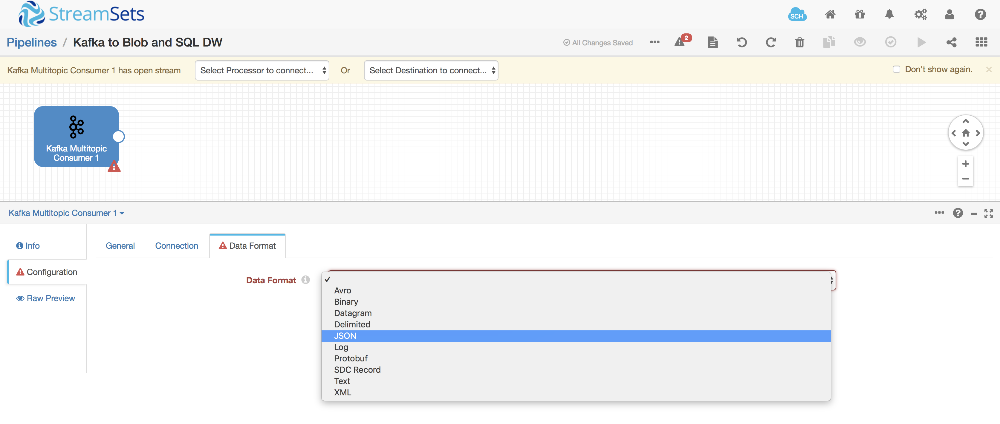
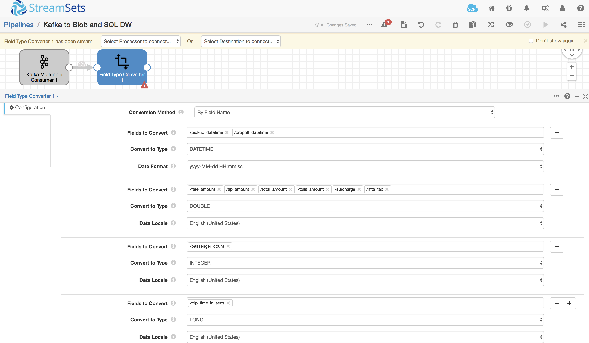
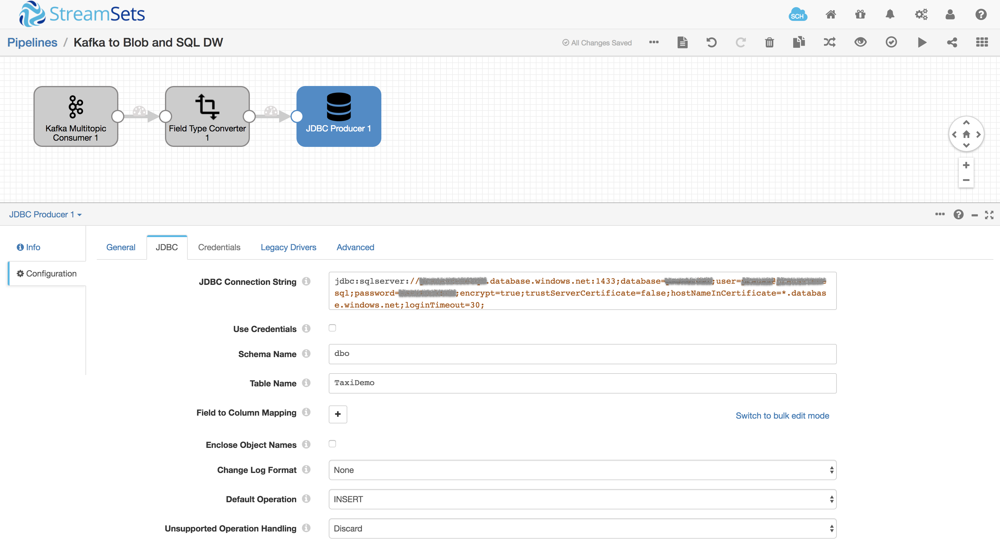
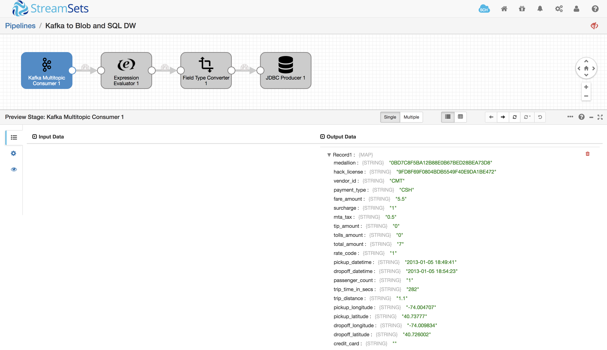
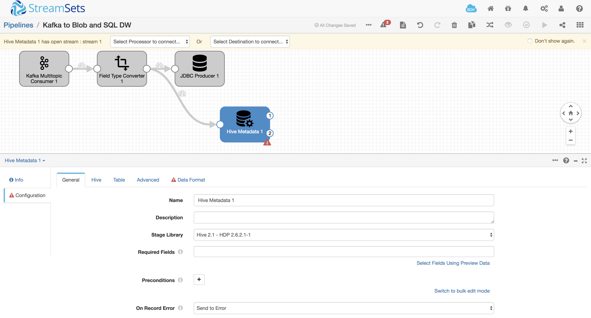
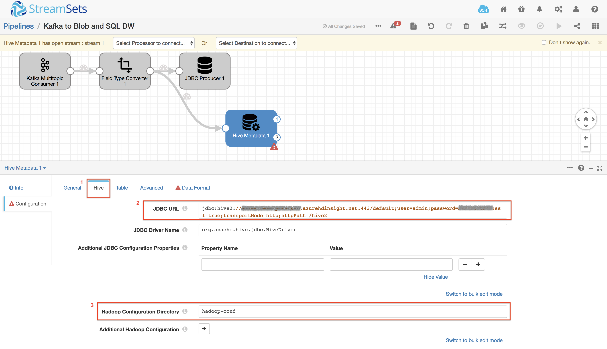
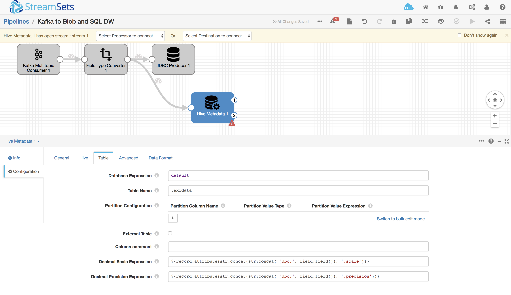
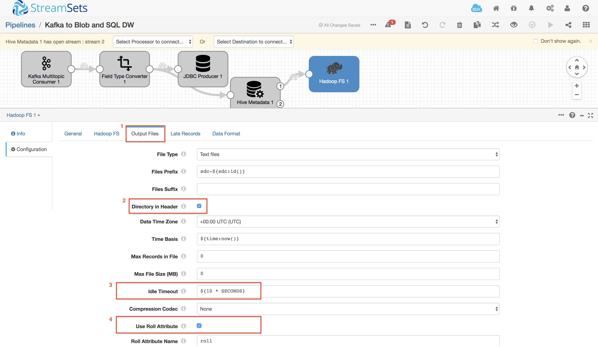
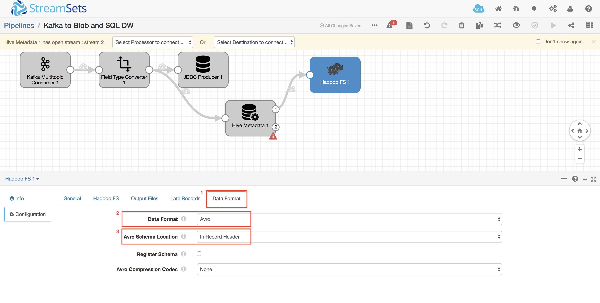
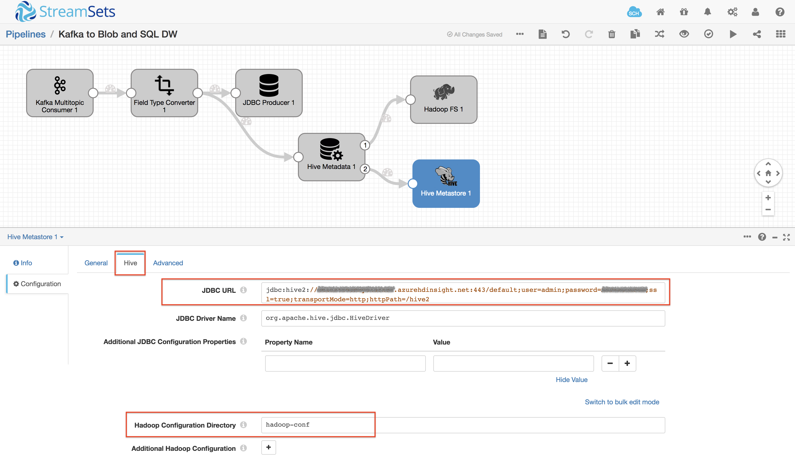

# Ingesting Data from Apache Kafka on HDInsight into Azure SQL Data Warehouse and Apache Hive backed by Azure Blob Storage

[Kafka](https://docs.microsoft.com/en-us/azure/hdinsight/kafka/apache-kafka-introduction) is an open-source, distributed streaming platform. It's often used as a message broker, as it provides functionality similar to a publish-subscribe message queue. [Apache Kafka on HDInsight](https://azure.microsoft.com/en-us/services/hdinsight/apache-kafka/) is a managed service that provides a simplified configuration for Apache Kafka.

[Azure SQL Data Warehouse](https://docs.microsoft.com/en-us/azure/sql-data-warehouse/sql-data-warehouse-overview-what-is) is a cloud-based Enterprise Data Warehouse (EDW) that leverages Massively Parallel Processing (MPP) to quickly run complex queries across petabytes of data. Use SQL Data Warehouse as a key component of a big data solution. SQL Data Warehouse stores data into relational tables with columnar storage. Once data is stored in SQL Data Warehouse, you can run analytics at massive scale.

[Azure Blob Storage](https://azure.microsoft.com/en-us/services/storage/blobs/ "Azure Blob Storage") can handle all your unstructured data, scaling up or down as required. You no longer have to manage it, you only pay for what you use, and you save money over on-premises storage options.

## Goal

The [previous tutorial](blobstorage_to_hdinsightkafka.md) showed how to use StreamSets Data Collector to read data from Blob Storage and send it to Apache Kafka on HDInsight cluster. In this tutorial, you will learn how to leverage Azure services with StreamSets to read data from an Apache Kafka on HDInsight stream into ingest into Azure SQL Data Warehouse and a Hive table backed by Blob Storage.

## Prerequisites

[Install and configure StreamSets Data Collector and the necessary Azure services](readme.md).

## Create the SQL Data Warehouse table

Log in to the SQL Server client and paste the following SQL statement to create the table:

	create table nyc_taxi (
		medallion varchar(32),
		hack_license varchar(32),
		vendor_id varchar(32),
		payment_type varchar(32),
		fare_amount decimal(10,2),
		surcharge decimal(10,2),
		mta_tax decimal(10,2),
		tip_amount decimal(10,2),
		tolls_amount decimal(10,2),
		total_amount decimal(10,2),
		rate_code decimal(10,2),
		pickup_datetime date,
		dropoff_datetime date,
		passenger_count integer,
		trip_time_in_secs long,
		trip_distance integer,
		pickup_longitude decimal(10,2),
		pickup_latitude decimal(10,2),
		dropoff_longitude decimal(10,2),
		dropoff_latitude decimal(10,2),
		credit_card varchar(32)
	);

## Creating a Pipeline

Now let's get some data flowing! In your browser, login to StreamSets Data Collector (SDC) and create a new pipeline.

From the Select Origin dropdown list, select Kafka Multitopic Consumer with the associated HDP version of the HDInsight Kafka cluster and let’s start by configuring the connection details on the Connection tab. Based on the previous pipeline, copy in the same Broker URI and the topic name.

**Kafka Connection tab**

* **Broker URI**: `<Your HDInsight Kafka Broker URI>`

* **Consumer Group**: `azuresqldw`

* **Topic**: `nyctaxi`

**Kafka Data Format tab**

* **Data Format**: `JSON`

Add a Field Convertor to convert incoming data from String to applicable formats matching the target table.

Select JDBC Producer from the Destination list and configure the JDBC URL, schema and table name:

**JDBC - JDBC tab**

* **JDBC Connection String**: `<Your JDBC Connection String to the SQL DW>`

* **Schema Name**: `dbo`

* **Table Name**: `TaxiDemo`

Configure the pipeline's **Error Records** property according to your preference. Since this is a tutorial, you could discard error records, but in a production system you would write them to a file or queue for analysis later.

Now your pipeline is fully configured and ready for action! Hit the validate button  to check the connections. If successful, hit the preview button  to check that you can read records from the Blob Store file. Click the Hadoop FS stage and you should see ten records listed in the preview panel. You can click into them to see the individual fields and their values:

If your pipeline reports an error at validation or preview, check your configuration properties. If it’s still not working, contact us via the [sdc-user Google Group](https://groups.google.com/a/streamsets.com/forum/#!forum/sdc-user) or the [StreamSets Community Slack channel](https://streamsetters-slack.herokuapp.com/) - details are on the [StreamSets Community Page](https://streamsets.com/community/).

Now that the pipeline is ready to read from a Kafka topic and send to SQL Datwarehouse, you can run it by hitting the run button  and you should see 5386 input records and 5386 output records in the monitoring panel.

Continue configuring the pipeline to write this data into a Hive table as well.

### Writing to Hive

Add a Hive Metadata processor and on the General tab, set the Stage Library to the respective version. This processor analyzes the structure of incoming data, comparing it to the Hive Metastore schema and creates metadata records capturing the changes that are required in the Hive table structure. Link the input to the Field Type Convertor's Output and configure it thus:

**Hive tab**:

* **JDBC URL**: `<Your Hive JDBC URL>`

* **JDBC Driver Name**: `org.apache.hive.jdbc.HiveDriver`

* **Hadoop Configuration Directory**: `hadoop-conf` 

**Table tab**:

* **Database Expression**: `default` - change this if you wish to use a different Hive database name.

* **Table Name**: `taxidata`

* **Partition Configuration**: hit the ‘-’ button to remove the dt entry. We will not be partitioning data in this tutorial.

**Data Format tab**:

* **Data Format**: `Avro`

The Hive Metadata processor emits data records on its #1 output stream, and metadata on #2. 

Next, add a Hadoop FS destination, and connect the Hive Metadata processor’s #1 output stream to the new destination’s input stream.
On the General tab, select the Stage Library matching your HDInsight Cluster.

**Hadoop FS tab**

* **Hadoop FS URI**: this has the form `wasb[s]://<BlobStorageContainerName>@<StorageAccountName>.blob.core.windows.net/<path>`

* **Hadoop FS Configuration**
	* **fs.azure.account.key.pranavkyo.blob.core.windows.net** = `<your storage account key>`
	* **fs.azure.account.keyprovider.pranavkyo.blob.core.windows.net** = `org.apache.hadoop.fs.azure.SimpleKeyProvider`

**Output Files**

* **Directory in Header**: Enabled

* **Idle Timeout**: `${10 * SECONDS}`

* **Use Roll Attribute**: Enabled

* **Roll Attribute Name**: `roll`

**Data Format tab**

* **Data Format**: `Avro`

* **Avro Schema Location**: `In Record Header`

Note - the destination will continue writing to a file until the first of these five conditions is satisfied:

* The number of records specified in ‘Max Records in File’ has been written (zero means there is no maximum)

* The specified ‘Max File Size’ has been reached (again, zero means there is no maximum)

* No records have been written for the specified ‘Idle Timeout’

* A record with the specified roll header attribute is processed

* The pipeline is stopped

When the Hive Metadata processor detects a schema change, it sets the roll header attribute to signal to the destination that the data file should be ‘rolled’ - that is, the current file closed and a new file opened.

We set **Idle Timeout** set to `10 SECONDS` so the destination closes the file within 10 seconds of writing the data, since we want to see data immediately. If we left the defaults in place, we might not see some data in Hive until an hour after it was written. This might be appropriate for a production deployment, but would make a very time-consuming tutorial!

To complete the pipeline, add a Hive Metastore destination and select the Stage Library based on your HDP version. Connected the input of this destination to the Hive Metadata processor’s #2 output and configure Hive settings like this:

Again, Validate and Preview the pipeline to ensure all is well.

## Running the Pipeline

If all is well, it’s time to run the pipeline! Hit the run button  and you should see 5386 input records and 5386 output records in the monitoring panel.

## Conclusion

This tutorial shows how simple it is to stream data from any Kafka into multiple destinations with Azure Services. For Realtime trickle feeds, you can directly send data into Azure SQL Data Warehouse and for Archival, you can send data into Hive.
