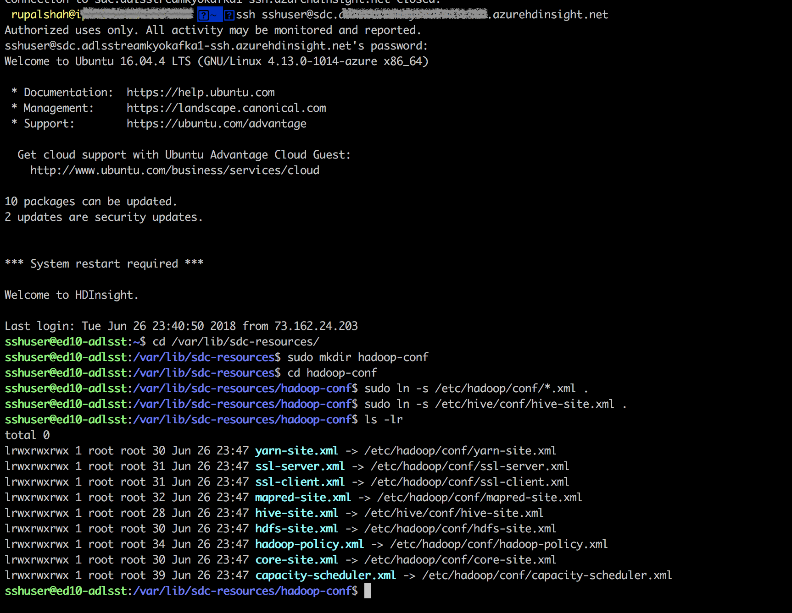
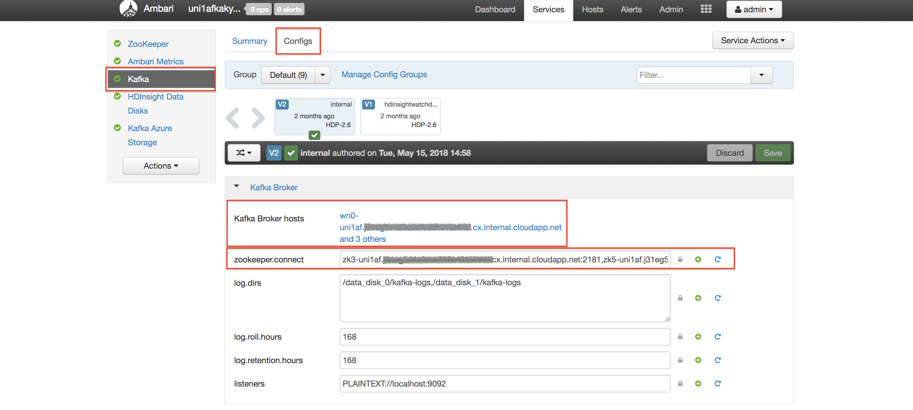

# Working with StreamSets Data Collector and Microsoft Azure

These tutorials explain how to use [StreamSets Data Collector](https://streamsets.com/products/sdc/) to integrate [Azure Blob Storage](https://azure.microsoft.com/en-us/services/storage/blobs/), [Apache Kafka on HDInsight](https://docs.microsoft.com/en-us/azure/hdinsight/), [Azure SQL Data Warehouse](https://azure.microsoft.com/en-us/services/sql-data-warehouse/) and Apache Hive backed by Azure Blob Storage:

* [Ingesting Data from Blob Storage into Apache Kafka on HDInsight](blobstorage_to_hdinsightkafka.md)
* [Ingesting Data from Apache Kafka on HDInsight into Azure SQL Data Warehouse and Apache Hive backed by Azure Blob Storage](hdinsightkafka_to_sqldw_and_blobstorage.md)

### Pre-requisites

In order to work through these tutorials, ensure you already have the following setup ready, otherwise follow the instructions described below:

1. Login to the [Azure Portal](https://portal.azure.com)

2. Create a [Virtual Network](https://docs.microsoft.com/en-us/azure/virtual-network/quick-create-portal#create-a-virtual-network) (vNet):
This vNet will allow us to enable communication between the clusters created in the next steps to communicate privately with each other.

3. Data storage: Create a [Blob Container](https://docs.microsoft.com/en-us/azure/hdinsight/hdinsight-hadoop-use-blob-storage#create-blob-containers)

4. Install [StreamSets Data Collector for HDInsight](https://docs.microsoft.com/en-us/azure/hdinsight/hdinsight-apps-install-streamsets)
Also check [StreamSets Documentation](https://streamsets.com/documentation/datacollector/latest/help/index.html#datacollector/UserGuide/Installation/CloudInstall.html#task_vnj_rl2_wdb) for more details on the installation process.

5. Create an [Apache Kafka on HDInsight cluster](https://docs.microsoft.com/en-us/azure/hdinsight/kafka/apache-kafka-get-started) in the same vNet as above. Use Azure Storage for the Kafka cluster. 

6. Configure StreamSets Data Collector to connect to HDInsight cluster

	Configure connection to HDInsight cluster by creating symlinks to the configuration files.
	
	- ssh into the SDC node using the SSH Endpoint of your cluster:
	
		```
		ssh sshuser@<ssh endpoint>
		```
		
	- Navigate to the StreamSets Resources Directory and create a directory to hold cluster configuration symlinks
	
		```
		cd /var/lib/sdc-resources
		sudo mkdir hadoop-conf
		cd hadoop-conf
		```
	
	- Symlink all *.xml files from /etc/hadoop/conf and hive-site.xml from /etc/hive/conf:
		```
		sudo ln -s /etc/hadoop/conf/*.xml .
		sudo ln -s /etc/hive/conf/hive-site.xml .
		```

    

7. Download and install SQL Server JDBC Driver for StreamSets Data Collector
	- Download: https://docs.microsoft.com/en-us/sql/connect/jdbc/microsoft-jdbc-driver-for-sql-server?view=sql-server-2017
	- Install: https://streamsets.com/documentation/datacollector/latest/help/index.html#datacollector/UserGuide/Configuration/ExternalLibs.html#concept_amy_pzs_gz
	
8. Capture and note down the Kafka Broker URI and Zookeeper Configuration from Ambari:

    
